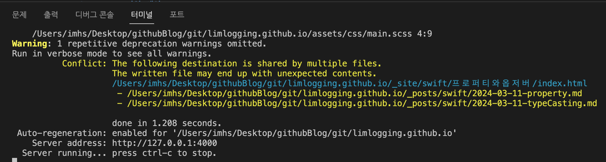
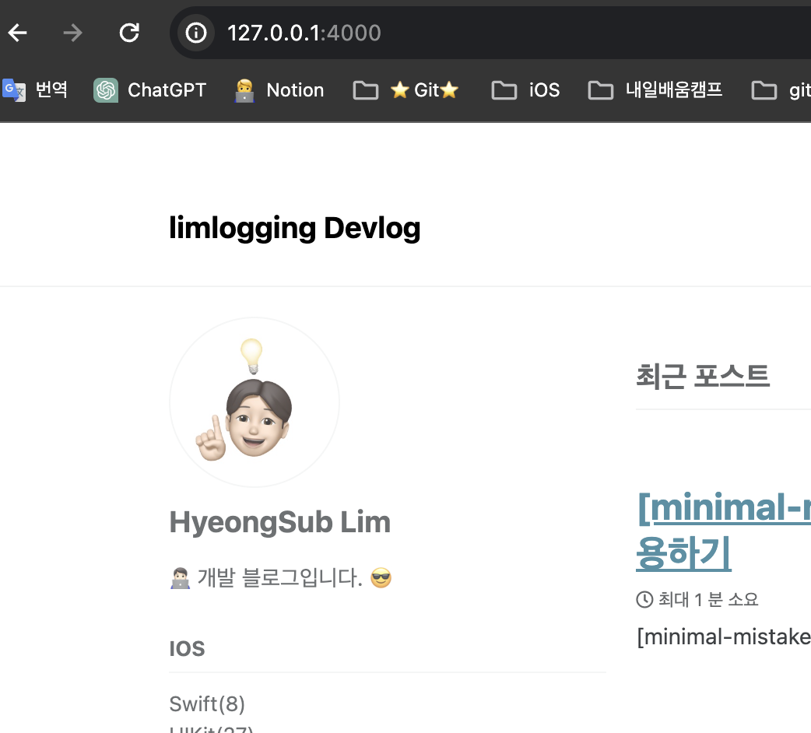

---
title: "[minimal-mistakes]로컬에서 블로그 실행시키기(bundle exec jekyll serve)"
excerpt: "[minimal-mistakes]로컬에서 블로그 실행시키기(bundle exec jekyll serve)"
categories: GitHubBlog
tags: [GitHub, blog, GitHub blog, bundle exec jekyll serve]

permalink: /GitHubBlog/bundleexecjekyllserve/  
toc: true           #On this page 보이기 
toc_sticky: true    #on this page 스크롤에 따라 움직이도록 
comments: true      #댓글
--- 

# 1. 터미널에서 명령어 입력 
- bundle exec jekyll serve

``` console 
imhs@imhsui-MacBookPro limlogging.github.io % bundle exec jekyll serve   
```



# 2. 실행 확인 
- 인터넷 주소창에 [http://127.0.0.1:4000/ 접속](http://127.0.0.1:4000/){:target="_blank"}


