---
title: "[minimal-mistakes]블로그 광고(google AdSense) 추가하기 "
excerpt: "[minimal-mistakes]블로그 google AdSense 추가하기"
categories: GitHubBlog
tags: [GitHub, blog, GitHub blog, AdSense]

permalink: /GitHubBlog/googleAdSense/  
toc: true           #On this page 보이기 
toc_sticky: true    #on this page 스크롤에 따라 움직이도록 
comments: true      #댓글
--- 

# 1. Google AdSense 시작하기 
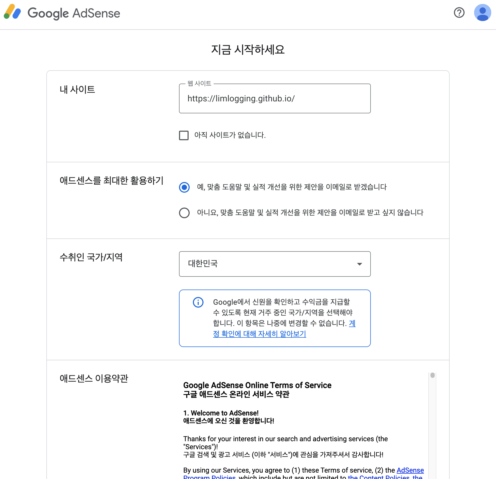

# 2. 애드센스에 사이트 연결하기 
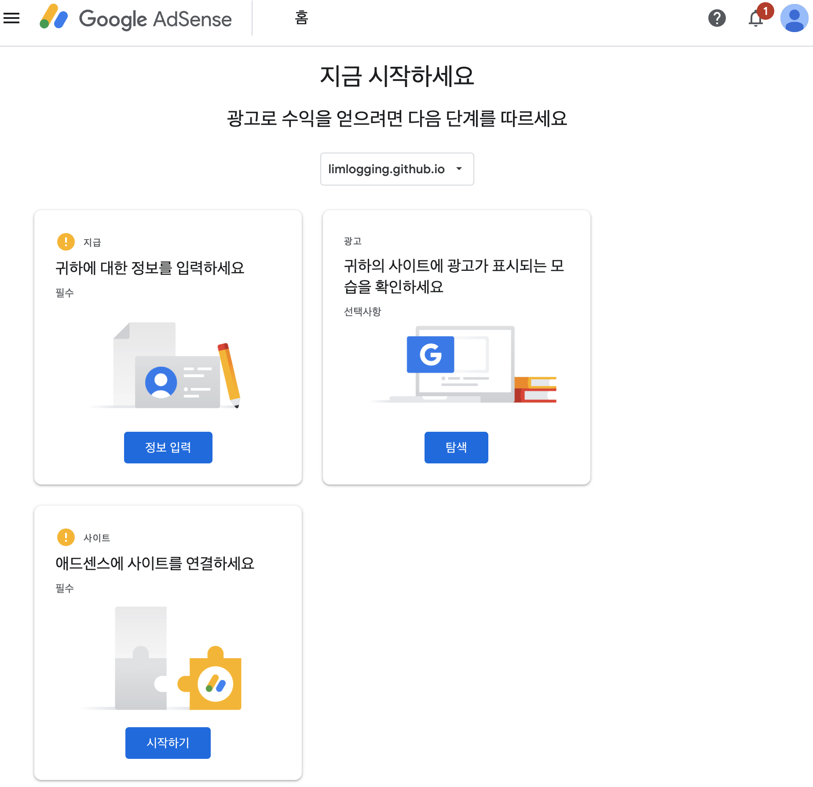

# 3. 코드스니펫 확인하기  
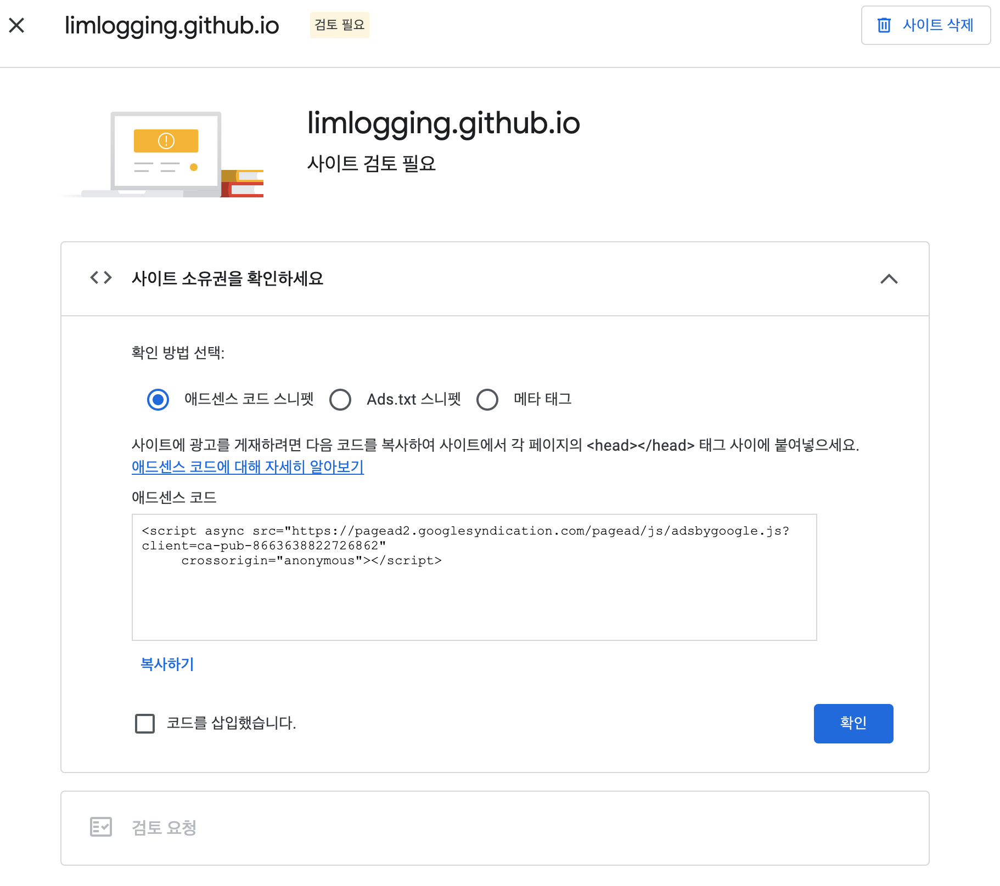

# 4. customs.html 수정 
- _includes / head 경로에 위치한 customs.html 상단에 코드를 추가합니다. 

``` html 
<!-- start custom head snippets -->
<!-- 구글 애드센스 추가 -->
<script async src="https://pagead2.googlesyndication.com/pagead/js/adsbygoogle.js?client=ca-pub-8663638822726862" crossorigin="anonymous"></script>
```

## 코드 반영 전 
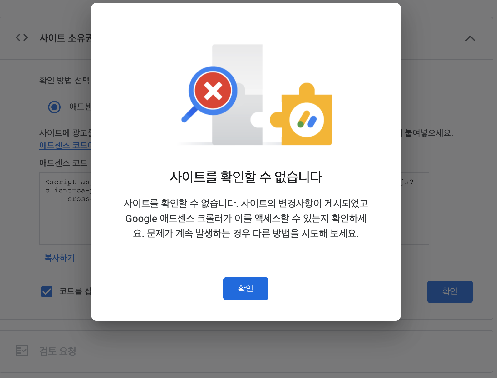

## 코드 반영 후 
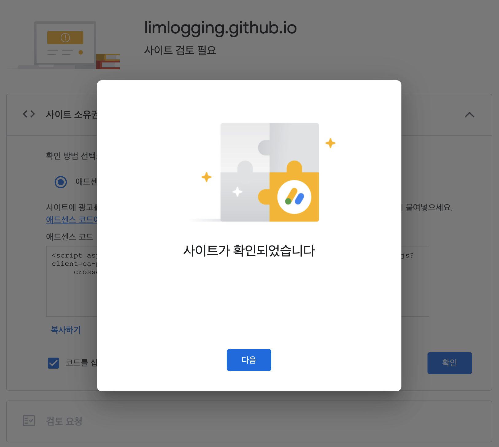

# 5. 애드센스 승인 메일 확인 
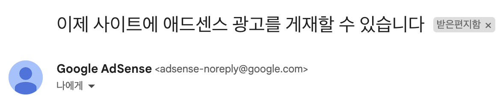

# 6. ads.txt 파일 추가 
- 애드센스 홈에서 아래와 같은 경고창이 뜨는데 ads.txt파일을 추가하면 됩니다.  
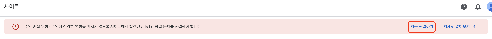

## 지금 해결하기 선택 
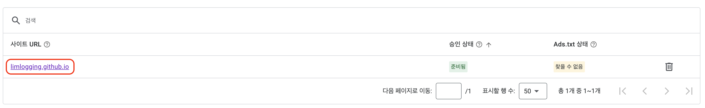

## 사이트 URL 선택 
- 코드를 복사합니다. 
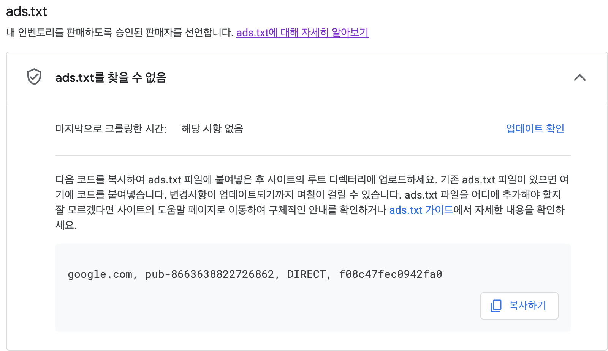

## ads.txt 파일 생성 및 코드 작성 
- _config.yml파일과 같은 위치에 ads.txt파일을 생성하고 복사한 코드를 추가합니다. 
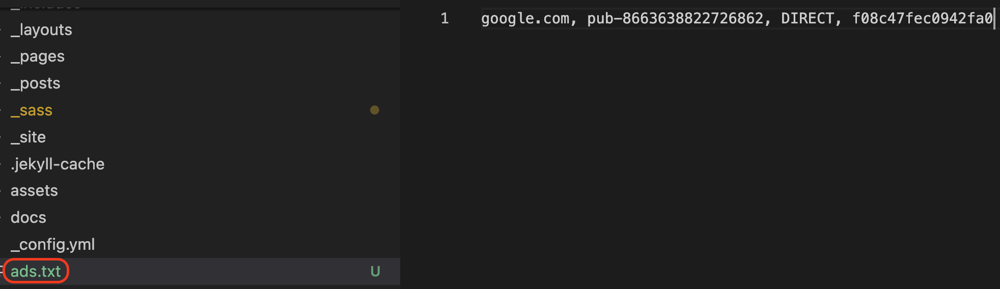

# 7. 블로그 하단에 광고 추가하기 
- 홈 - 광고 - 광고 단위 기준에서 디스플레이 광고를 선택합니다. 
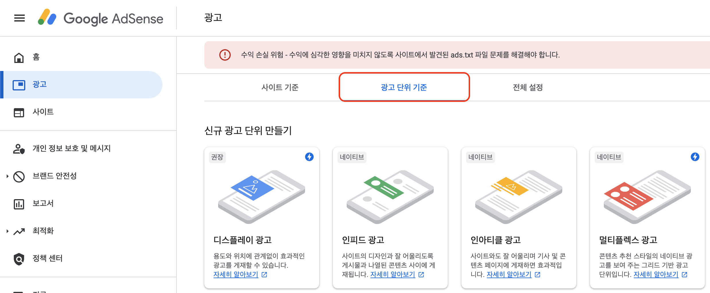

## 1. 수평형 디스플레이 광고를 생성
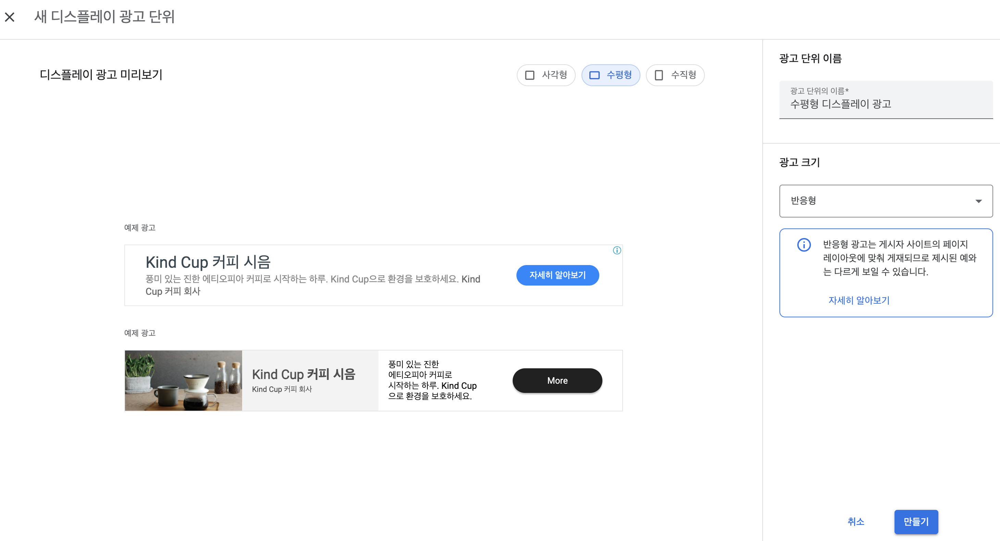

## 2. 코드 받기  
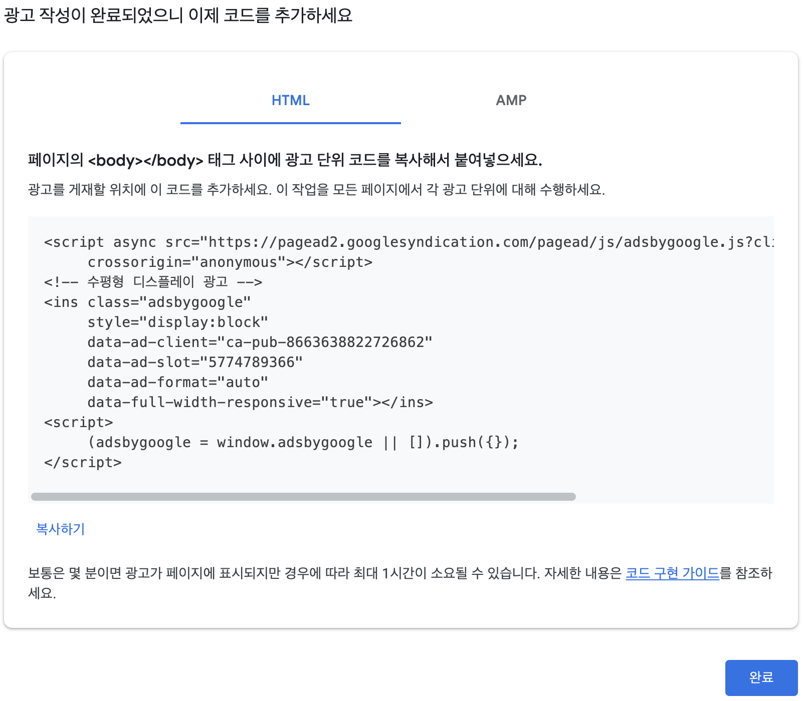

## 3. 코드 추가하기 
- _layouts 폴더 내 single.html파일 가장 하단에 코드를 추가합니다. 

``` html
<!-- 하단 광고 추가 -->
<div style="text-align: center;">
  <script async src="https://pagead2.googlesyndication.com/pagead/js/adsbygoogle.js?client=ca-pub-8663638822726862"
      crossorigin="anonymous"></script>
  <!-- 수평형 디스플레이 광고 -->
  <ins class="adsbygoogle"
      style="display:block"
      data-ad-client="ca-pub-8663638822726862"
      data-ad-slot="5774789366"
      data-ad-format="auto"
      data-full-width-responsive="true"></ins>
  <script>
      (adsbygoogle = window.adsbygoogle || []).push({});
  </script>
</div>
```

# 8. 블로그 우측 toc에 광고 추가하기 
- 7번과 동일한 방법으로 수직형 디스플레이 광고를 만들고 코드를 받습니다. 

## 1. html 파일 생성 및 코드 작성 
- _includes 폴더에 GoogleAdSenseSidbar.html 파일을 추가하고 코드를 작성합니다. 

```html
<script async src="https://pagead2.googlesyndication.com/pagead/js/adsbygoogle.js?client=ca-pub-8663638822726862"
     crossorigin="anonymous"></script>
<!-- 수직형 디스플레이 광고 -->
<ins class="adsbygoogle"
     style="display:block"
     data-ad-client="ca-pub-8663638822726862"
     data-ad-slot="8971782438"
     data-ad-format="auto"
     data-full-width-responsive="true"></ins>
<script>
     (adsbygoogle = window.adsbygoogle || []).push({});
</script>
```

## 2. _config.yml 파일 수정 
- toc_ads, toc_sticky 부분을 추가합니다. 

``` yml 
# Defaults
defaults:
  # _posts
  - scope:
      path: ""
      type: posts
    values:
      layout: single
      author_profile: true
      read_time: true
      comments: # true
      share: true
      related: true
      toc_ads: true     #사이드 광고 추가 
      toc_sticky: true  #사이드 광고 추가 
# 사이드바 탐색 기본값 추가 
      sidebar:
        nav: "categories"
```

## 3. single.html 수정 
- 코드 복붙하니 너무 길어져서 캡처로 대체합니다.
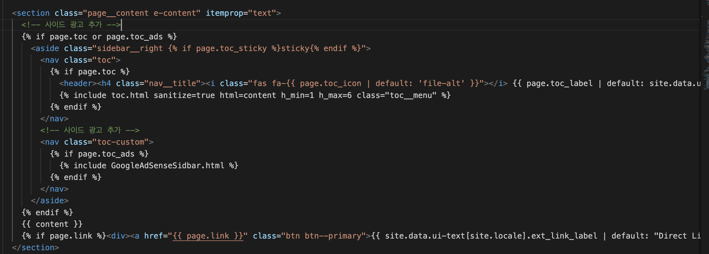

# 9. 하단 광고 확인 
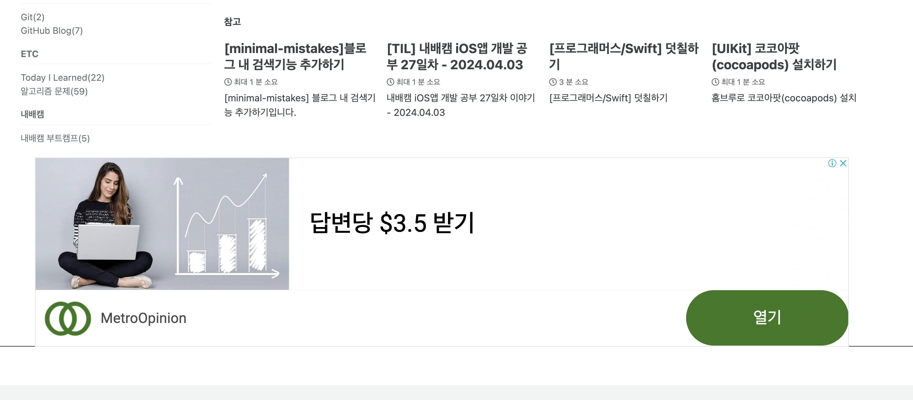

# 10. 우측 광고 확인 
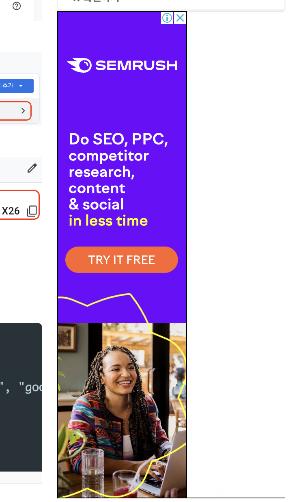