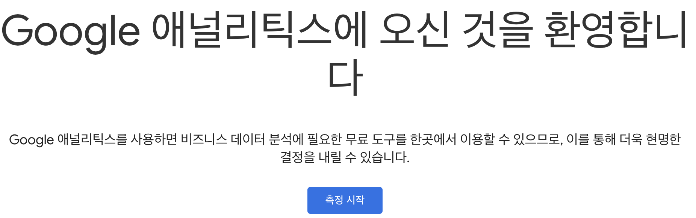
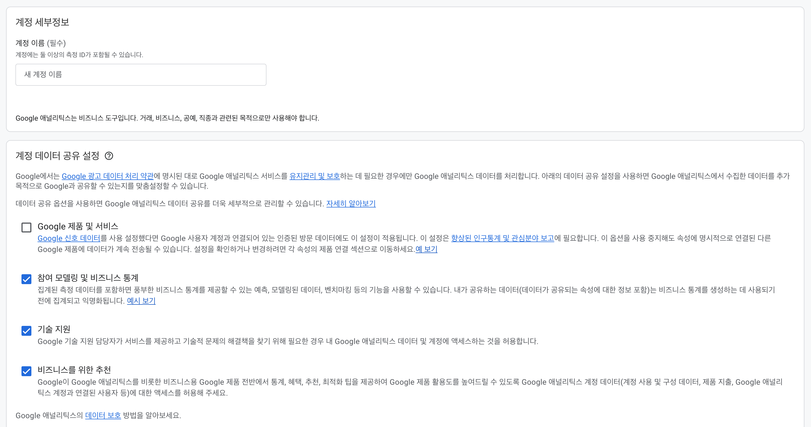
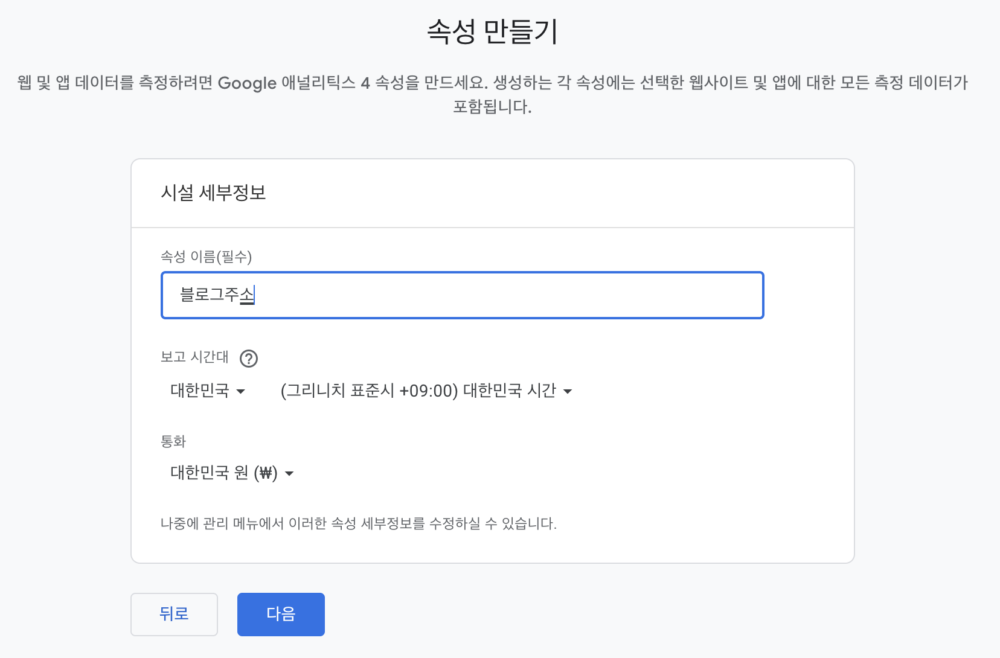
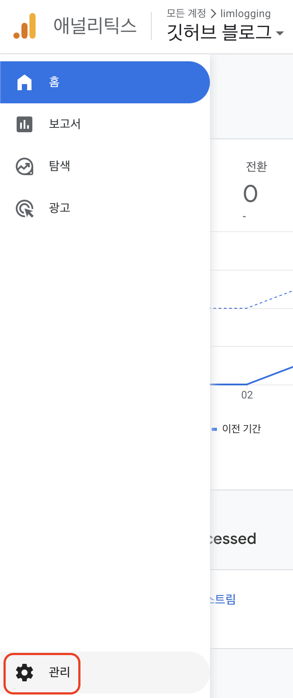
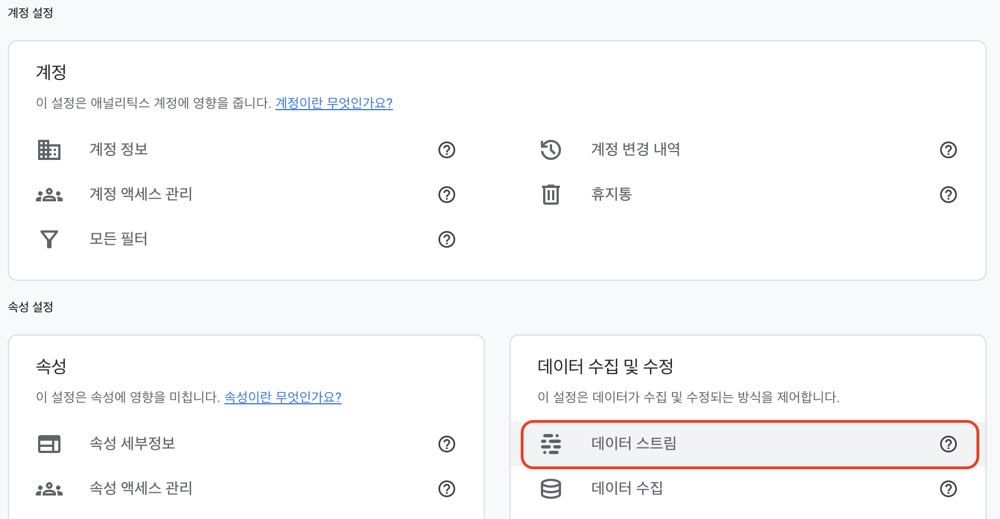
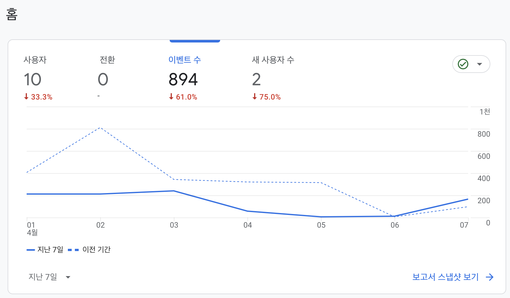

---
title: "[minimal-mistakes]블로그 방문자 통계(google Analytics) 추가하기 "
excerpt: "[minimal-mistakes]google Analytics 추가하기"
categories: GitHubBlog
tags: [GitHub, blog, GitHub blog, Analytics]

permalink: /GitHubBlog/googleAnalytics/  
toc: true           #On this page 보이기 
toc_sticky: true    #on this page 스크롤에 따라 움직이도록 
comments: true      #댓글
--- 

# 1. Google Analytics 등록하기
- [Google Analytics](https://analytics.google.com/){:target="_blank"}에 접속해서 측정시작합니다. 

- 계정 이름 설정 (자유롭게 작명하면 됩니다.)

- 블로그 주소 및 시간대를 선택합니다. 


<br>

# 2. 트랙킹 ID 확인하기 
- 관리 

- 데이터 스트림 

- 블로그 선택 

- 측정 ID 확인 


<br>

# 3. _config.yml 수정하기 
```yml
# Analytics
analytics:
  provider               : "google-gtag" # false (default), "google", "google-universal", "google-gtag", "custom"
  google:
    tracking_id          : "G-B9ZRRL1X26"
    anonymize_ip         : # true, false (default)
```

<br>

# 4. 확인하기 
- 홈에서 확인 

