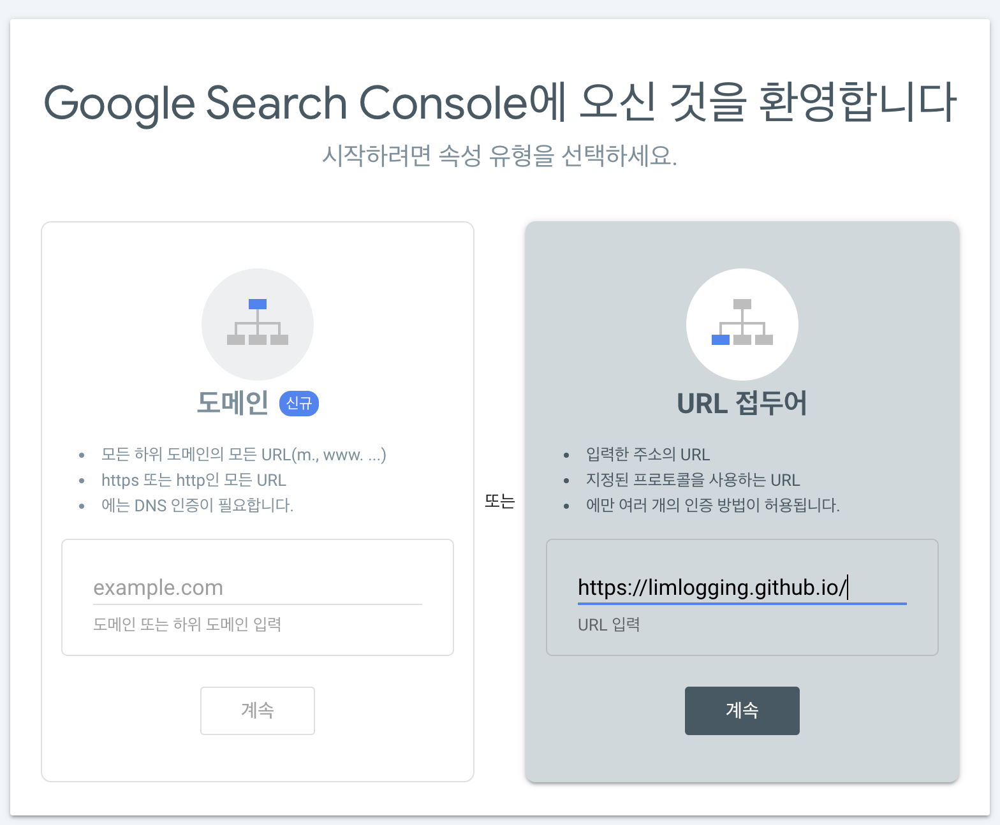
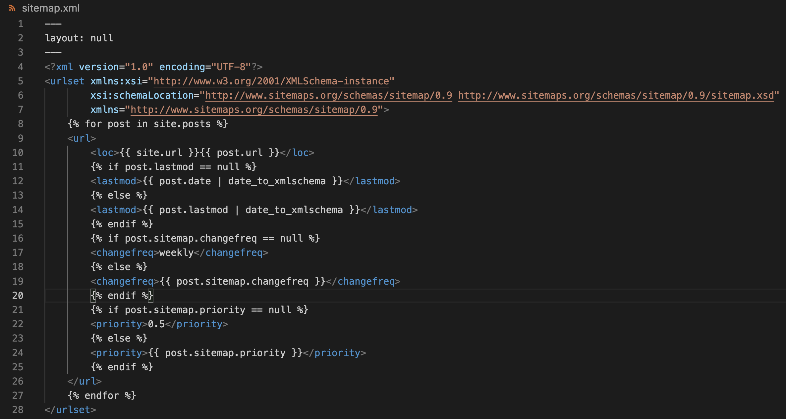
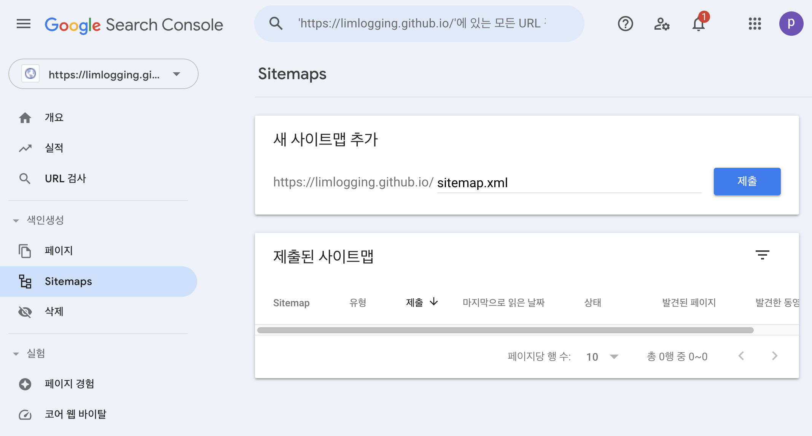
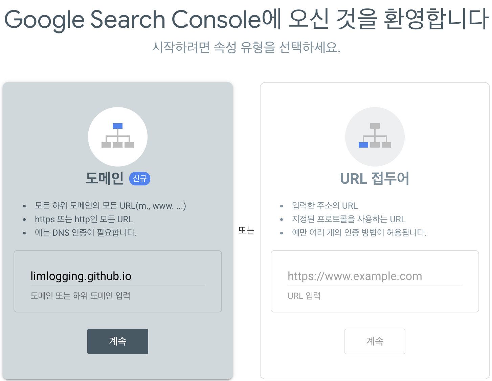
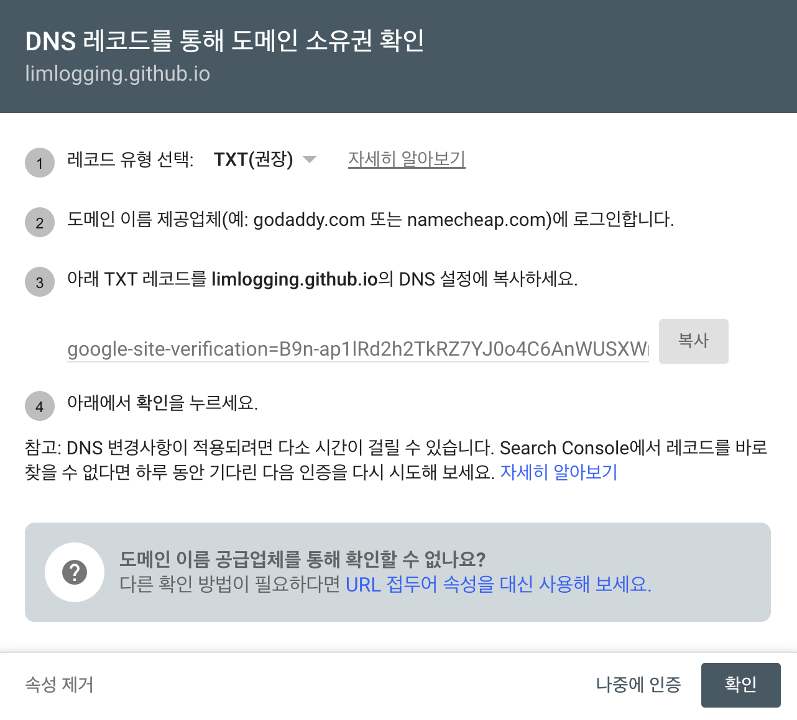
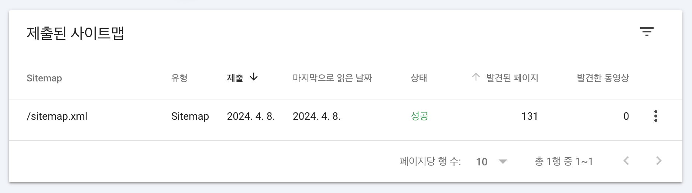

---
title: "[minimal-mistakes]블로그에서 검색 노출(Search Console) 사용하기"
excerpt: "[minimal-mistakes]블로그에서 검색 노출(Search Console) 사용하기"
categories: GitHubBlog
tags: [GitHub, blog, GitHub blog, Search Console]

permalink: /GitHubBlog/googleSearchConsole/  
toc: true           #On this page 보이기 
toc_sticky: true    #on this page 스크롤에 따라 움직이도록 
comments: true      #댓글
--- 

# 1. Google Search Console 접속  
- [Google Search Console 접속하기](https://search.google.com/search-console/welcome?utm_source=about-page){:target="_blank"}


# 2. Google Search Console 시작 



# 3. sitemap.xml 추가하기 
- _config.yml 파일과 같은 경로에 sitemap.xml 파일을 추가 후 코드를 작성합니다. 
- %안에 내용때문에 코드가 길어지고 달라져서 캡처로 대체합니다 ㅠ ㅠ 

 

# 4. robots.txt 파일 생성 
- _config.yml 파일과 같은 경로에 robots.txt 파일을 추가 후 내용 작성합니다. 

``` 
User-agent: *
Allow: /
Sitemap: {{ '/sitemap.xml' | relative_url | prepend: site.url }}
```

# 5. 새 사이트맵 추가   


# 6. 도메인으로 계속하기 


# 7. txt 레코드 복사 


# 8. _config.yml 파일 수정 
- google_site_verification 레코드를 붙여넣습니다. 

``` yml
# SEO Related
google_site_verification : "B9n-ap1lRd2h2TkRZ7YJ0o4C6AnWUSXWrBq2xCjZ9ug"
bing_site_verification   :
naver_site_verification  :
yandex_site_verification :
baidu_site_verification  :
```

# 9. 완료
