# 프로젝트 
1. 프로젝트 주제: 팀 소개 앱 만들기 
2. 프로젝트 기간: 4/1(월) ~ 4/7(일)  
3. 인원: 4명 (팀장: 임형섭 / 팀원: 김시종, 금세미, 송동익)
4. 프로젝트 명: Fine Apple Store 
5. 프로젝트 소개: 키오스크하면 생각나는 음료가 아닌 본 과정이 iOS 앱 개발 과정인 만큼, 애플 제품을 소개 및 판매하는 앱을 구현하기로 결정.
6. 개발환경 
- OS : macOS Sonoma 14.3.1
- IDE : Xcode 15.3
- Language : Swift
- 협업 Tool : Git (https://github.com/-limlogging/Kiosk3Jo) 

 

# 팀원 구성 및 역할 
## 임형섭  
1. Github에서 팀원 코드 merge 최종 작업
2. 제품 기초 이미지 파일 준비 
3. 스토리보드에서, TabBar, Navigation 기능 추가 (홈, 상품, 마이페이지)
4. 스토리보드 버튼을 코드로 변경 
5. 마이페이지 구현 (코드를 통한 UI 구성, TableView, 오토레이아웃 사용)
6. 제품 상세 페이지 구현 (코드를 통한 UI 구성, ScrollView, PageControl를 사용한 슬라이드 이미지 구현)

## 금세미 
1. UIButton, UIAlertController 기능 구현
    - 문의, 취소, 주문 버튼 클릭 시, UIAlertController를 통해 주문 및 취소 기능 구현, 전체 취소 및 주문 완료 시 UITableView 초기화
2. 제품 이미지 영문명 변경
3. 제품 이미지 확장자 변경(jpeg → png)
4. 컬렉션 뷰와 이미지 연결하여 제품 정보(상품명, 가격) 불러오기
5. launch screen 디자인

## 김시종 
1. 데이터 모델링(Model → image, title, price)
2. CollectionView, SegmentedControl 기능 구현
    - 제품군별로 SegmentedControl로 분류
    - Seg마다 각각의 선택된 제품군 화면출력
3. 탭바 홈 화면 구현
4. 탭바 고객센터 화면 구현
5. 이미지 및 레이아웃 상세 디자인 수정

## 송동익  
1. 프로젝트 초기 UI틀 구성
2. UITableView 기능 구현
3. 장바구니 기능 구현
4. 장바구니 화면을 보여줄 Modal 기능 구현
5. 물품의 갯수를 Notification Badge 형식으로 구현
6. Search Bar 기능 구현
7. 새로 출시된 제품 표기 기능 구현
8. 매장의 위치를 보여줄 지도 기능 구현
9. App Icon 구현
10. 팀원 업무 보조 

 

# 어려웠던 점 & 해결 방법 

## 임형섭 
- github를 통해 충돌된 코드를 머지하는 방식이 어려웠으나 프로젝트를 통해 머지방식이 조금 익숙해 졌습니다. 
- TabBar를 통해 View 이동 시 배열 데이터를 주고 받기 어려워 팀원들의 도움을 받아 해결할 수 있었습니다. 
- pageControl을 통해서 ScrollView내 imageview를 이동하기 어려웠지만 ScrollView width 지정과 오토레이아웃에 문제가 있는걸 확인하고 해결할 수 있었습니다. 

## 금세미  
- git 사용법이 익숙하지 않아 팀에 피해를 끼치지 않고 프로젝트 파일을 pull, push, merge 하는 것이 좀 부담스러웠으나 여러번 반복하며 익혔다.

## 김시종 
- 홈화면 구성할 때 컬렉션 뷰위에 헤더를 구현하고 싶었으나, 가로로 구성된 컬렉션 뷰의 헤더가 위로 구성되는게 아닌 왼쪽으로 오는 것에 대해 위로 올리는 과정이 어려웠던 것 같습니다. 일반적인 방법으로 가로 구성의 컬렉션 뷰 헤더를 위로 구성하는 것이 어렵다는 것을 깨닫고 **Compositional Layout 을 사용하게 되었습니다. 아직 이해하기 어려운 개념이지만 헤더를 위에 구성하는 것 까진 성공하게 되었습니다. 추후 컴포지셔널 레이아웃 관련해서 더 공부해야할 것 같습니다.**

## 송동익 
- 데이터 전달방식이다. 내가 알고있던 방법으로 VC간 데이터를 전달했지만, 탭바를 사용하면서 이럴땐 어떻게 전달해야하지? 라는 생각을했고, 내가 아는 모든 지식을 사용해도 전달이 안되었는데, 튜터님께 여쭤보고 바로 해답을 찾았고, 그 문제를 해결하는데는 단 5분도 걸리지않았다. 항상 내 수준에 만족을 하고 있지는 않아 만족을 하기위해 노력을 하고있는데, 그 노력 이상으로 더 열심히 공부해야겠다라는 생각이 든다.

 

# 프로젝트 소감 
## 임형섭 
- github를 통해서 협업을 경험해보고 공부했던 내용을 다시 적용하면서 복습할 수 있었습니다. 특히 다른 사람 코드 작성 방식을 통해 다양한 구현 방법을 확인 해 볼 수 있어 소중한 경험이 되었습니다.

## 금세미 
- 완성한 앱을 보니 우리가 이 정도 수준의 앱을 만들었다는 것이 믿을 수 없을 정도로 만족스럽고 뿌듯했다.

## 김시종 
- 처음 프로젝트를 진행하면서 내가 해야할 일이 생기면서 피해끼치지 않고 좋은 프로젝트를 진행하고 싶어 혼자 할때 보다 더 노력을 하게 된 것 같았습니다. 진행될 수록 각자 맡은 내용이 합쳐지고 하나의 결과물이 생기는 과정이 너무 재밌었고 뿌듯했던 과정이었습니다.

## 송동익 
- 온보딩 주차에 프로젝트를 진행하지 않아서 이번프로젝트가 첫프로젝트였지만, 맡은 임무를 최대한 열심히 하고자 노력을 했다. 하루하루 지나며 아무것도 없던 상태에서 틀이 갖춰지고 하나씩 기능이 갖춰 질때마다, 미천하지만 팀에 기여를 하고있다는 생각에 뿌듯함을 느꼈다.

 

# Wireframe
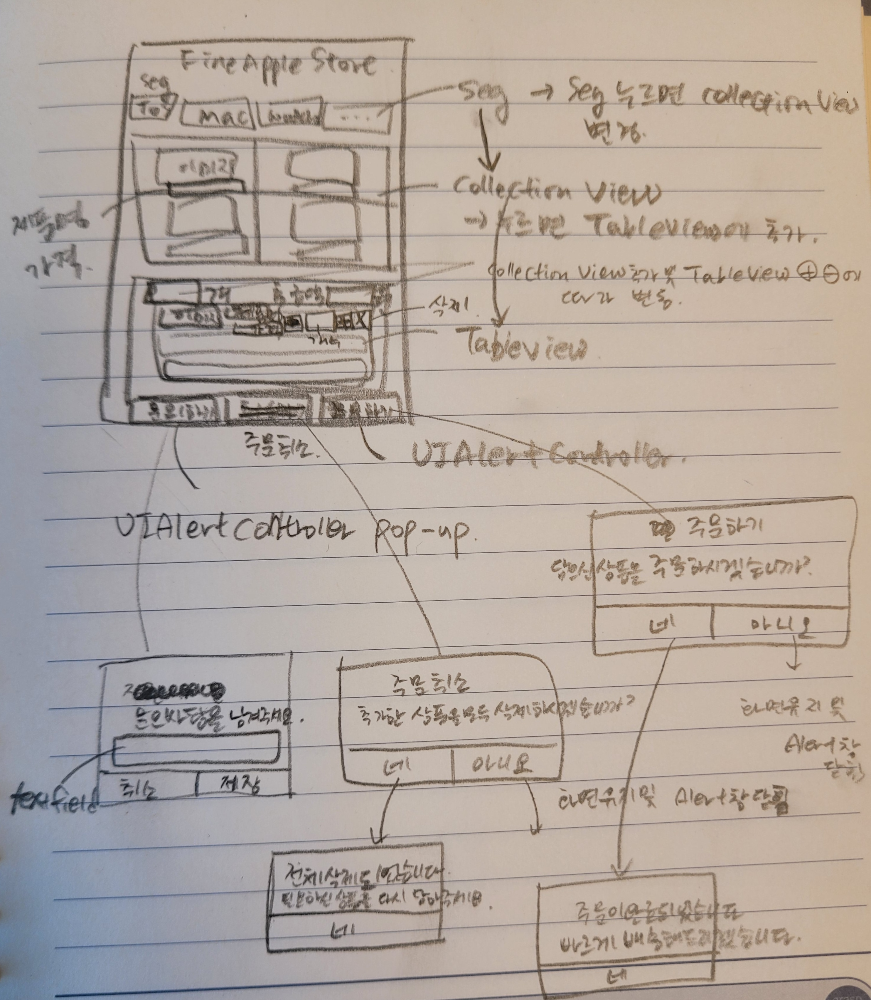

 

# 최종 결과물 
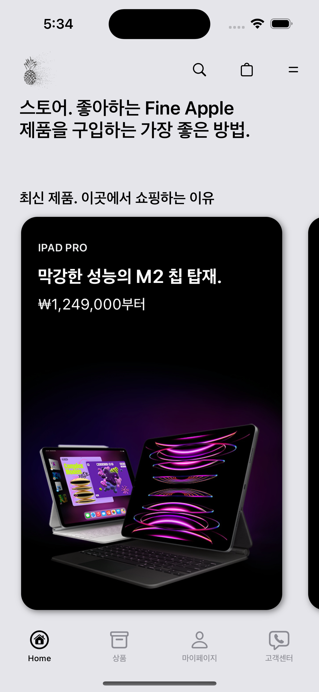
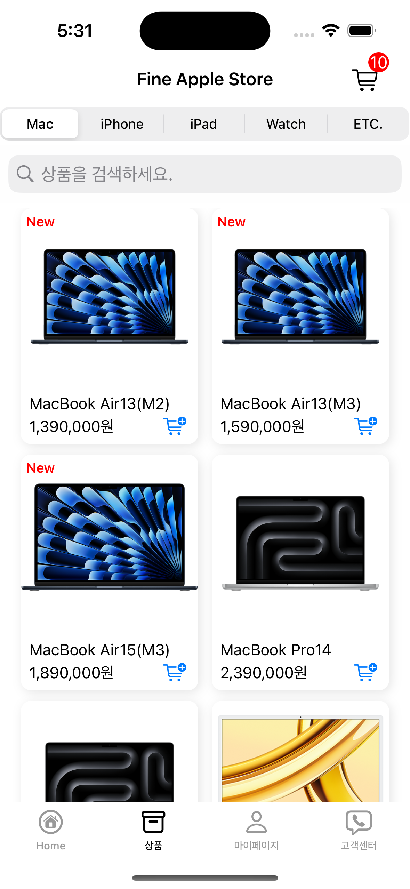
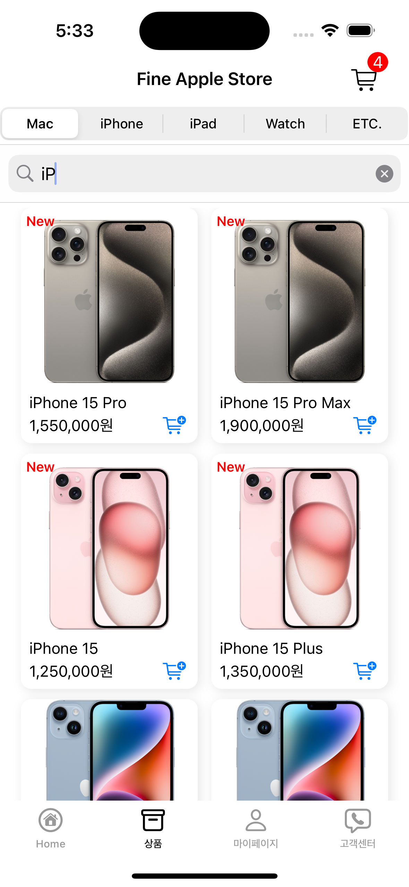
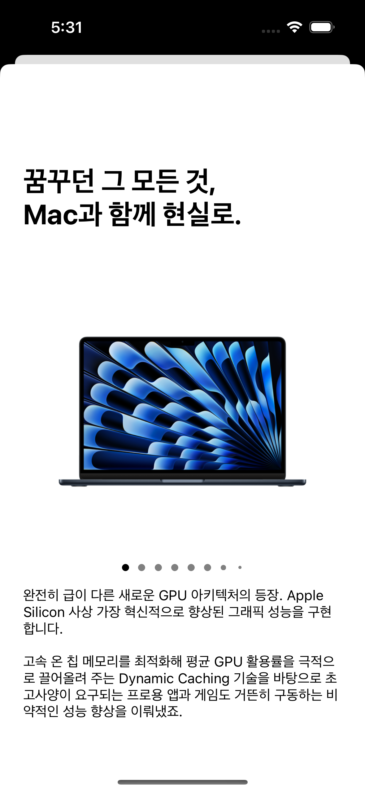
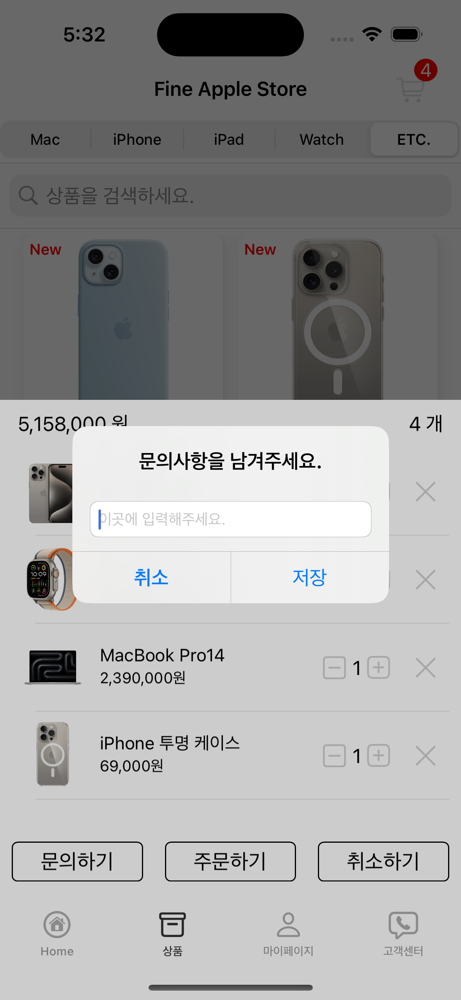
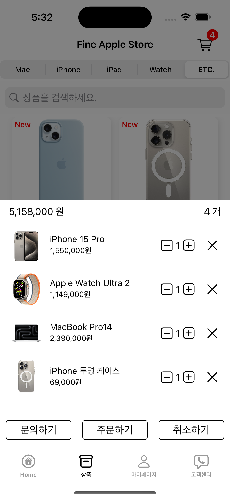

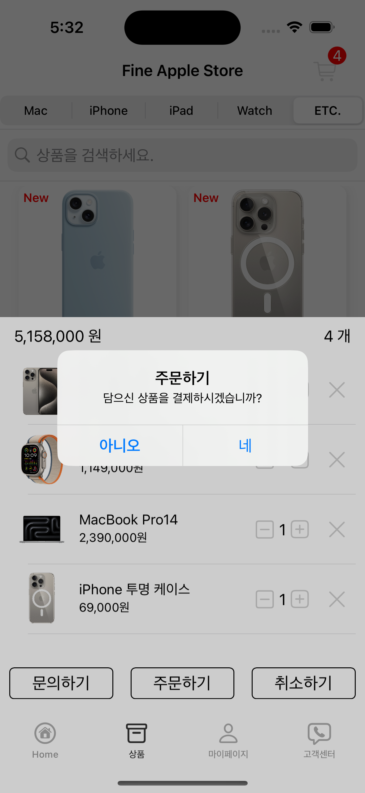
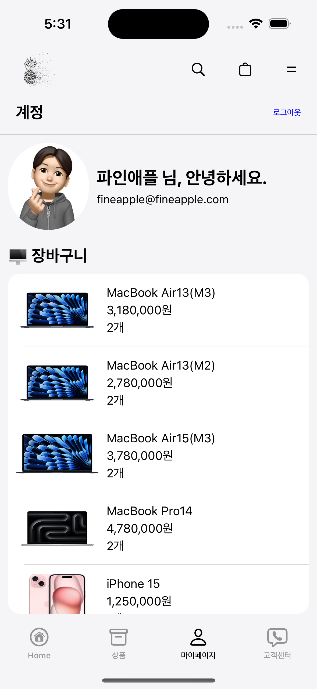
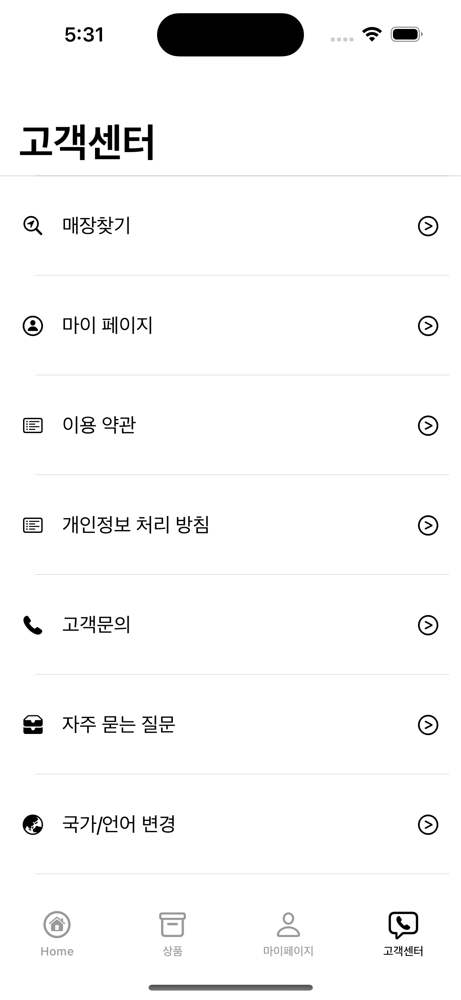
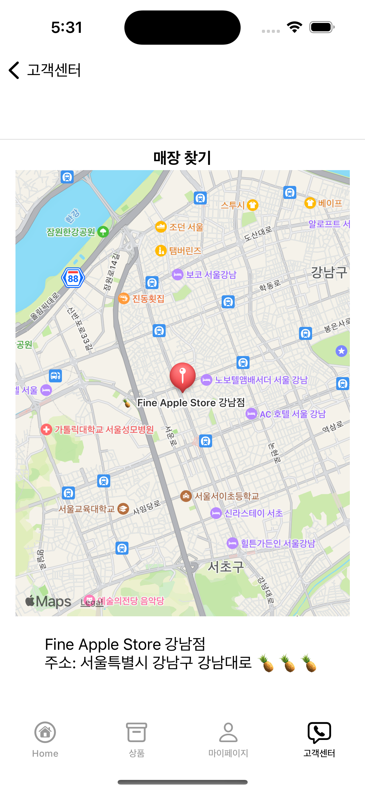

# 시연 영상 

<video width="640" height="360" controls>
    <source src="../../assets/video/categories/sparta/2024-04-09-firstTeamProject.mp4" type="video/mp4">
</video>
