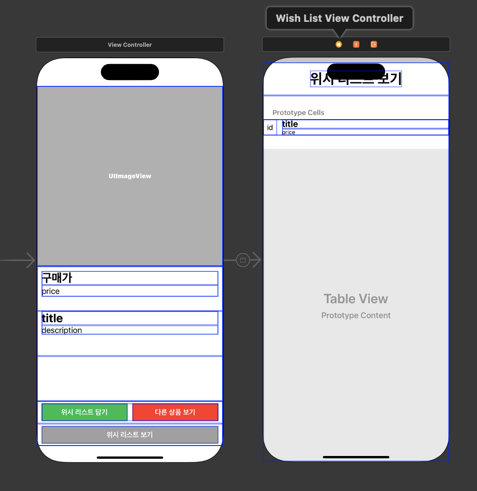
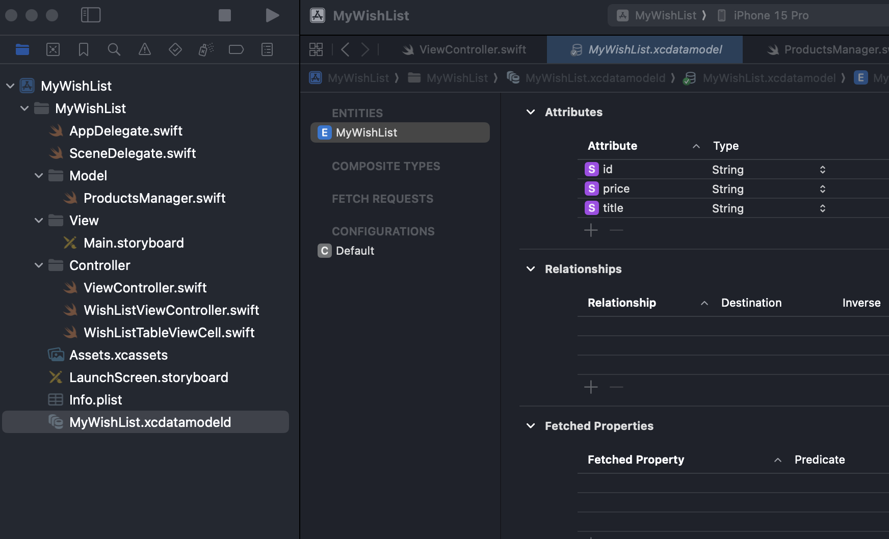
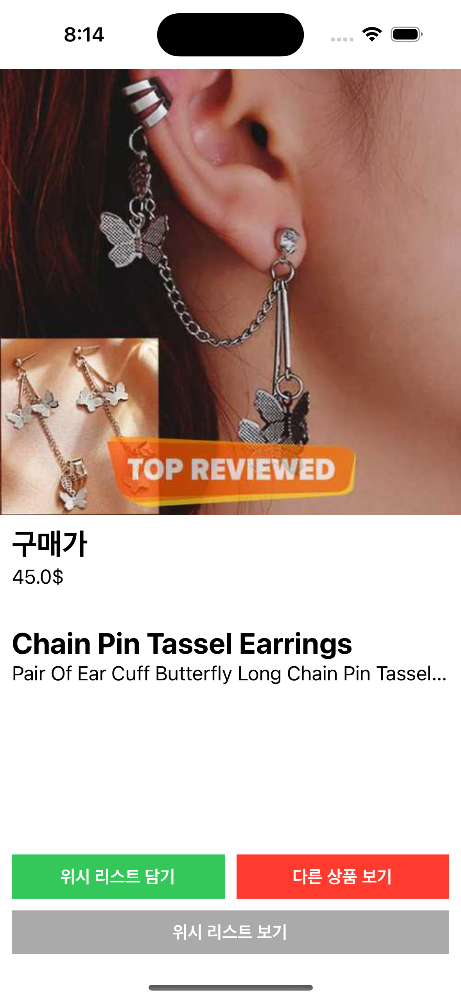
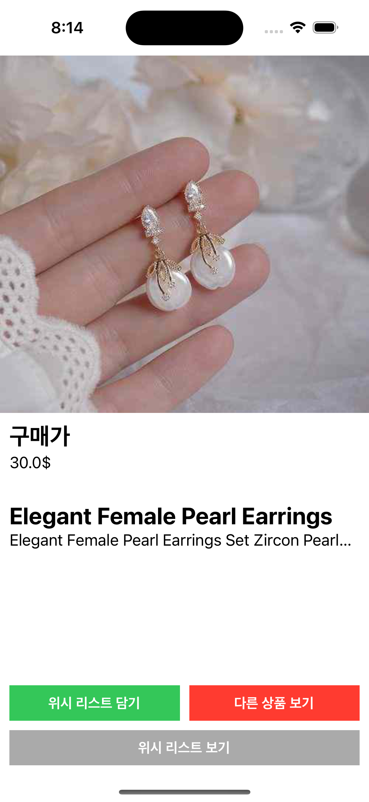
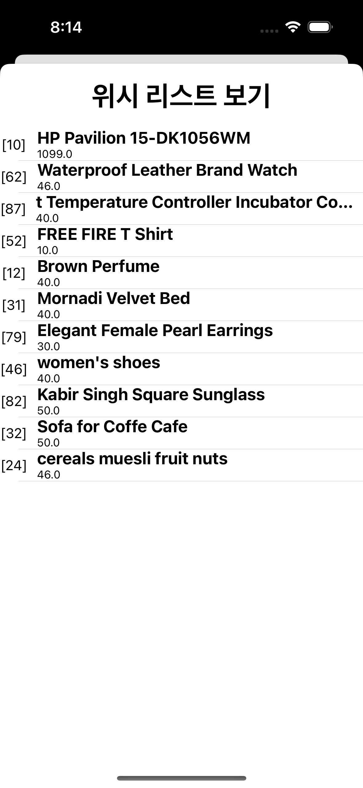

# WishList 앱 만들기 
- 네트워크 통신과 내부 저장소를 사용하여 WishList 앱 만들기입니다. 

<br>

# 과제 요구사항 
- 필수과제 
    - Lv1. 데이터 모델링하기 
    - Lv2. 위시 리스트 메인 페이지 구현
    - Lv3. “위시 리스트 보기” 페이지 구현
- 선택과제 
    - Lv4. TableView에서 스와이프하여 삭제기능 구현
    - Lv5. UIRefreshControl을 사용한 새로고침 구현  

<br>

# 스토리보드를 사용해서 시작 
- 코드베이스로 시작했다가 버튼 위치 조절하고 이것 저것 하다보니 개발 속도가 더뎌 스토리보드로 바꿔서 새로 시작했습니다. ㅠ 

<br>

# 기능 구현 
## 1. 스토리보드에 UI 구성하기 
- 확실히 코드로 하나씩 하는것보다 빠릅니다. ㅠ ㅠ 



## 2. Data 가져오기 
- dummyjson 사이트에서 랜덤하게 데이터를 받아옵니다. 
- 원래 주석처리된 부분처럼 사용했는데 경고 메시지가 많이 발생해서 튜터님 가이드에 따라 속성감시자로 수정했습니다.  

### getData()
```swift 
func getData() {
    let productID: Int = Int.random(in: 1...100)

    if let url = URL(string: "https://dummyjson.com/products/\(productID)") {
        print("url: \(url)")
        //URLSessionDataTask를 사용하여 비동기적으로 데이터 요청
        let task = URLSession.shared.dataTask(with: url) { (data, response, error) in
            if let error = error {
                print("Error: \(error)")
            } else if let data = data {
                do {
                    let product = try JSONDecoder().decode(ProductsManager.self, from: data)
            
                    self.currentProduct = product   //데이터 설정 

//                        DispatchQueue.main.async {
//                            self.productPriceLabel.text = String(product.price)
//                            self.productTitleLabel.text = product.title
//                            self.productDescriptionLabel.text = product.description
//                            
//                        }
//                        DispatchQueue.main.async {
//                            //이미지 URL 가져오기
//                            if let productUrlString = product.thumbnail as? String,
//                               let productImageUrl = URL(string: productUrlString) {
//                                // 이미지 데이터를 다운로드하여 이미지 뷰에 표시
//                                if let imageData = try? Data(contentsOf: productImageUrl) {
//                                    //DispatchQueue.main.async {
//                                    self.productImageView.image = UIImage(data: imageData)
//                                    //}
//                                }
//                            }
//                        }
                } catch {
                    print("Decode Error: \(error)")
                }
            }
        }
        task.resume()
    }
}
```

<br>

### 속성감시자 설정 
```swift 
private var currentProduct: ProductsManager? = nil {
    didSet {
        //currentProduct가 nil이 아닌지 확인하고 종료하기 
        guard let currentProduct = self.currentProduct else { return }
        
        //메인 스레드에서 UI 업데이트를 수행
        DispatchQueue.main.async {
            self.productImageView.image = nil
            self.productTitleLabel.text = currentProduct.title
            self.productDescriptionLabel.text = currentProduct.description
            self.productPriceLabel.text = "\(currentProduct.price)$"
        }
        
        // 백그라운드 스레드에서 제품의 섬네일 이미지를 비동기적으로 가져오기 
        DispatchQueue.global().async { [weak self] in
            // 제품의 섬네일 이미지 데이터를 가져와 UIImage로 변환
            if let data = try? Data(contentsOf: currentProduct.thumbnail), let image = UIImage(data: data) {
                // 가져온 이미지를 메인 스레드에서 productImageView에 설정하여 이미지 출력 
                DispatchQueue.main.async { self?.productImageView.image = image }
            }
        }
    }
}
```

## 3. CoreData 저장하기 
- coredata 설정이 데이터베이스 테이블을 만들고 컬럼을 추가하는 것과 비슷한 것 같다. 

### Entities 추가 및 Attributes 추가 


### AppDelegate.swift 파일 수정 
- 처음 프로젝트 만들때 코어데이터를 추가하고 만들면 자동으로 코드가 추가됩니다. 
- import CoreData, persistentContainer 메서드, saveContext 메서드를 추가합니다. 
- core Data를 나중에 추가하는 경우 파일 추가에서 Data Model로 생성하면 됩니다.  

```swift 
import UIKit
import CoreData //필수 

@main
class AppDelegate: UIResponder, UIApplicationDelegate {
    //중간코드 생략 

    // MARK: - Core Data stack
    lazy var persistentContainer: NSPersistentContainer = {
        let container = NSPersistentContainer(name: "MyWishList")   //core data 이름 
        container.loadPersistentStores(completionHandler: { (storeDescription, error) in
            if let error = error as NSError? {
                fatalError("Unresolved error \(error), \(error.userInfo)")
            }
        })
        return container
    }()

    // MARK: - Core Data Saving support
    func saveContext () {
        let context = persistentContainer.viewContext
        if context.hasChanges {
            do {
                try context.save()
            } catch {
                let nserror = error as NSError
                fatalError("Unresolved error \(nserror), \(nserror.userInfo)")
            }
        }
    }
}
```

<br>

### viewController 수정
```swift 
import CoreData //필수 

class ViewController: UIViewController {
    //UIApplication의 shared 인스턴스를 통해 AppDelegate에 접근하고 persistentContainer 속성 반환
    var persistentContainer: NSPersistentContainer? {
        (UIApplication.shared.delegate as? AppDelegate)?.persistentContainer
    }
}
```
### 위시리스트 담기 버튼 수정 
- alert를 사용하여 입력 확인, 중복 데이터인 경우 알림창을 띄우도록 하였습니다. 

```swift 
    // MARK: - 위시 리스트 담기 버튼 선택
    @IBAction func addToWishListButtonTapped(_ sender: UIButton) {
        guard let product = self.currentProduct else { return }
        
        // 위시리스트 담기 전 중복 확인
        if checkId(String(product.id)) {
            let alertController = UIAlertController(title: "중복 확인", message: "이미 위시 리스트에 포함되어 있습니다.", preferredStyle: .alert)
            let cancel = UIAlertAction(title: "확인", style: .cancel, handler: { _ in return })
            
            alertController.addAction(cancel)
            present(alertController, animated: true, completion: nil)
        } else {
            //코어데이터에 저장
            guard let context = self.persistentContainer?.viewContext else { return }
            let myWishList = MyWishList(context: context)
            
            myWishList.id = String(product.id)
            myWishList.title = product.title
            myWishList.price = String(product.price)
            //저장
            try? context.save()
            
            let alertController = UIAlertController(title: "위시 리스트 담기", message: "해당 상품을 위시 리스트에 담았습니다.", preferredStyle: .alert)
            let addToWishList = UIAlertAction(title: "확인", style: .default, handler: { _ in return })
            
            alertController.addAction(addToWishList)
            present(alertController, animated: true, completion: nil)
        }
    }
```

### 중복 ID 체크
```swift
   // MARK: - 중복 ID 체크
    func checkId(_ id: String) -> Bool {
        //true 중복, false 중복아님
        guard let context = self.persistentContainer?.viewContext else { return true }
        let request = MyWishList.fetchRequest()
        guard let myWishList = try? context.fetch(request) else { return true }
        
        if myWishList.filter({ $0.id == id}).count != 0 {
            //중복
            return true
        } else {
            //중복 아님
            return false
        }
    }
```

<br>

## 4. 다른 상품 보기 
```swift
    // MARK: - 다른 상품 보기 버튼 선택
    @IBAction func otherProductButtonTapped(_ sender: UIButton) {
        self.getData()
    }
```

## 5. 위시리스트보기 
- viewController와 별개로 WishListViewController파일을 추가하였습니다. 

```swift 
import CoreData

class WishListViewController: UIViewController {
    // MARK: - 코어데이터를 사용하기 위한 설정
    var persistentContainer: NSPersistentContainer? {
        (UIApplication.shared.delegate as? AppDelegate)?.persistentContainer
    }
    var productList: [MyWishList] = []  //코어데이터를 가져와 배열에 담기 
    
    @IBOutlet weak var wishListTableView: UITableView!
    
    override func viewDidLoad() {
        super.viewDidLoad()
        wishListTableView.dataSource = self //데이터소스 설정 
                
        getCoreData()   //데이터가져오기 
    }
    //나머지 코드 생략 
}
```

<br>

### 코어데이터 가져오기 
```swift
    // MARK: - CoreData에서 데이터 가져오기
    func getCoreData() {
        guard let context = self.persistentContainer?.viewContext else { return }
    
        let request = MyWishList.fetchRequest()
    
        if let products = try? context.fetch(request) {
            self.productList = products
        }
    }
```

### tableView Data Source 추가 
``` swift 
extension WishListViewController: UITableViewDataSource {
    func tableView(_ tableView: UITableView, numberOfRowsInSection section: Int) -> Int {
        return productList.count
    }
    
    func tableView(_ tableView: UITableView, cellForRowAt indexPath: IndexPath) -> UITableViewCell {
        let cell = tableView.dequeueReusableCell(withIdentifier: "WishListTableViewCell", for: indexPath) as? WishListTableViewCell
                
        let id = "[" + (productList[indexPath.row].id ?? "") + "]"
        let title = productList[indexPath.row].title
        let price = productList[indexPath.row].price
        
        cell?.productIdLabel.text = id
        cell?.productTitleLabel.text = title
        cell?.productPriceLabel.text = price
        
        return cell ?? UITableViewCell()
    }
}
```

# 실행화면 
- 메인화면, 다른상품보기, 위시리스트 확인 화면입니다. 





<br>

# 실행영상
<video width="640" height="360" controls>
    <source src="../../assets/video/categories/sparta/2024-04-16-wishList1.mov" type="video/mp4">
</video>  

<br>

# 마무리
- 가격에 , 추가해야하는데 빼먹어버렸다. 내일 다시 추가할 예정
- 필수 과제까지는 완료했는데 선택과제도 내일 다시 구현 에정 
- ⭐️⭐️ 데이터가져오기 및 코어데이터 사용은 강의 예제와 동일해서 많이 사용해보고 익숙해져야겠다. ⭐️⭐️
