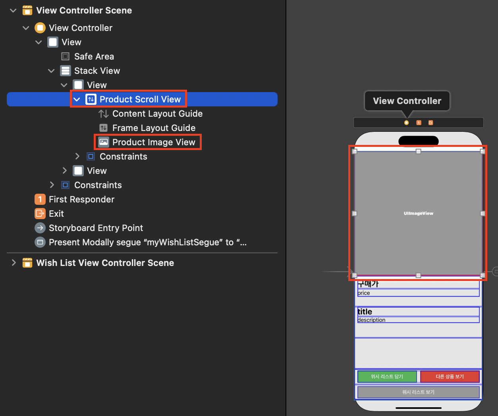

# WishList 앱 만들기 
- 지난 포스팅 
    - [WishList 앱 만들기 - 1](https://limlogging.github.io/sparta/wishList1/){:target="_blank"}
    - [WishList 앱 만들기 - 2](https://limlogging.github.io/sparta/wishList2/){:target="_blank"} 

<br>

# 과제 제출 후 피드백 
- 과제 제출 이후에 피드백을 받아 수정하였습니다. 
    1. 가격이 1000달러가 넘어가면 1,000 이런식으로 표현해주시면 좋을거 같아요.
    2. Product에서 Codable를 채택하고 있는데 Encode 하는 코드가 없으니 Decodable을 채택하는것도 좋을거 같아요.
    3. 코드를 보았을 때 엄청 잘 작성해주셔서 Lv5까지 도전해보시는것도 좋을거 같아요! 

# 1. 가격이 1000달러가 넘어가면 1,000 이런식으로 표현해주시면 좋을거 같아요.
- formatter를 사용해서 자리수 표시를하고 임의로 환율을 정하여 원화도 보여주도록 했습니다. 

## ViewController 

```swift 
let formatter = NumberFormatter()
formatter.numberStyle = .decimal
let dollarPriceText = "$ " + (formatter.string(from: product.price as NSNumber) ?? "")
let wonPriceText = "￦ " + (formatter.string(from: product.price * 1400 as NSNumber) ?? "")

self.productPriceLabel.text = "\(dollarPriceText) (\(wonPriceText))"
```

## WishListViewController 

```swift 
if let productPrice = Double(productList[indexPath.row].price ?? "0.0") {
    let formatter = NumberFormatter()
    formatter.numberStyle = .decimal
    let dollarPriceText = "$ " + (formatter.string(from: productPrice as NSNumber) ?? "")
    let wonPriceText = "￦ " + (formatter.string(from: productPrice * 1400 as NSNumber) ?? "")
    cell?.productPriceLabel.text = "\(dollarPriceText) (\(wonPriceText))"
}
```

# 2. Product에서 Codable를 채택하고 있는데 Encode 하는 코드가 없으니 Decodable을 채택하는것도 좋을거 같아요.
## 수정 전 

```swift 
import Foundation

struct Product: Codable {
    var id: Int
    var title: String
    var description: String
    var price: Double
    var discountPercentage: Double
    var rating: Double
    var stock: Int
    var brand: String
    var category: String
    var thumbnail: String
    var images: [String]
}
```

## 수정 후 

```swift 
import Foundation

struct Product: Decodable {
    var id: Int
    var title: String
    var description: String
    var price: Double
    var discountPercentage: Double
    var rating: Double
    var stock: Int
    var brand: String
    var category: String
    var thumbnail: String
    var images: [String]
}
```

<br>

# 3. 코드를 보았을 때 엄청 잘 작성해주셔서 Lv5까지 도전해보시는것도 좋을거 같아요! 
- 좋은 말씀을 해 주셔서 5단계까지 도전했습니다. 

## 레벨4. 위시리스트 보기에서 테이블뷰 스와이프해서 row 삭제하기 

```swift
// MARK: - 삭제 기능
func tableView(_ tableView: UITableView, commit editingStyle: UITableViewCell.EditingStyle, forRowAt indexPath: IndexPath) {
    if editingStyle == .delete {
        guard let context = self.persistentContainer?.viewContext else { return }
        
        let request = MyWishList.fetchRequest()
        guard let products = try? context.fetch(request) else { return }
        
        // 선택한 특정 인덱스의 객체를 가져옴
        let productToDelete = products[indexPath.row]
        
        context.delete(productToDelete)
        
        // 변경 사항 저장
        try? context.save()
        
        //CoreData에서 데이터 가져오기
        getCoreData()
        //테이블뷰리로드
        wishListTableView.reloadData()
    }
}
```

<br>

## 레벨5. 메인화면에서 화면을 아래로 내리면 새로고침 창이 뜨면서 다른상품으로 변경하기 
### 이미지 뷰 위에 스크롤 뷰 추가하기



### UIRefreshControl 추가하기 
```swift 
// MARK: - 위시리스트 보기
override func viewDidLoad() {
    super.viewDidLoad()
    
    self.getData(completionHandler: { product in
        self.currentProduct = product
    })
    
    self.productScrollView.refreshControl = UIRefreshControl()
    self.productScrollView.refreshControl?.addTarget(self, action: #selector(refresh), for: .valueChanged)
}

//새로고침 추가 
@objc func refresh() {
    self.getData { product in
        self.currentProduct = product
        DispatchQueue.main.async {
            self.productScrollView.refreshControl?.endRefreshing()
        }
    }
}
```

# 마무리
- 시간이 갈수록 잘하는 사람과의 격차가 벌어지는 것 같아 살짝 조급한 마음이 있었지만 신경쓰지 않고 하나씩 하나씩 해봐야겠다. 
