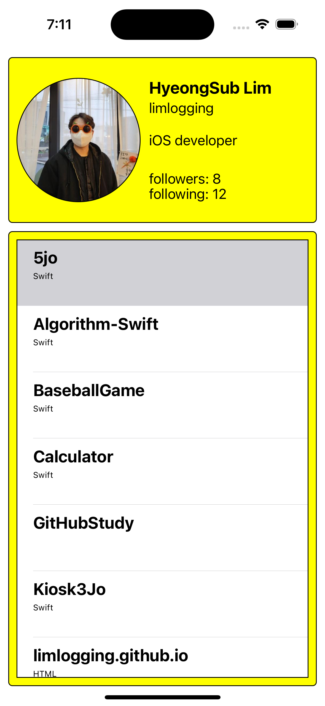

# 깃허브 앱 만들기 개선해보기 
- 이번 주차에 네트워크 작업과 관련해서 배웠습니다. 나중에 보니 구글 검색으로 알라모파이어로 어거지로 불러와서 구현은 됐는데 구조체에 Struct를 사용하지 않고 옛날 방식으로 데이터를 불러왔다는 것을 알았습니다. 
- 배운 내용을 바탕으로 다시 개선해 보았습니다. 

<br>

# 1차 제출 보기 
- [1차 제출 바로가기](https://limlogging.github.io/sparta/%EC%B1%8C%EB%A6%B0%EC%A7%80%EB%B0%98%EA%B3%BC%EC%A0%9C1-1/){:target="_blank"} 

<br>

# 튜터님 피드백 
1. Model에 있는 struct 2개에 Decodable을 적용해주세요.
2. API에서 받아온 데이터를 Decoding 하여 객체로 만들어주세요.
3. (responseJSON 대신 responseData 같은거를 사용하시면 됩니다)
4. Pull to refresh는 모든 데이터를 다시 받아와서 테이블뷰를 그려주세요.
5. 페이징처리를 해주세요.
6. as! TableViewCell 대신 옵셔널 바인딩을 사용해주세요.

## 1. Model에 있는 struct 2개에 Decodable을 적용해주세요. 
### 수정 전 
#### GithubProfile 
```swift 
import Foundation

// GitHub 프로필 정보를 저장할 구조체
struct GithubProfile {
    //var myImage: UIImage?
    var myImage: URL        //프로필 사진
    var name: String        //이름
    var login: String       //깃허브 ID
    var followers: Int      //팔로워
    var following: Int      //팔로잉
    var repoCnt: Int        //리포지토리 개수 
}
```

#### GithubRepositories
```swift 
import Foundation

// 리포지토리 정보를 저장할 구조체
struct GithubRepositories {
    var name: String            //리포지토리 이름
    var htmlUrl: String         //리포지토리 주소
    var description: String     //리포지토리 설명
    var language: String        //언어 
}
```

### 수정 후
- Decodable을 추가하였습니다. 

#### GithubProfile 
```swift 
import Foundation

// GitHub 프로필 정보를 저장할 구조체
struct GithubProfile: Decodable {
    var login: String       //깃허브 ID
    var name: String           //이름
    var bio: String         //bio
    var avatarUrl: URL      //프로필 사진
    var followers: Int      //팔로워
    var following: Int      //팔로잉
    
    enum CodingKeys: String, CodingKey {
        case login
        case name
        case bio
        case followers
        case following
        case avatarUrl = "avatar_url"
    }
}
```

#### GithubRepositories
```swift 
import Foundation

// 리포지토리 정보를 저장할 구조체
struct GithubRepositories: Decodable {
    var name: String             //리포지토리 이름
    var language: String?        //언어
}
```

<br>

## 2, 3번 API에서 받아온 데이터를 Decoding 하여 객체로 만들어주세요. / responseData 사용
### 수정 전
#### 깃허브에서 프로필 정보 가져오기
```swift 
// MARK: - 깃허브에서 프로필 정보 가져오기
func getGithubProfile() {
    AF.request(profileUrl).responseJSON { response in
        switch response.result {
        case.success(let value):
            if let json = value as? [String: Any],
                let name = json["name"] as? String,
                let login = json["login"] as? String,
                let followers = json["followers"] as? Int,
                let following = json["following"] as? Int,
                let repoCnt = json["public_repos"] as? Int,
                let avatarURLString = json["avatar_url"] as? String,
                let avatarURL = URL(string: avatarURLString) {
                
                let profile = GithubProfile(myImage: avatarURL, name: name, login: login, followers: followers, following: following, repoCnt: repoCnt)
                
                self.showProfileInfo(profile)                    
            }
        case .failure(let error):
            print("error: \(error)")
        }
    }
}

// 구조체에서 데이터를 가져와 label 및 imageView에 보여주는 함수
func showProfileInfo(_ profile: GithubProfile) {
    //SDWebImage를 사용하여 프로필 이미지 다운로드 및 출력
    profileImageView.sd_setImage(with: profile.myImage, placeholderImage: nil, options: [], completed: nil)
    
    profileName.text = profile.name     // 이름 출력
    profileLogin.text = profile.login   // 로그인 출력
    profileFollowers.text = "Followers: \(String(profile.followers))"   //followers
    profileFollowing.text = "Following: \(String(profile.following))"   //following
    
    self.repoCnt = profile.repoCnt
    repositoriesTableView.reloadData()  //최초 실행하면 numberOfRowsInSection를 먼저 실행하고 깃허브 데이터를 받아와서 row 수가 0임, row수를 깃허브 repo수 만큼 보이도록 새로고침 추가
}
```
#### 깃허브에서 리포지토리 정보 가져오기
```swift 
// MARK: - 깃허브에서 리포지토리 정보 가져오기
func getGithubRepositories() {
    AF.request(repositoriesUrl).responseJSON { response in
        switch response.result {
        case.success(let value):
            if let repositories = value as? [[String: Any]] {
                for repo in repositories {
                    if let name = repo["name"] as? String,
                        let htmlUrl = repo["html_url"] as? String {
                            //description, language는 없거나 Null 값이 있어서 닐 코얼레싱 추가
                            let description = repo["description"] as? String ?? ""
                            let language = repo["language"] as? String ?? ""
                            
                            //배열에 저장
                            self.repoArr.append(GithubRepositories(name: name, htmlUrl: htmlUrl, description: description, language: language))
                    }
                }
            }
        case .failure(let error):
            print("에러: \(error)")
        }
    }
}
```

### 수정 후 
#### 네트워크 작업을 전담할 파일 생성 
- NetworkManager.swift 생성 

```swift 
import Foundation
import Alamofire

final class NetworkManager {
    let url = "https://api.github.com/users/"
    
    // MARK: - URLSession으로 깃허브 프로필 가져오기
    func fetchUserProfile(userName: String, completionHandler: @escaping (Result<GithubProfile, Error>) -> Void) {
        //1. url 구조체 생성
        guard let url = URL(string: "\(self.url)\(userName)") else {
            completionHandler(.failure(NSError(domain: "url 변환에 실패했어요.", code: 401)))
            return
        }
        
        //2. request 설정
        var request = URLRequest(url: url)
        request.httpMethod = "GET"
        
        //3. 작업 만들기
        let task = URLSession.shared.dataTask(with: request) { data, response, error in
            if let error {
                completionHandler(.failure(error))
                return
            }
            guard let data else {
                completionHandler(.failure(NSError(domain: "Data가 없습니다.", code: 402)))
                return
            }
            do {
                let profile = try JSONDecoder().decode(GithubProfile.self, from: data)
                //콜백함수로 데이터 전달
                completionHandler(.success(profile))
            } catch {
                completionHandler(.failure(error))
            }
        }
        //4. 작업시작
        task.resume()
    }
    
    // MARK: - 알라모파이어로 리포지토리 정보 가져오기
    func fetchUserRepositories(userName: String, page: Int, completionHandler: @escaping (Result<[GithubRepositories], Error>) -> Void) {
        let url = "\(self.url)\(userName)/repos?page=\(page)"
        
        AF.request(url).responseDecodable(of: [GithubRepositories].self) { response in
            switch response.result {
            case .success(let repositories):
                completionHandler(.success(repositories))
            case .failure(let error):
                completionHandler(.failure(error))
            }
        }
    }
}
```
#### 깃허브에서 프로필 및 리포지토리 정보 가져오기
```swift 
// MARK: - 깃허브 프로필 가져오기, 강한 순환 참조를 피하기 위해서 [weak self] 사용
networkManager.fetchUserProfile(userName: userName) { [weak self] result in
    switch result {
    case .success(let githubProfile):
        self?.profile = githubProfile
        
        DispatchQueue.main.async {
            self?.profileName.text = githubProfile.name                             //이름
            self?.profileLogin.text = githubProfile.login                           //ID
            self?.profileBio.text = githubProfile.bio                               //BIO
            self?.profileFollowers.text = "followers: \(githubProfile.followers)"   //follwers
            self?.profileFollowing.text = "following: \(githubProfile.following)"   //follwing
            self?.profileImageView.kf.setImage(with: githubProfile.avatarUrl)       //프로필사진
            
            self?.view.setNeedsDisplay()
        }
    case .failure(let error):
        print(error.localizedDescription)
    }
}

// MARK: - 깃허브 리포지토리 가져오기, 강한 순환 참조를 피하기 위해서 [weak self] 사용
networkManager.fetchUserRepositories(userName: userName, page: self.page) { [weak self] result in
    switch result {
    case .success(let repositories):
        self?.repositories = repositories
        DispatchQueue.main.async {
            self?.repositoriesTableView.refreshControl?.endRefreshing() //새로고침 끝내기
            self?.repositoriesTableView.reloadData()
        }
    case .failure(let error):
        print(error.localizedDescription)
    }
}
```

<br>

## 4. Pull to refresh는 모든 데이터를 다시 받아와서 테이블뷰를 그려주세요.
### 수정 전 
``` swift
    // MARK: - viewDidLoad()
    override func viewDidLoad() {
        super.viewDidLoad()

        // 다른 코드 생략 

        //Pull to refresh 추가
        tableViewRefresh()
    }
    
    // MARK: - Pull to refresh 컨트롤 추가
    func tableViewRefresh() {
        let refreshControl = UIRefreshControl()
        refreshControl.attributedTitle = NSAttributedString(string: "새로고침")
        refreshControl.addTarget(self, action: #selector(refreshData), for: .valueChanged)
        repositoriesTableView.refreshControl = refreshControl
    }
    
    // MARK: - pull to refresh 메서드
    @objc func refreshData() {
        DispatchQueue.main.asyncAfter(deadline: .now() + 1.0) {
            // 테이블 뷰 리로드
            self.repositoriesTableView.reloadData()
            // UIRefreshControl 종료
            self.repositoriesTableView.refreshControl?.endRefreshing()
        }
    }
```

### 수정 후 
- 기존 테이블 뷰 리로드에서 네트워크를 통해 새로 받아오도록 수정 
``` swift
    // MARK: - 테이블뷰 설정
    func configureTableView() {
        //다른 코드 생략 

        let refreshControl = UIRefreshControl()
        refreshControl.attributedTitle = NSAttributedString(string: "새로고침")
        refreshControl.addTarget(self, action: #selector(refreshData), for: .valueChanged)
        repositoriesTableView.refreshControl = refreshControl
    }
    
    // MARK: - pull to refresh 메서드
    @objc func refreshData() {
        configureData() // 2,3 번 부분을 함수로 만들어 불러오기 
    }
```

## 5. 페이징처리를 해주세요.
- 1차 제출때는 구현하지 못한 부분입니다. 

### TableViewDelegate에 willDisplay 함수 추가 
```swift 
extension ViewController: UITableViewDelegate {
    //특정 셀이 화면에 나타나기 전에 실행 (셀이 화면에 나타나기 전에 수행되어야 하는 작업이 필요할때)
    func tableView(_ tableView: UITableView, willDisplay cell: UITableViewCell, forRowAt indexPath: IndexPath) {
        //셀의 마지막에 도착했을때 데이터 다시 로드
        if indexPath.row == repositories.count - 1 {
            loadMore()
        }
    }
}
```

### leadMore 함수 추가 
```swift
// MARK: - 페이징 처리
func loadMore() {
    if isLoadingLast == true {
        print("마지막 페이지까지 불러왔어요.")
        return
    }
    page += 1
    networkManager.fetchUserRepositories(userName: userName, page: page) { [weak self] result in
        // self에 대한 약한 참조를 만들어 strong reference cycle을 방지합니다.
        guard let self = self else { return } // self가 nil이라면 함수를 종료합니다.
        
        switch result {
        case .success(let repositories):
            
            //api 호출결과가 비어있으면 마지막으로 인식
            if repositories.isEmpty == true {
                self.isLoadingLast = true   //마지막 저장소 로딩
                return
            }
            
            self.repositories = self.repositories + repositories    //기존 배열에 새로 불러온 데이터 추가하기
            //UI 다시 그리기는 메인큐
            DispatchQueue.main.async {
                self.repositoriesTableView.reloadData()
            }
        case .failure(let error):
            print(error.localizedDescription)
        }
    }
}
```

## 6. as! TableViewCell 대신 옵셔널 바인딩을 사용해주세요.
### 수정 전
``` swift
func tableView(_ tableView: UITableView, cellForRowAt indexPath: IndexPath) -> UITableViewCell {
    let cell = tableView.dequeueReusableCell(withIdentifier: "CellId", for: indexPath) as! TableViewCell
    
    //깃허브에서 데이터를 불러오기도 전에 cellForRowAt이 실행되어 추가
    if repoArr.count != 0 {
        cell.nameLabel.text = repoArr[indexPath.row].name
        cell.descriptionLabel.text = repoArr[indexPath.row].description
        cell.languageLabel.text = repoArr[indexPath.row].language
    } else {
        repositoriesTableView.reloadData()
    }
    
    return cell
}
```

### 수정 후 
- guard let 사용 
``` swift
func tableView(_ tableView: UITableView, cellForRowAt indexPath: IndexPath) -> UITableViewCell {
    guard let cell = tableView.dequeueReusableCell(withIdentifier: "CellId", for: indexPath) as? TableViewCell else { return UITableViewCell() }
    
    let repositories = repositories[indexPath.row]
    cell.bind(repositories)
    
    return cell
}
```

# 실행화면 
  

<br>

# 마무리
- 구글에서 검색해서 구현한 이전 1차 제출보다 네트워크 작업 관련해서 한번 공부하고 다시 풀어보니 공부한 내용을 적용하면서 풀어볼 수 있었습니다.  