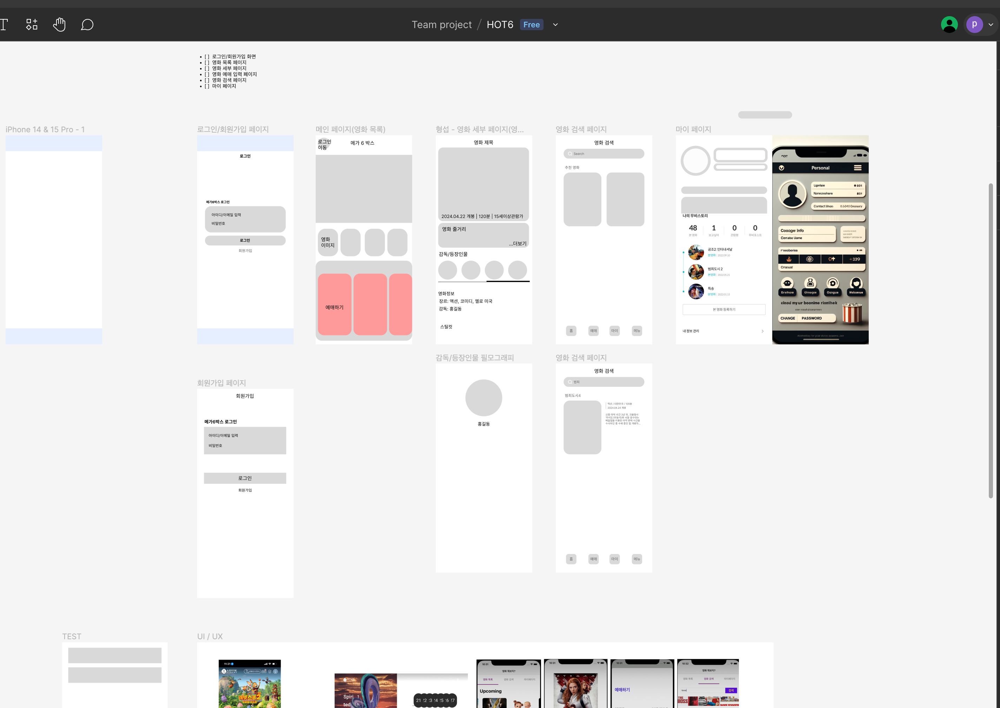
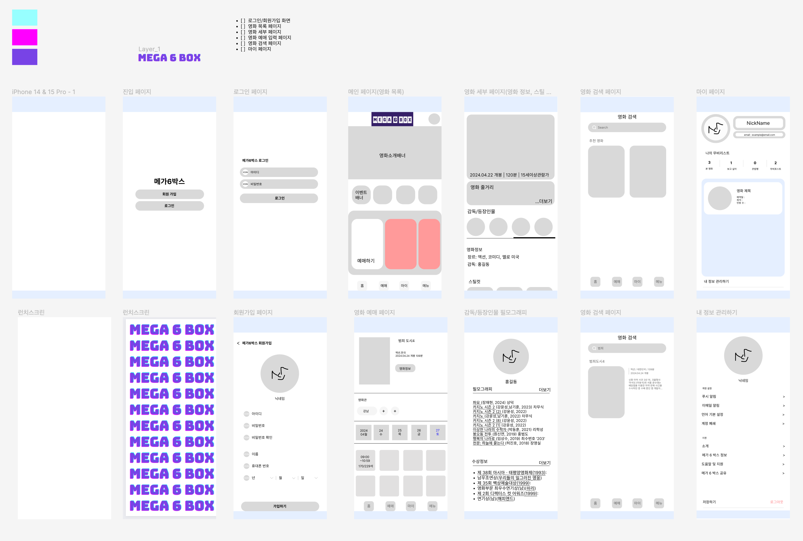
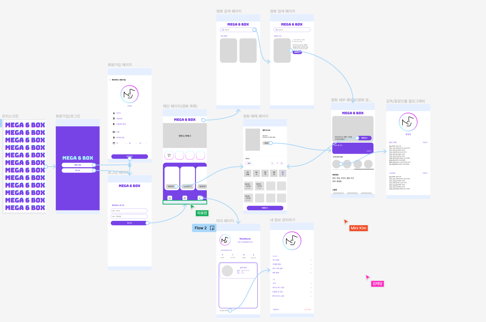
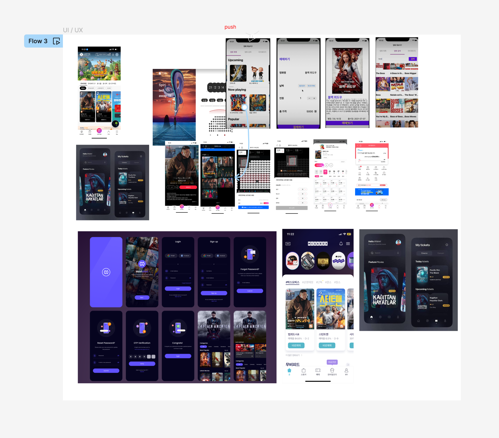
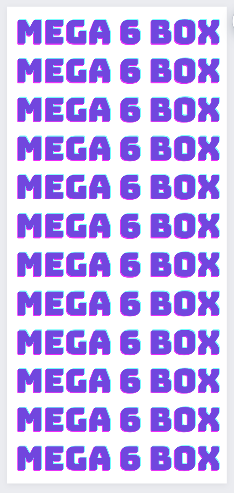
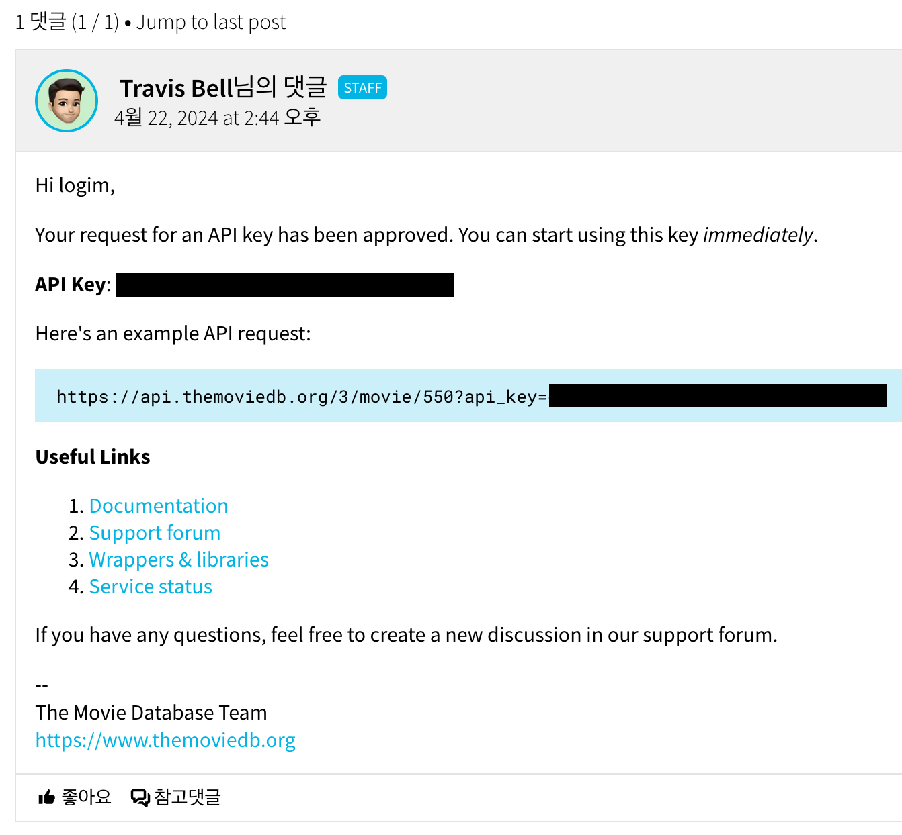
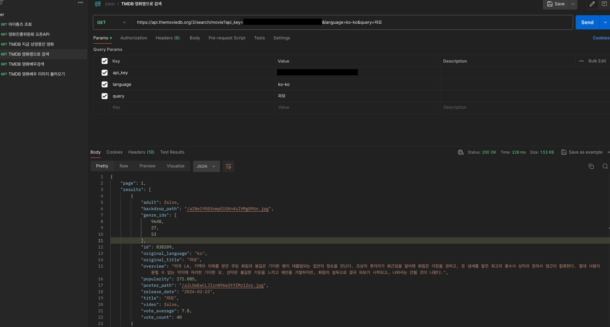

# 영화 예약 앱 만들기 
- 개인 프로젝트인 위시리스트 앱 만들기가 끝나고 팀프로젝트 발제가 있었습니다. 
- 프로젝트 주제는 킥보드 앱 만들기 또는 영화예약 앱 만들기 중 선택할 수 있었고 팀원들의 의견을 모아 영화 예약 앱을 만들기로 하였습니다. 

# 필수 구현 기능 
- 로그인 화면/회원가입 화면
    - 앱에 진입했을 때 로그인을 먼저 진행합니다.
    - 회원가입 버튼을 누르면 아이디와 비밀번호를 입력받아 회원가입을 하고, 완료되면 다시 로그인 화면으로 이동합니다(아이디와 비밀번호 이외에 다른 정보들을 받아도 됩니다).
    - 로그인이 완료되면 UserDefault에 아이디와 비밀번호를 저장해서 이후 로그인할 때 아이디와 비밀번호가 자동으로 입력되어 있도록 합니다.
    - 로그인이 완료되면 상단 TapBar가 있는 화면으로 이동하면 됩니다.
    - 필수 기능 요소
        - `UserDefaults`를 활용하여 아이디와 비밀번호, 기타 정보를 저장해주세요.
- 영화 목록 페이지
    - 상단 **TapBar의 첫번째 화면**입니다.
    - 영화 이미지들은 좌우 스크롤 가능하도록 구현해주세요
    - 필수 기능 요소
        - `UICollectionView`를 활용하여 영화 포스터를 표시해주세요.
        - 사용자가 직접 상호 작용할 수 있는 다양한 기능을 제공해보세요.
- 영화 세부 페이지
    - 영화를 클릭시 영화의 세부 페이지로 이동해주세요
    - 영화의 정보를 함께 페이지에 보여주세요
- 영화 예매 입력 페이지
    - 영화 세부 페이지에서 입력하기 버튼 클릭시 해당 페이지로 이동해주세요
    - 예매를 위해 입력해야 할 것들을 입력 가능하도록 구성해주세요
    - 결제하기 버튼을 누르면 결제 내역이 마이페이지에서 보이도록 해주세요
- 영화 검색 페이지
    - 상단 **TapBar의 두번째 화면**입니다.
    - 검색창에 텍스트를 입력하고 검색 버튼 클릭시 해당 텍스트가 포함된 영화들을 보여주세요
    - `UICollectionView`를 활용하여 영화 포스터를 표시해주세요.
- 마이 페이지
    - 상단 **TapBar의 세번째 화면**입니다.
    - 사용자의 정보와 관련된 기능을 모아서 제공하는 페이지를 자유롭게 만들어보세요.
    - 나의 필요한 계정 정보들을 표시해주세요(회원가입시 받은 정보들 활용)
    - 예매한 영화 내역을 볼 수 있도록 해주세요

# S.A (Starting Assignments) 작성하기 
- 영화예매 및 영화정보 등장인물 필모그래피가 들어간 앱
- 프로젝트 제목
    - 메가 6 박스 = 메가박스와 6조의 합작품
- 프로젝트 설명
    - API를 사용한 영화 예매 앱 구현
    - API를 사용하여 영화 정보 받아오기
    - API를 사용하여 배우 정보 받아오기
    - 코어데이터를 활용한 회원정보 및 영화 예매 정보 확인 구현
    - 영화 정보를 활용한 영화 예매 기능 구현
    - 싱글톤 패턴, 델리게이트 등을 사용한 구현
- 프로젝트 구현 페이지
    - 런치스크린
    - 회원가입/로그인 선택
    - 로그인
    - 회원가입
    - 메인(예매 가능 영화 목록)
    - 영화 예매
    - 영화 세부 정보
    - 감독/등장인물
    - 영화 검색
    - 마이 페이지
    - 내 정보 관리
- 개발기능정리
    - API
    - sync / async
    - URLSession
    - CoreData
    - UICollectionView
    - UITableView
    - Searchbar
    - UIRefreshControl
    - Navigation Bar

# 결과물에 대한 목업(MOCKUP) 그려보기
- 피그마를 사용해본 경험이 있는 팀장님과 팀원들 덕분에 피그마에서 작업을 해볼 수 있었습니다. 
- 쉽게 디자인 할 수 있어 프로젝트 규모가 커져버렸습니다. 
- 와이어 프레임 

- 색상 입히기 및 화면 연결하기 

- 참고 자료 

# 영화 정보를 받아오기 위한 API 사용하기 
- 영화 정보 API 
    - [영화진흥위원회 오픈 API](https://www.kobis.or.kr/kobisopenapi/homepg/main/main.do){:target="_blank"}
    - [The Movie Database(TMDB) API](https://www.themoviedb.org/){:target="_blank"}
    - [한국영화데이터베이스(KMDB) API](https://www.kmdb.or.kr/info/api/apiList?menuIndex=119){:target="_blank"}
- 영화 정보를 가져올 수 있는 곳을 구글검색하여 3가지로 추려서 TMDB를 사용하기로 결정하였습니다. 

# 런치 스크린 이미지 만들기 
- [canva](https://www.canva.com/){:target="_blank"}
- canva에서 런치스크린 이미지를 만들었습니다. 

# TMDB API 키 발급 받기 
- 회원가입 후 KEY 발급 요청하면 즉시 키를 발급해 줍니다. (사용용도 및 개인정보 입력해야합니다.)

# 포스트맨으로 조회해보기
- 필요할 것 같은 API 4개를 찾았습니다. 필요시 더 추가할 예정입니다. 
    - 지금 상영중인 영화 조회 
    - 영화명으로 영화 조회 
    - 영화배우이름으로 배우 조회  
    - 영화배우 이미지 조회  
- 영화 제목으로 파묘를 입력하여 영화 검색하기 

# 내일 할 일 
- 오늘 10시 30분 부터 프로젝트 주제 정하기, 피그마로 디자인 그리기, API 찾아보기, 역할분담으로 시간을 다 써버렸습니다. 
- 내일은 깃허브에 프로젝트를 올리고 본격적으로 프로젝트를 시작해보겠습니다 ! 🔥🔥🔥 