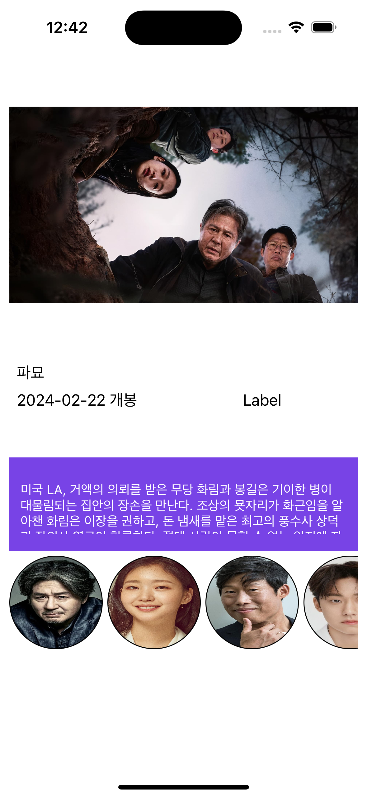

# 영화 예약 앱 만들기 2
- 지난 이야기 
    - [영화 예약 앱 만들기 1](https://limlogging.github.io/sparta/mega6box1/){:target="_blank"} 

# 역할 배분 
- 태담: 런치스크린, 회원가입/로그인
- 유진: 메인페이지, 마이페이지, 내 정보 관리 
- 민희: 예매, 검색
- 형섭: 영화 세부정보, 감독/등장인물 

# 영화 상세 페이지 구현 상황
- 현재까지 구현한 내용입니다. 
- 영화 ID를 가지고 영화 상세 페이지, 출연 배우 2가지 API를 사용해서 조합하여 만들었습니다. 
- 등장인물은 사진의 데이터가 nil이면 보이지 않게 하였고 좌우로 스크롤하여 등장인물을 확인할 수 있습니다. 
- 생각보다 페이지 1개를 구현하는데 너무 오래 걸려서 내용을 먼저 구현하고 디테일은 나중에 신경써야겠습니다. 
- 파묘데이터를 가져왔습니다! 

# 내일 할 일 
- 배우 필모그래피 관련페이지 구현하기 ! 