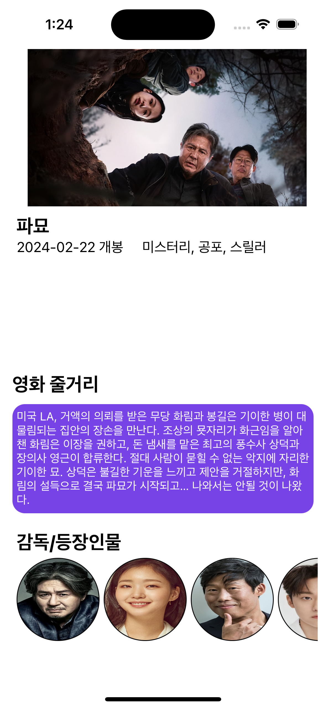
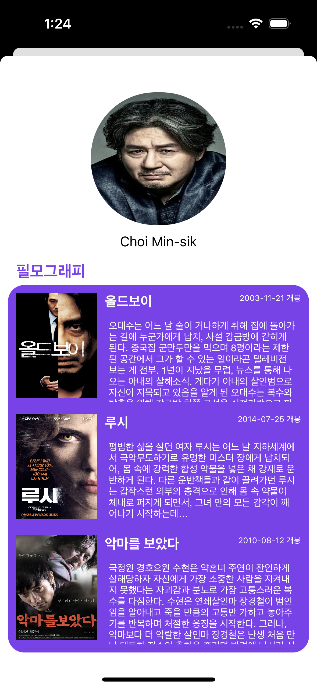

# 영화 예약 앱 만들기 3
- 지난 이야기 
    - [영화 예약 앱 만들기 1](https://limlogging.github.io/sparta/mega6box1/){:target="_blank"} 
    - [영화 예약 앱 만들기 2](https://limlogging.github.io/sparta/mega6box2/){:target="_blank"} 

# 역할 배분 
- 태담: 런치스크린, 회원가입/로그인
- 유진: 메인페이지, 마이페이지, 내 정보 관리 
- 민희: 예매, 검색
- 형섭: 영화 세부정보, 감독/등장인물 

# 영화 상세 페이지 구현 상황
- 현재까지 구현한 내용입니다. 
- 오토레이아웃을 잡아야하는데 하나라도 어긋나는 경우 배우 슬라이드 이미지가 사라져서 신경써서 수정이 필요합니다. ㅠ 
- 배우 얼굴을 선택하면 필모그래피페이지로 넘어갑니다. 

# 배우 필모그래피 페이지 구현 상황 
- 여기 페이지는 코드로만 작성했다. 상세페이지보다는 그나마 수월하게 구현완료 

# 내일 할 일 
- 오토레이아웃 수정 및 디테일 수정 