# 영화 예약 앱 만들기 4
- 지난 이야기 
    - [영화 예약 앱 만들기 1](https://limlogging.github.io/sparta/mega6box1/){:target="_blank"} 
    - [영화 예약 앱 만들기 2](https://limlogging.github.io/sparta/mega6box2/){:target="_blank"}
    - [영화 예약 앱 만들기 3](https://limlogging.github.io/sparta/mega6box3/){:target="_blank"} 

# 목,금,토,일 이야기 
- 목요일 
    - 화요일에 네트워크 작업을 할 네트워크 컨트롤러 파일을 만들고 싱글톤 패턴으로 구현하였다. 각자 맡은 부분을 개발하면서 소스코드를 합치지 않은 상태였고 다들 새벽까지 열심히 하길래 문제 없이 진행되는 줄 알았다. 
    - 하지만 네트워크 컨트롤러 파일 내용을 다른 팀원들이 이해하지 못해서 API를 사용하여 데이터 불러오는 작업이 목요일까지 아무도 하지 못했던 것이다 ㅠ ㅠ (작성된 코드 설명이 필요하다고 하셔서 그때 알게되었다.)
    - 그래서 포스트맨을 사용하여 JSON 데이터를 확인하고 구조체를 생성, 컴플리션 핸들러 동기/비동기에 관련된 내용을 한시간 가량 팀원들에게 설명을하게 되면서 나도 다시 공부할 수 있었다. 
    - 수정한 내용을 깃허브에 올리고 난 후 팀원들에게 공유했는데 2~3시간 후 팀 회의를 통해 어떤 문제(구조체옵셔널) 때문에 로직이 동작을 안했다고 이야기를 하는데 그 내용이 아까 내가 화면을 공유하면서 다 수정한 내용이었고 깃허브에도 올려놓은 내용이었다. (파일이 누락되어 다시 올려놨다고해서 2번 전달)  
    - 아까 다 알려준 내용 깃허브에도 올려놨는데 확인안했냐고 했더니 확인을 안했다고하더라... 조금 당황하고 섭섭했지만 소통에 문제가 있었던 것 같다. 
- 금요일 
    - 영화 정보를 받아오는 부분을 다른 팀원들이 목요일까지 하지 못해서 내가 맡은 부분에서 디테일한 부분은 나중에 하기로하고 다른팀원들을 도와주기로했다. 영화 검색하는 부분에서 어려운 부분이 있다고해서 화면을 공유하면서 라이브 코딩을 하면서 진행했다. (내가 잘해서가 아니라 팀원들이 어떻게 데이터를 받아오는지 궁금하다고 했고 잘 몰라서 구글검색하면서 팀원들과 같이 작업했다.)
    - 영화 검색으로 데이터를 가져오고 컬렉션뷰에 데이터가 들어간것까지 확인하고 디테일한 작업은 담당자가 하기로했다. 
    - 각자 브랜치를 만들고 맡은 내용을 관리하다가 merge 작업을 하면서 충돌이 발생하고 pull 받고 진행해도 Push가 안되는 등 깃허브 사용에 문제가 많았다. (나 포함 다들 깃허브 사용에 미숙했다.) 
    - 팀원들 중 깃허브 데스크탑 사용에 익숙하신 분이 있어 주로 merge 작업을 해주셨으나 파일을 수동으로 옮기면서 참조로 추가가되고 깃허브 데스크탑도 원활하지 못했다. 지난번에는 내가 merge 담당으로 깃허브 홈페이지에서 풀 리퀘스트로 작업하고 충돌이 많이 없었으나 이번에는 작업을 지켜보는 입장에서 답답한 부분도 많았다. (지난번 팀원들도 나를 답답하게 생각했을것이다.) 하지만 많이 알아야 주도적으로 작업할 수 있으니 지켜보면서 다른 사람의 방법도 익히는 좋은 시간이었다. 
- 토요일 
    - 우여곡절 끝에 merge는 되었고 디테일한 부분을 작업하느라 오후 2시부터 일요일 새벽까지 작업하였다. 
    - 새벽에도 열심히 작업하는 우리 팀원들 정말 대단... 정말 많이 배웠습니다. 💪🏻💪🏻💪🏻💪🏻💪🏻💪🏻💪🏻💪🏻💪🏻💪🏻💪🏻💪🏻💪🏻
    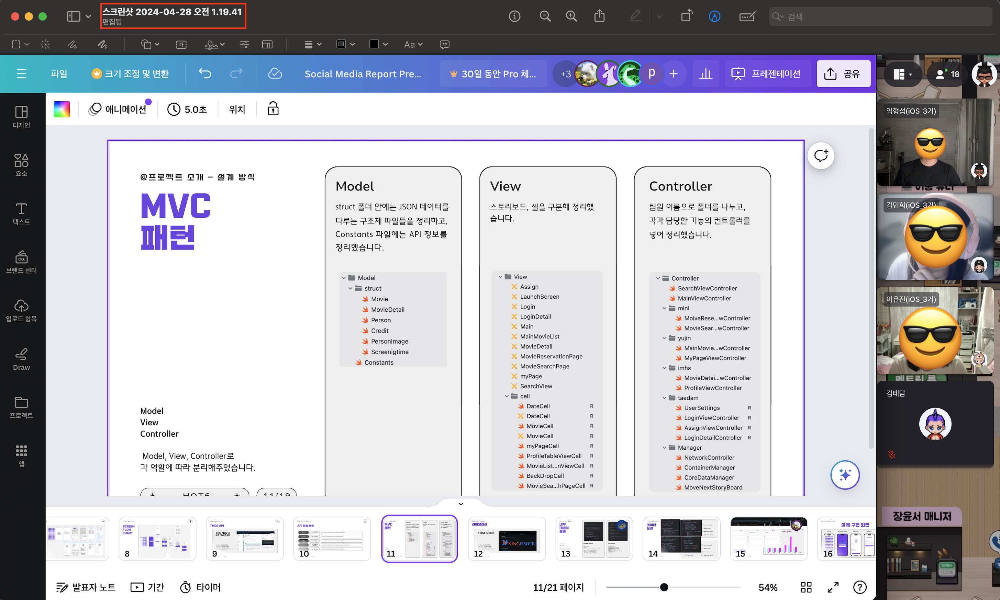
    
- 일요일 
    - 캔바에서 발표자료 작성을 다 같이 진행하고 메인브랜치에 적용, 리드미 작성을 진행하였다. 

# 최종 결과물 
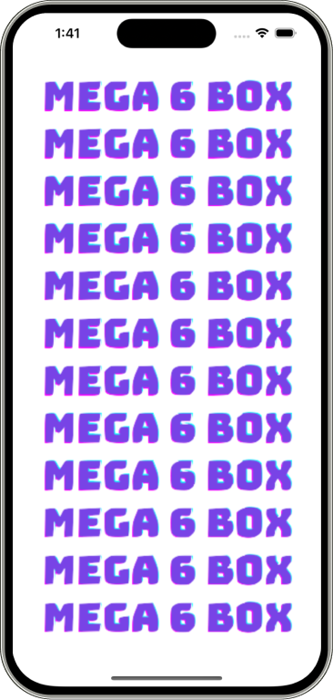
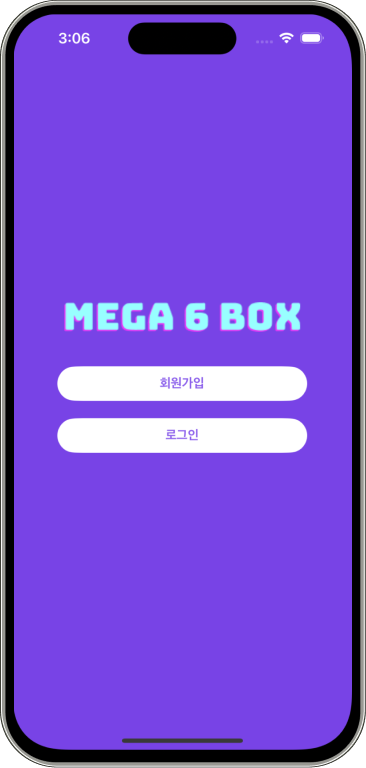
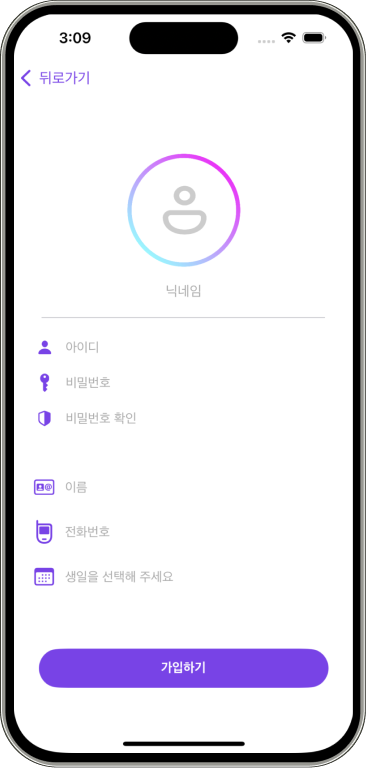
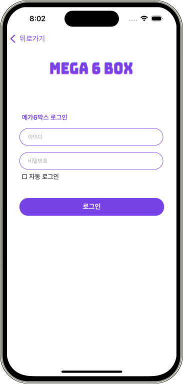
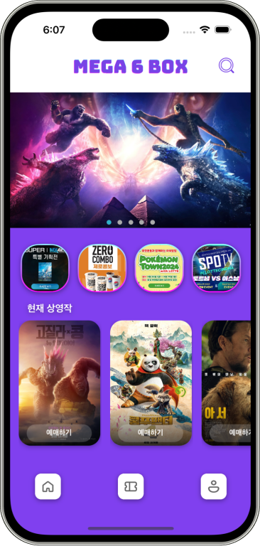
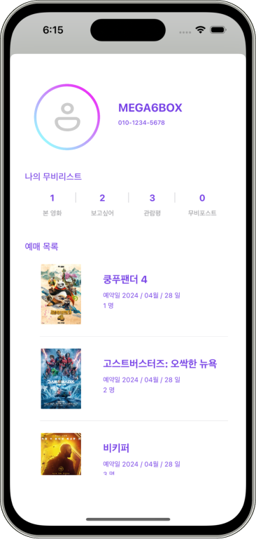
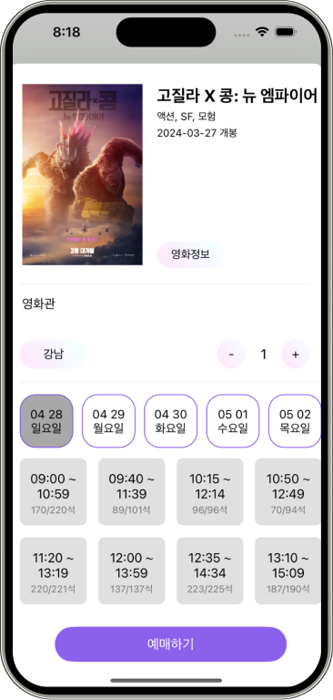
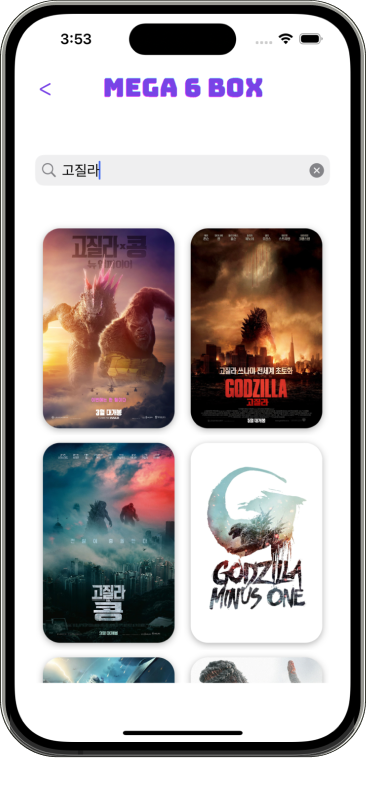
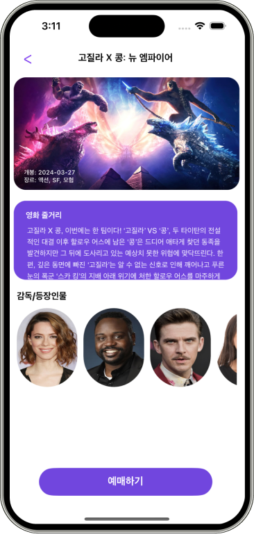
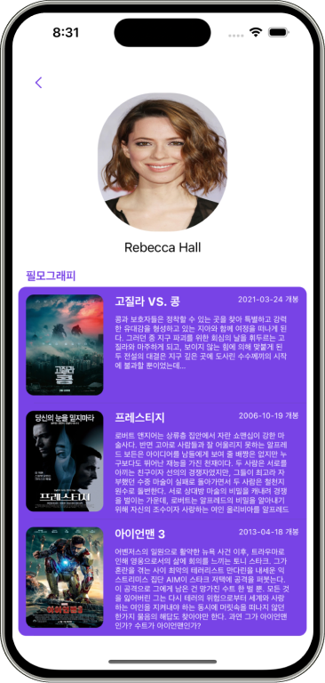

# 문제점 및 해결 
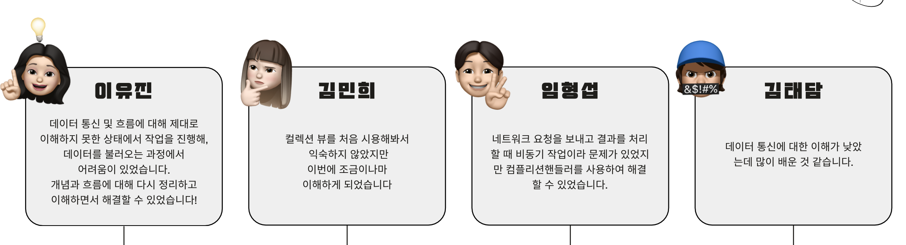

# 느낀점 
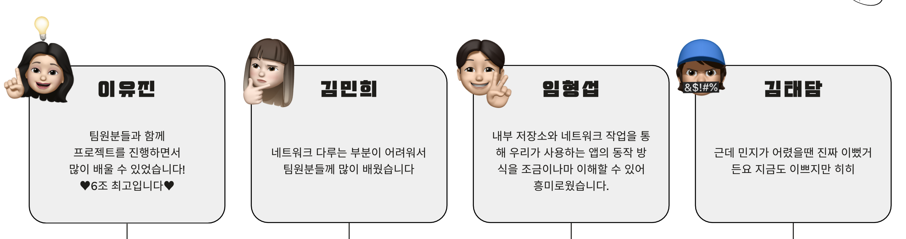

# 마무리 
- 3주 가까이 캠켜놓고 공부했더니 오랜시간 함께한듯한 우리 팀원들, 성향도 비슷해 큰 문제없이 마무리 잘 할 수 있었던 것 같다. 
- 팀원들을 통해서 많이 배울 수 있었다. 🔥🔥🔥🔥🔥🔥