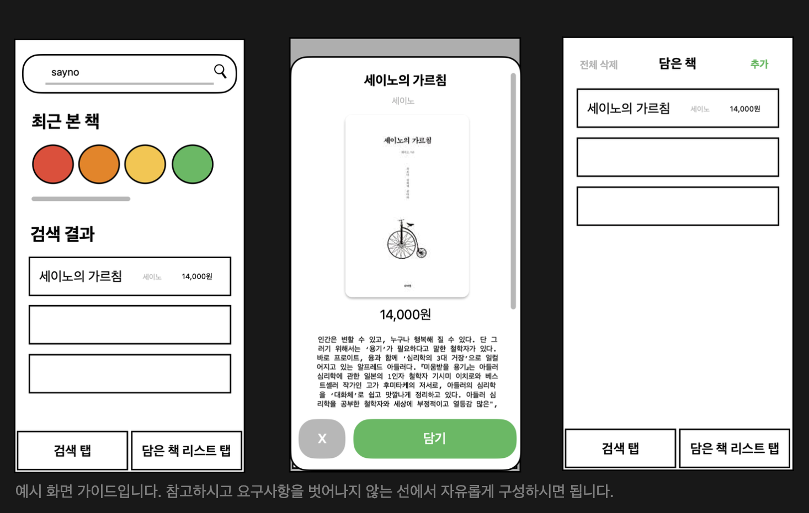
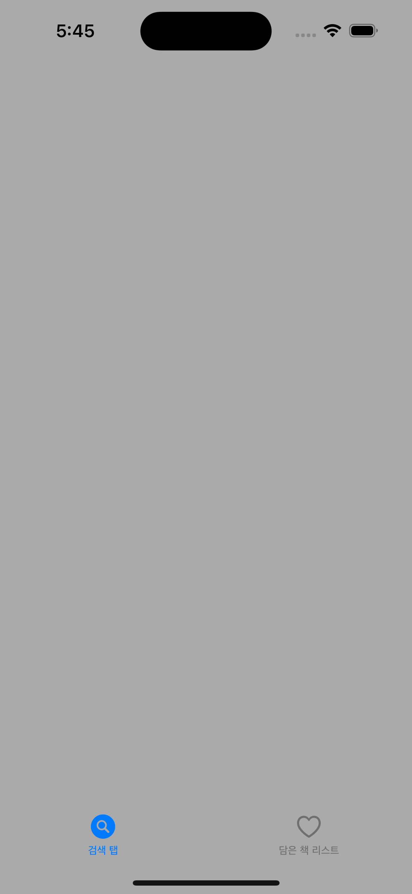
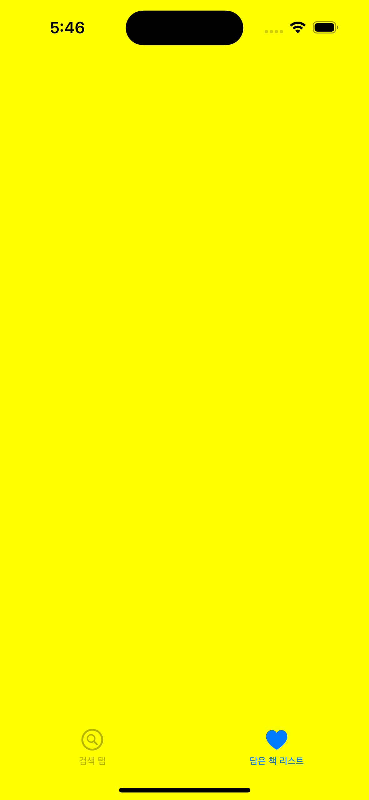
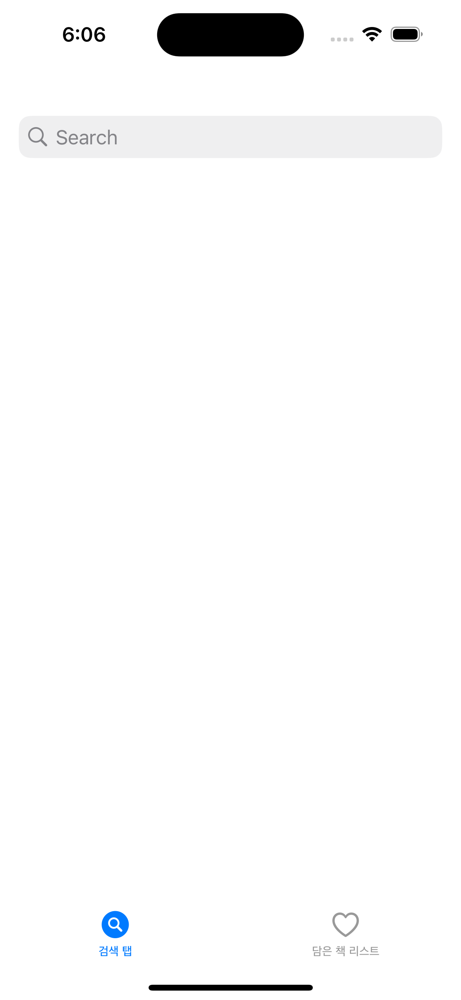
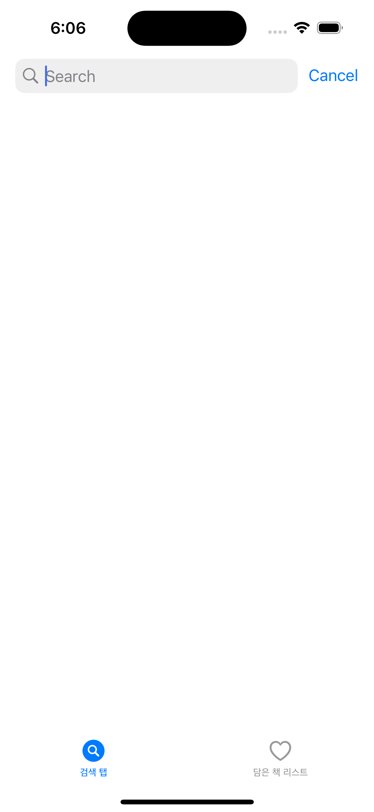
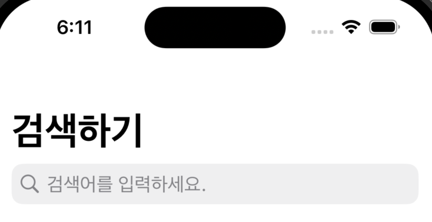
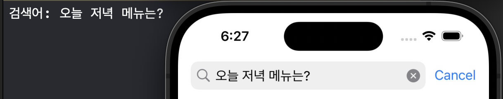

# iOS 앱 개발 심화 개인 과제  
- 팀프로젝트가 끝나면 찾아오는 개인 과제, 어렵지만 차근차근 해보기! 

# 개인 과제 목표
1. 이번 과제에서 우리는 책을 검색하고 저장하는 앱을 구현합니다.
2. **앱의 모든 UI 는 코드를 기반으로** 구현합니다.
3. CoreData 와 HTTP 통신을 사용하여 앱의 기능을 구현합니다
4. 간단한 MVVM 구조로 리팩토링해봅니다.

# 화면 구성하기
## 예시 화면 


# 1. 메인 스토리보드 삭제
- 스토리보드를 사용하지 않고 코드를 기반으로 구현하기위해 main 스토리보드를 삭제하였습니다. 
- [⭐️코드로 UI를 구성하기 위해 메인 스토리보드 삭제하는 방법 바로가기 클릭!!!!⭐️](https://limlogging.github.io/UIKit/MainStoryBoardDelete/){:target="_blank"} 

# 2. 탭 바 추가하기
- 예시화면에 탭바가 포함되어 있어 탭바를 추가하고 먼저 탭바로 화면을 이동할 수 있게 하겠습니다.   

## 탭바 추가를 위한 SceneDelegate.swift 파일 수정하기 
- UIViewController를 상속 받는 파일 2개를 만듭니다. (SearchBookViewController.swift, MyBookListViewController.swift)
- 상단에 위치한 scene 메서드를 수정합니다. 

``` swift 
func scene(_ scene: UIScene, willConnectTo session: UISceneSession, options connectionOptions: UIScene.ConnectionOptions) {
    guard let windowScene = (scene as? UIWindowScene) else { return }
    window = UIWindow(windowScene: windowScene)
    
    // 검색 화면(SearchBookViewController)과 내 책 리스트 화면(MyBookListViewController)을 UINavigationController에 넣음
    let searchBookViewController = UINavigationController(rootViewController: SearchBookViewController())
    let myBookListViewController = UINavigationController(rootViewController: MyBookListViewController())
                
    // 탭 바 컨트롤러(UITabBarController)를 생성하고 검색 화면과 내 책 리스트 화면을 설정
    let tabBarController = UITabBarController()
    tabBarController.setViewControllers([searchBookViewController, myBookListViewController], animated: true)
    
    // 탭 바 아이템(TabBarItem) 설정
    if let items = tabBarController.tabBar.items {
        items[0].selectedImage = UIImage(systemName: "magnifyingglass.circle.fill")      //선택했을때 이미지
        items[0].image = UIImage(systemName: "magnifyingglass.circle")                //선택하지않았을때 이미지
        items[0].title = "검색 탭"
        
        items[1].selectedImage = UIImage(systemName: "heart.fill")
        items[1].image = UIImage(systemName: "heart")
        items[1].title = "담은 책 리스트"
    }
    // 윈도우의 루트 뷰 컨트롤러(rootViewController)를 탭 바 컨트롤러로 설정
    window?.rootViewController = tabBarController
    // 윈도우를 화면에 표시
    window?.makeKeyAndVisible()
}
```

### UITabBarController 추가 후 실행 화면
- 확인을 위해 백그라운드 색상은 임의로 변경하였습니다. 




# 3. UISearchController 추가하기 
- 함수를 새로 만들어 SearchController 관련 설정을 추가했습니다. 
- UISearchController에 UISearchBar 포함되어 있습니다. 
- 일반적으로 UISearchBar는 단순한 검색 상자를 표시하는 데 사용되고, 더 복잡한 검색 기능이 필요한 경우에는  UISearchController를 사용합니다.

```swift 
override func viewDidLoad() {
    super.viewDidLoad()
    view.backgroundColor = .white
    setupSearchController()
}

// MARK: - UISearchController 설정
func setupSearchController() {
    //UISearchController 추가하기 
    let searchController = UISearchController(searchResultsController: nil) //검색 시 다른 View로 이동하려면 nil이 아닌 ViewController로 설정
    self.navigationItem.searchController = searchController 
}
```

## UISearchController 추가 후 실행화면 
- searchbar를 선택하면 취소버튼이 자동 생성됩니다. 




# 4. UISearchController 추가 수정하기 
## title 및 placeholder 추가 
```swift 
// MARK: - UISearchController 설정
func setupSearchController() {
    //다른 코드 생략 
    self.navigationItem.title = "검색하기"
    self.navigationController?.navigationBar.prefersLargeTitles = true // Large title로 설정
    searchController.searchBar.placeholder = "검색어를 입력하세요."
}
```
## title 및 placeholder 추가 후 실행화면



# 5. 검색어 확인을 위한 UISearchBarDelegate 델리게이트 채택 
## searchBarSearchButtonClicked 추가 
```swift
extension SearchBookViewController: UISearchBarDelegate {
    // 사용자가 검색 버튼을 눌렀을 때 호출되는 메서드
    func searchBarSearchButtonClicked(_ searchBar: UISearchBar) {
        if let searchText = searchBar.text {
            print("검색어: \(searchText)")
        }
    }
}
```

## Delegate 설정 
```swift
func setupSearchController() {
    //다른코드 생략 

    //검색어 확인을 위해 SearchBar의 delegate를 SearchBookViewController로 설정
    searchController.searchBar.delegate = self
}
```

## 검색 후 검색어 확인 



# 마무리 
- 코드로 프로젝트를 진행하기 위한 셋팅 작업과 UINavigationController, UITabBarController, UISearchController를 추가했습니다. 