# 지난이야기 
- [⭐️책 검색 앱 만들기 1 보러가기⭐️](https://limlogging.github.io/sparta/MyBookApp1/){:target="_blank"} 
- 지난번에 이어 최근 본 책을 보여줄 컬렉션뷰와 책 검색 결과를 보여줄 테이블 뷰를 추가하도록 하겠습니다. 

# 1. 컬렉션 뷰가 담길 뷰 추가하기 
- 뷰를 추가해서 label과 컬렉션뷰를 담아보겠습니다. 
- <font color="red">추가된 코드만 작성하였습니다.</font>

```swift
// MARK: - 최근 본 책의 title과 컬렉션뷰가 담길 뷰
class SearchBookViewController: UIViewController {
    var recentlyViewedBooksView: UIView = {
        let view = UIView()
        view.layer.borderColor = #colorLiteral(red: 0, green: 0, blue: 0, alpha: 1)
        view.layer.borderWidth = 1
        view.translatesAutoresizingMaskIntoConstraints = false
        return view
    }()

    override func viewDidLoad() {
        setupAddView()          
        setupAutoLayout()
    }

    // MARK: - 뷰 추가
    func setupAddView() {
        //최근 본 책
        view.addSubview(recentlyViewedBooksView)
    }

    // MARK: - 오토레이아웃 설정
    private func setupAutoLayout() {
        NSLayoutConstraint.activate([
            recentlyViewedBooksView.topAnchor.constraint(equalTo: view.safeAreaLayoutGuide.topAnchor, constant: 10),
            recentlyViewedBooksView.leadingAnchor.constraint(equalTo: view.safeAreaLayoutGuide.leadingAnchor, constant: 10),
            recentlyViewedBooksView.trailingAnchor.constraint(equalTo: view.safeAreaLayoutGuide.trailingAnchor, constant: -10),
            recentlyViewedBooksView.heightAnchor.constraint(equalTo: view.heightAnchor, multiplier: 0.2),   //view 높이의 20%로 설정
        ])
    }
}
```

## 실행화면
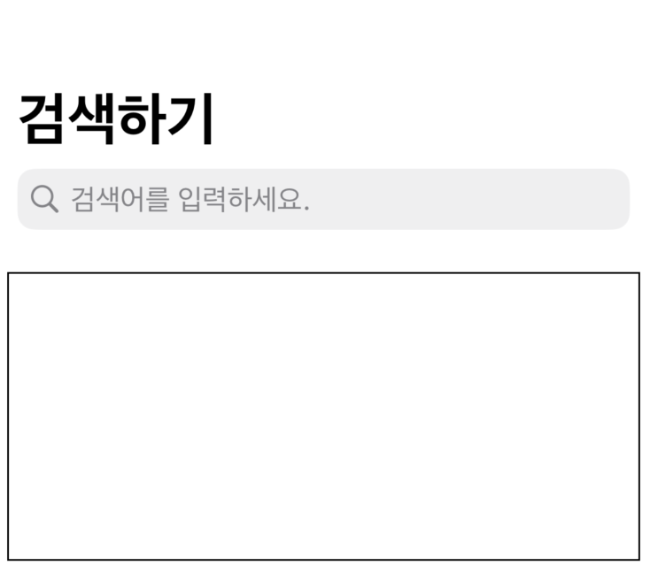

# 2. 컬렉션뷰가 담길 뷰에 Label 추가하기 
- <font color="red">추가된 코드만 작성하였습니다.</font>

``` swift 
    // MARK: - 최근 본 책 타이틀
    private var recentlyViewedBooksTitleLabel: UILabel = {
        let label = UILabel()
        label.text = "최근 본 책"
        label.font = UIFont.systemFont(ofSize: 20, weight: .bold)
        label.translatesAutoresizingMaskIntoConstraints = false
        return label
    }()

    // MARK: - 뷰 추가
    private func setupAddView() {
        recentlyViewedBooksView.addSubview(recentlyViewedBooksTitleLabel)
    }

        // MARK: - 오토레이아웃 설정
    private func setupAutoLayout() {
        NSLayoutConstraint.activate([
            //최근 본 책 
            recentlyViewedBooksTitleLabel.topAnchor.constraint(equalTo: recentlyViewedBooksView.topAnchor, constant: 10),
            recentlyViewedBooksTitleLabel.leadingAnchor.constraint(equalTo: recentlyViewedBooksView.leadingAnchor, constant: 10),
        ])
    }
```

## 실행화면
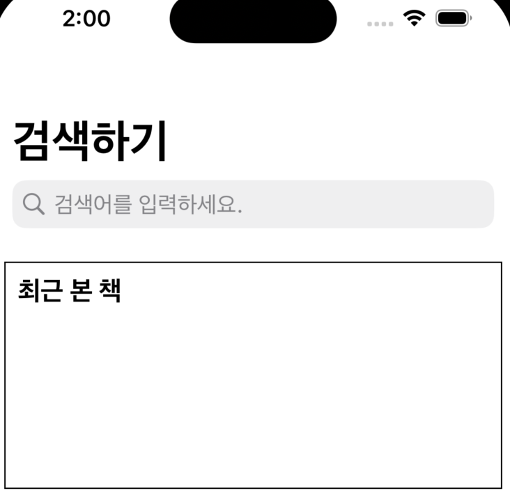

# 3. 컬렉션 뷰가 담길 뷰에 컬렉션 뷰 추가하기 
- <font color="red">추가된 코드만 작성하였습니다.</font>

```swift
    // MARK: - 최근 본 책 컬랙션 뷰
    private lazy var recentlyViewedBooksCollectionView: UICollectionView = {
        let flowLayout = UICollectionViewFlowLayout()
        let collectionView = UICollectionView(frame: .zero, collectionViewLayout: flowLayout)
        collectionView.layer.borderColor = #colorLiteral(red: 0, green: 0, blue: 0, alpha: 1)
        collectionView.layer.borderWidth = 1
        collectionView.translatesAutoresizingMaskIntoConstraints = false
        return collectionView
    }()

        // MARK: - 뷰 추가
    private func setupAddView() {
        recentlyViewedBooksView.addSubview(recentlyViewedBooksCollectionView)
    }

    // MARK: - 오토레이아웃 설정
    private func setupAutoLayout() {
        NSLayoutConstraint.activate([
            //컬렉션뷰
            recentlyViewedBooksCollectionView.topAnchor.constraint(equalTo: recentlyViewedBooksTitleLabel.bottomAnchor, constant: 10),
            recentlyViewedBooksCollectionView.leadingAnchor.constraint(equalTo: recentlyViewedBooksView.leadingAnchor, constant: 10),
            recentlyViewedBooksCollectionView.trailingAnchor.constraint(equalTo: recentlyViewedBooksView.trailingAnchor, constant: -10),
            recentlyViewedBooksCollectionView.bottomAnchor.constraint(equalTo: recentlyViewedBooksView.bottomAnchor, constant: -10),
        ])
    }
```
## 실행화면
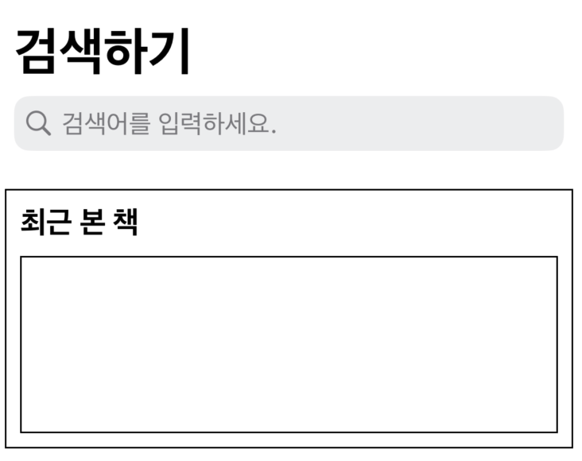

# 4. 컬렉션뷰에 Cell 추가하고 레이아웃 설정하기 
- UICollectionViewCell을 상솓받는 RecentlyViewedBooksCollectionViewCell 이름의 파일을 만들었습니다. 
- Cell 등록을 위한 identifier만 설정하였습니다. 

```swift
class RecentlyViewedBooksCollectionViewCell: UICollectionViewCell {
    // MARK: - Cell 등록 시 사용할 identifier 설정
    static let identifier = String(describing: RecentlyViewedBooksCollectionViewCell.self)
    
    override init(frame: CGRect) {
        super.init(frame: frame)
        self.layer.borderColor = #colorLiteral(red: 0, green: 0, blue: 0, alpha: 1)
        self.layer.borderWidth = 1
    }
    
    required init?(coder: NSCoder) {
        fatalError("init(coder:) has not been implemented")
    }
}
```

# 5. Cell 등록 및 DataSource 프로토콜 채택하기 
- SearchBookViewController에 컬렉션뷰 cell 등록 및 DataSource 프로토콜 채택하여 오토레이아웃을 잡아보겠습니다. 
- <font color="red">추가된 코드만 작성하였습니다.</font>
```swift
    override func viewDidLoad() {
        setupCollectionView()   //컬렉션 뷰 설정
    }

    // MARK: - 컬렉션뷰 설정
    private func setupCollectionView() {
        recentlyViewedBooksCollectionView.dataSource = self
        recentlyViewedBooksCollectionView.register(RecentlyViewedBooksCollectionViewCell.self, forCellWithReuseIdentifier: RecentlyViewedBooksCollectionViewCell.identifier)    //최근 본 책 컬렉션 뷰에서 사용할 Cell 등록
    }

    // MARK: - 컬렉션뷰 데이터소스 프로토콜 채택
    extension SearchBookViewController: UICollectionViewDataSource {
        func collectionView(_ collectionView: UICollectionView, numberOfItemsInSection section: Int) -> Int {
            return 10
        }
        
        func collectionView(_ collectionView: UICollectionView, cellForItemAt indexPath: IndexPath) -> UICollectionViewCell {
            guard let cell = collectionView.dequeueReusableCell(withReuseIdentifier: RecentlyViewedBooksCollectionViewCell.identifier, for: indexPath) as? RecentlyViewedBooksCollectionViewCell else { return UICollectionViewCell() }
            return cell 
        }
    }
```
## 실행화면
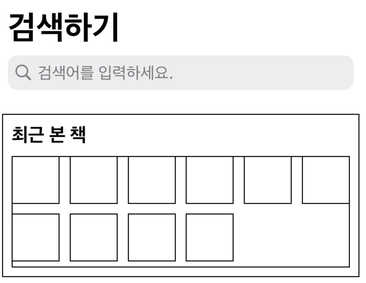

# 6. 컬렉션뷰 레이아웃 수정 
- 컬렉션뷰의 스크롤 방향을 가로로 만들고 Cell이 1개씩만 보이도록 하겠습니다. 
- 그 다음 Cell에는 이미지뷰와 label하나를 추가하겠습니다. 
- 컬렉션 뷰 관련 참고 포스팅
    - [⭐️UICollectionView 스토리보드 예제 코드⭐️](https://limlogging.github.io/UIKit/UICollectionViewStoryboard/){:target="_blank"} 
    - [⭐️UICollectionView Codebase 예제 코드⭐️](https://limlogging.github.io/UIKit/UICollectionViewCodebase/){:target="_blank"} 
- <font color="red">추가된 코드만 작성하였습니다.</font>

```swift
class SearchBookViewController: UIViewController {
    let recentlyViewedBooksCollectionViewItemSpacing: CGFloat = 0   //아이템 사이 간격
    let recentlyViewedBooksCollectionViewItemCnt: CGFloat = 1       //라인에 들어갈 아이템 수

    // MARK: - 최근 본 책 컬랙션 뷰
    private lazy var recentlyViewedBooksCollectionView: UICollectionView = {
        flowLayout.scrollDirection = .horizontal    //스크롤 방향 
        flowLayout.minimumInteritemSpacing = self.recentlyViewedBooksCollectionViewItemSpacing  //아이템 사이 거리, 아이템 1개라 0으로 지정 
        flowLayout.minimumLineSpacing = 10  // 라인 사이 거리를 10으로 띄우기 
    }()

    // MARK: - 컬렉션뷰 설정
    private func setupCollectionView() {
        recentlyViewedBooksCollectionView.delegate = self   
    }
} 

// MARK: - 컬렉션뷰 플로우 레이아웃 프로토콜 채택
extension SearchBookViewController: UICollectionViewDelegateFlowLayout {
    func collectionView(_ collectionView: UICollectionView, layout collectionViewLayout: UICollectionViewLayout, sizeForItemAt indexPath: IndexPath) -> CGSize {

        let height = (recentlyViewedBooksCollectionView.bounds.height - (recentlyViewedBooksCollectionViewItemSpacing * (recentlyViewedBooksCollectionViewItemCnt - 1))) / recentlyViewedBooksCollectionViewItemCnt
        
        return CGSize(width: 100, height: height)
    }
}
```

## 실행화면
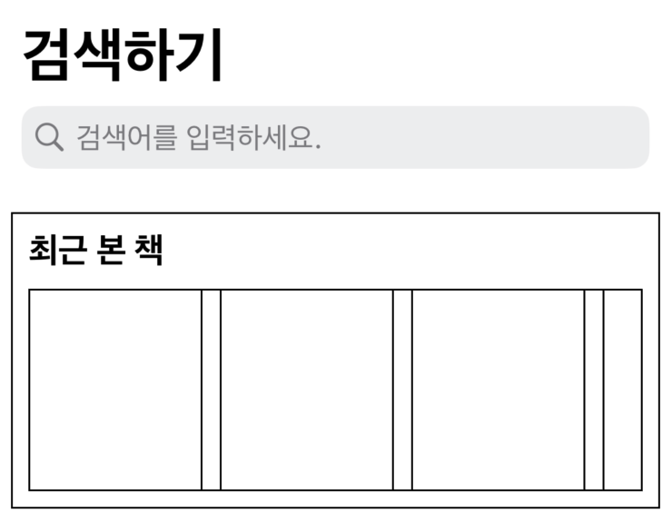

# 7. Cell에 imageView와 label 추가하기 
- RecentlyViewedBooksCollectionViewCell 파일을 수정하였습니다. 
- 전체 코드 

```swift
class RecentlyViewedBooksCollectionViewCell: UICollectionViewCell {
    // MARK: - Cell 등록 시 사용할 identifier 설정
    static let identifier = String(describing: RecentlyViewedBooksCollectionViewCell.self)
    
    // MARK: - 책 이미지
    var bookImageView: UIImageView = {
        let imageView = UIImageView()
        return imageView
    }()
    
    // MARK: - 책 제목
    var bookTitleLabel: UILabel = {
        let label = UILabel()
        label.text = "책 제목"
        label.font = UIFont.systemFont(ofSize: 10, weight: .bold)
        label.layer.borderColor = #colorLiteral(red: 0, green: 0, blue: 0, alpha: 1)
        label.layer.borderWidth = 1
        return label
    }()
    
    override init(frame: CGRect) {
        super.init(frame: frame)
        self.layer.borderColor = #colorLiteral(red: 0, green: 0, blue: 0, alpha: 1)
        self.layer.borderWidth = 1
        addView()
        setupAutoLayout()
    }
    
    required init?(coder: NSCoder) {
        fatalError("init(coder:) has not been implemented")
    }
    
    // MARK: - 뷰 추가
    func addView() {
        [bookImageView, bookTitleLabel].forEach { item in
            item.translatesAutoresizingMaskIntoConstraints = false
            addSubview(item)
        }
    }
    
    // MARK: - 오토레이아웃 설정
    func setupAutoLayout() {
        NSLayoutConstraint.activate([
            bookImageView.topAnchor.constraint(equalTo: topAnchor),
            bookImageView.leadingAnchor.constraint(equalTo: leadingAnchor),
            bookImageView.trailingAnchor.constraint(equalTo: trailingAnchor),
            bookImageView.widthAnchor.constraint(equalTo: widthAnchor),
            bookImageView.heightAnchor.constraint(equalTo: heightAnchor, multiplier: 0.8),  //Cell의 80%
            
            bookTitleLabel.topAnchor.constraint(equalTo: bookImageView.bottomAnchor),
            bookTitleLabel.leadingAnchor.constraint(equalTo: leadingAnchor),
            bookTitleLabel.trailingAnchor.constraint(equalTo: trailingAnchor),
            bookTitleLabel.bottomAnchor.constraint(equalTo: bottomAnchor),
            bookTitleLabel.widthAnchor.constraint(equalTo: widthAnchor),
            bookTitleLabel.heightAnchor.constraint(equalTo: heightAnchor, multiplier: 0.2), //Cell의 20%
        ])
    }
}
```
## 실행화면
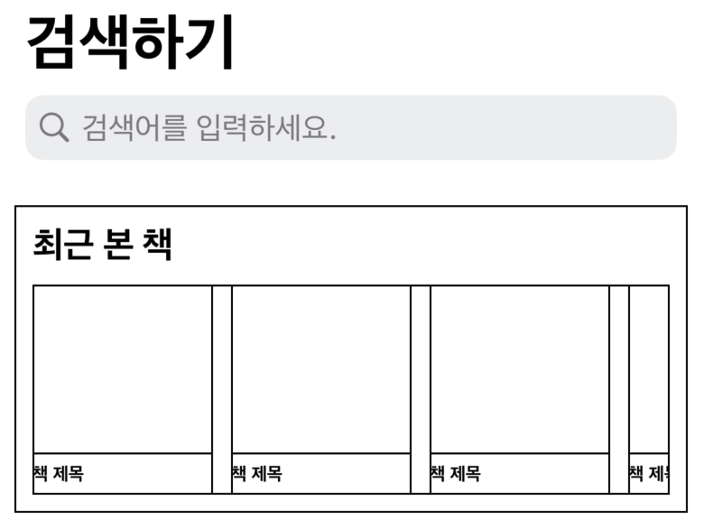

# 8. 테이블 뷰가 담길 뷰 추가하기 
- <font color="red">추가된 코드만 작성하였습니다.</font>

```swift 
    // MARK: - 검색 결과 타이틀과 검색결과 테이블뷰가 담길 뷰
    private var searchResultView: UIView = {
        let view = UIView()
        view.layer.borderColor = #colorLiteral(red: 0, green: 0, blue: 0, alpha: 1)
        view.layer.borderWidth = 1
        view.translatesAutoresizingMaskIntoConstraints = false
        return view
    }()

    // MARK: - 뷰 추가
    private func setupAddView() {
        //검색 결과
        view.addSubview(searchResultView)
    }
        
    // MARK: - 오토레이아웃 설정
    private func setupAutoLayout() {
        NSLayoutConstraint.activate([
            //테이블 뷰와 타이틀을 담을 뷰
            searchResultView.topAnchor.constraint(equalTo: recentlyViewedBooksView.bottomAnchor, constant: 10),
            searchResultView.leadingAnchor.constraint(equalTo: view.safeAreaLayoutGuide.leadingAnchor, constant: 10),
            searchResultView.trailingAnchor.constraint(equalTo: view.safeAreaLayoutGuide.trailingAnchor, constant: -10),
            searchResultView.bottomAnchor.constraint(equalTo: view.safeAreaLayoutGuide.bottomAnchor, constant: -10),
        ])
    }
```
## 실행화면
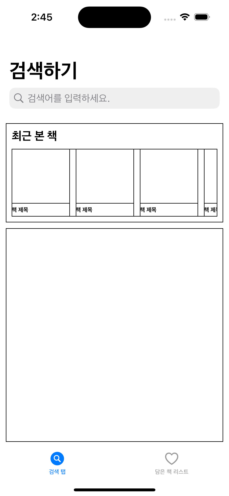

# 9. 테이블 뷰가 담길 뷰에 Label 추가하기 
- <font color="red">추가된 코드만 작성하였습니다.</font>
```swift
    // MARK: - 검색 결과 타이틀
    private var searchResultTitleLabel: UILabel = {
        let label = UILabel()
        label.text = "검색 결과"
        label.font = UIFont.systemFont(ofSize: 20, weight: .bold)
        label.translatesAutoresizingMaskIntoConstraints = false
        return label
    }()

    // MARK: - 뷰 추가
    private func setupAddView() {
        searchResultView.addSubview(searchResultTitleLabel)
    } 

    // MARK: - 오토레이아웃 설정
    private func setupAutoLayout() {
        NSLayoutConstraint.activate([
            //검색 결과 타이틀
            searchResultTitleLabel.topAnchor.constraint(equalTo: searchResultView.topAnchor, constant: 10),
            searchResultTitleLabel.leadingAnchor.constraint(equalTo: searchResultView.leadingAnchor, constant: 10),
        ])
    }
```
## 실행화면
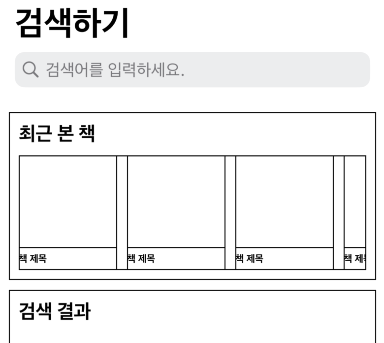

# 10. 테이블 뷰가 담길 뷰에 테이블 뷰 추가하기
- <font color="red">추가된 코드만 작성하였습니다.</font>

```swift
class SearchBookViewController: UIViewController {
    // MARK: - 검색 결과 테이블 뷰
    private var searchResultTableView: UITableView = {
        let tableView = UITableView()
        tableView.layer.borderColor = #colorLiteral(red: 0, green: 0, blue: 0, alpha: 1)
        tableView.layer.borderWidth = 1
        tableView.translatesAutoresizingMaskIntoConstraints = false
        return tableView
    }()

    override func viewDidLoad() {
        setupTableView()        //테이블 뷰 설정
    }

    // MARK: - 뷰 추가
    private func setupAddView() {
        searchResultView.addSubview(searchResultTableView)
    }

    // MARK: - 테이블뷰 설정
    private func setupTableView() {
        searchResultTableView.dataSource = self
    }
}

// MARK: - 테이블뷰 데이터소스 프로토콜 채택
extension SearchBookViewController: UITableViewDataSource {
    func tableView(_ tableView: UITableView, numberOfRowsInSection section: Int) -> Int {
        return 10
    }
    
    func tableView(_ tableView: UITableView, cellForRowAt indexPath: IndexPath) -> UITableViewCell {
        return UITableViewCell()
    }
}
```
## 실행화면
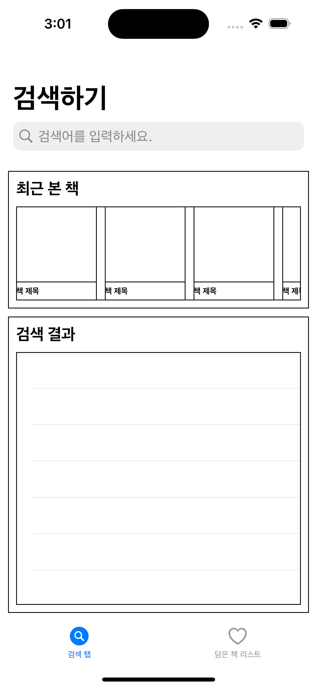

# 11. TableView Row의 Height 설정하기 
- <font color="red">추가된 코드만 작성하였습니다.</font>

```swift
// MARK: - 테이블뷰 설정
private func setupTableView() {
    searchResultTableView.delegate = self
}

// MARK: - 테이블뷰 델리게이트 프로토콜 채택
extension SearchBookViewController: UITableViewDelegate {
    func tableView(_ tableView: UITableView, heightForRowAt indexPath: IndexPath) -> CGFloat {
        return 120
    }
}
```

## 실행화면
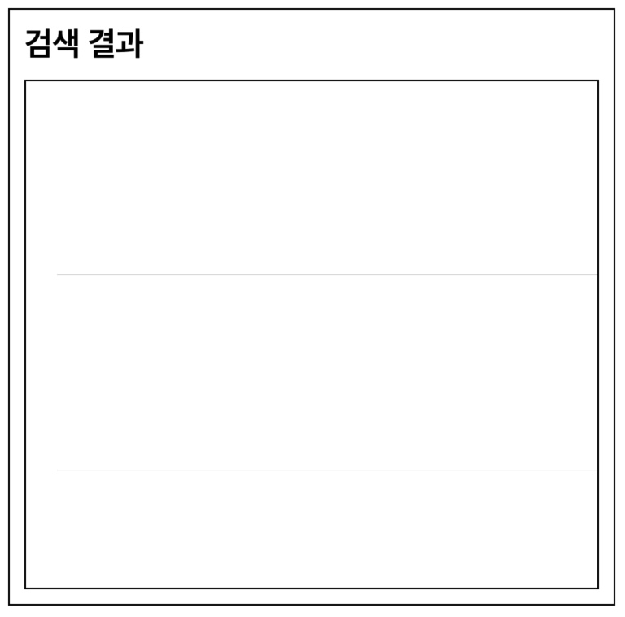

# 12. TableView Cell에 imageView 및 Label 추가하기 
- UITableViewCell을 상속받는 SearchResultTableViewCell 파일을 만들었습니다. 
- SearchResultTableViewCell 파일 전체 코드 

```swift 
class SearchResultTableViewCell: UITableViewCell {
    //TableView Cell을 등록하기위해 식별자 설정
    static let identifier = String(describing: SearchResultTableViewCell.self)
    
    // MARK: - 책 이미지
    var bookImageView: UIImageView = {
        let imageView = UIImageView()
        imageView.layer.borderColor = #colorLiteral(red: 0, green: 0, blue: 0, alpha: 1)
        imageView.layer.borderWidth = 1
        return imageView
    }()
    
    // MARK: - 책 제목
    var bookTitleLabel: UILabel = {
        let label = UILabel()
        label.text = "책 제목"
        return label
    }()
    
    // MARK: - 저자
    var bookAuthorsLabel: UILabel = {
        let label = UILabel()
        label.text = "저자"
        return label
    }()
    
    // MARK: - 책 가격
    var bookPriceLabel: UILabel = {
        let label = UILabel()
        label.text = "책 가격"
        return label
    }()
    
    // MARK: - 책 소개
    var bookContentsLabel: UILabel = {
        let label = UILabel()
        label.text = "책 소개"
        return label
    }()
    
    override func setSelected(_ selected: Bool, animated: Bool) {
        super.setSelected(selected, animated: animated)
        setupAddView()
        setupAutoLayout()
    }
    
    // MARK: - 뷰 추가
    func setupAddView() {
        [bookImageView, bookTitleLabel, bookAuthorsLabel, bookPriceLabel, bookContentsLabel].forEach { item in
            item.translatesAutoresizingMaskIntoConstraints = false
            contentView.addSubview(item)
        }
    }
    
    // MARK: - 오토레이아웃 추가
    func setupAutoLayout() {
        NSLayoutConstraint.activate([
            //책 이미지
            bookImageView.topAnchor.constraint(equalTo: contentView.topAnchor, constant: 10),
            bookImageView.leadingAnchor.constraint(equalTo: contentView.leadingAnchor, constant: 10),
            bookImageView.bottomAnchor.constraint(equalTo: contentView.bottomAnchor, constant: -10),
            bookImageView.widthAnchor.constraint(equalToConstant: 100),
            
            //책 제목
            bookTitleLabel.topAnchor.constraint(equalTo: contentView.topAnchor, constant: 10),
            bookTitleLabel.leadingAnchor.constraint(equalTo: bookImageView.trailingAnchor, constant: 10),
            
            //책 저자
            bookAuthorsLabel.topAnchor.constraint(equalTo: bookTitleLabel.bottomAnchor, constant: 10),
            bookAuthorsLabel.leadingAnchor.constraint(equalTo: bookImageView.trailingAnchor, constant: 10),
            
            //책 가격
            bookPriceLabel.topAnchor.constraint(equalTo: bookAuthorsLabel.bottomAnchor, constant: 10),
            bookPriceLabel.leadingAnchor.constraint(equalTo: bookImageView.trailingAnchor, constant: 10),
            
            //책 소개
            bookContentsLabel.topAnchor.constraint(equalTo: bookPriceLabel.bottomAnchor, constant: 10),
            bookContentsLabel.leadingAnchor.constraint(equalTo: bookImageView.trailingAnchor, constant: 10),
        ])
    }
}
```

# 13. TableViewCell 등록 및 cellForRowAt 메서드 수정 
- SearchBookViewController 파일에서 tableView의 Cell을 등록합니다. 
- <font color="red">추가된 코드만 작성하였습니다.</font>

```swift
    // MARK: - 테이블뷰 설정
    private func setupTableView() {
        searchResultTableView.register(SearchResultTableViewCell.self, forCellReuseIdentifier: SearchResultTableViewCell.identifier) //검색 결과 테이블뷰에서 사용할 Cell 등록
    }

    func collectionView(_ collectionView: UICollectionView, cellForItemAt indexPath: IndexPath) -> UICollectionViewCell {
        guard let cell = collectionView.dequeueReusableCell(withReuseIdentifier: RecentlyViewedBooksCollectionViewCell.identifier, for: indexPath) as? RecentlyViewedBooksCollectionViewCell else { return UICollectionViewCell() }
        return cell 
    }
```

## 실행화면 
- 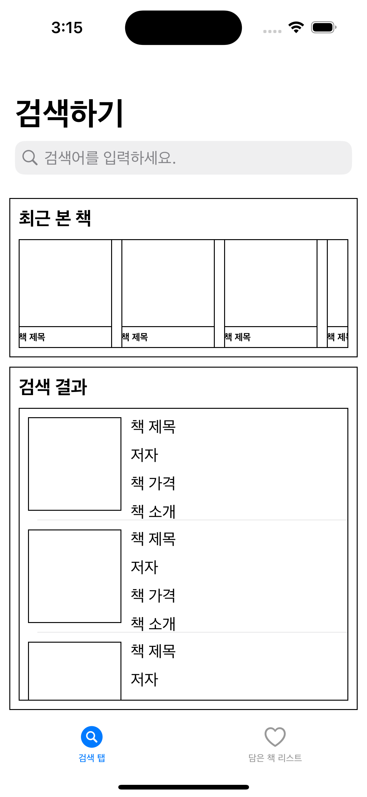

# 마무리 
- 검색할 책의 데이터를 보여줄 컬렉션뷰와 검색결과를 보여줄 테이블뷰를 추가하였습니다. 