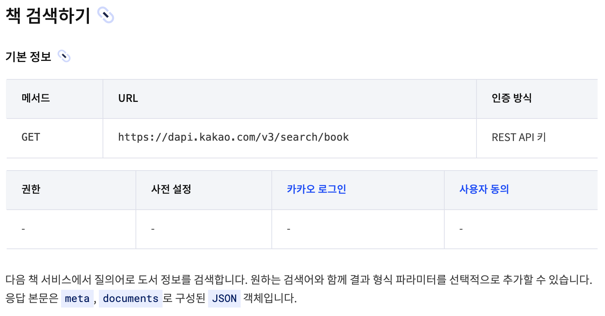
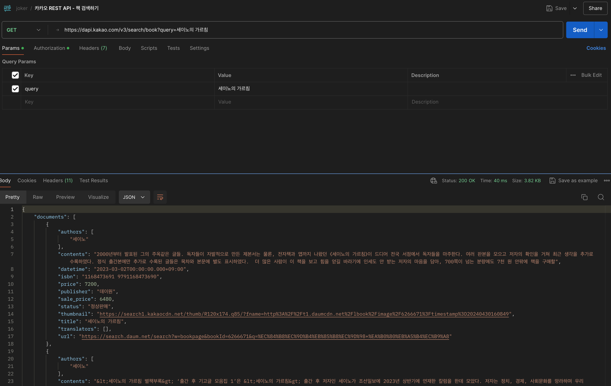
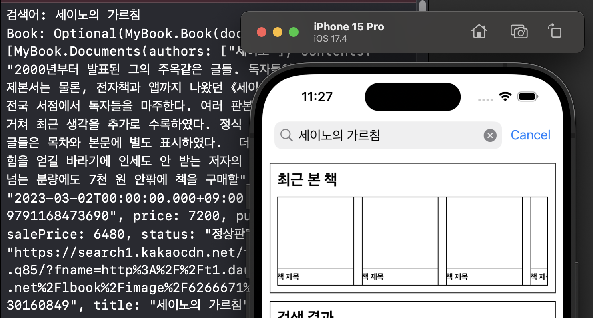
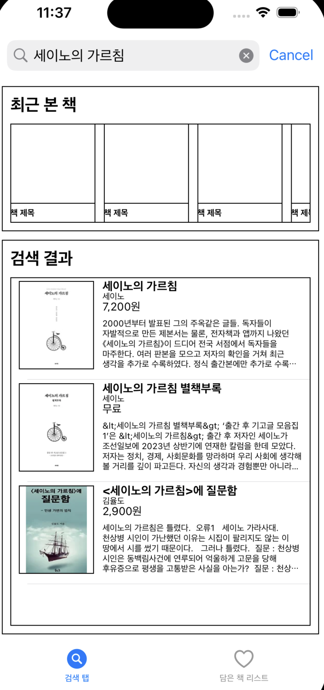

# 지난이야기 
- [⭐️책 검색 앱 만들기 1 보러가기⭐️](https://limlogging.github.io/sparta/MyBookApp1/){:target="_blank"} 
- [⭐️책 검색 앱 만들기 2 보러가기⭐️](https://limlogging.github.io/sparta/MyBookApp2/){:target="_blank"} 
- 지난번에 이어 카카오 api를 사용하여 책 이름으로 책을 검색하고 테이블 뷰에 보여주도록 하겠습니다. 

# 1. 카카오 REST API 사용하기
- 카카오 책 검색하기 API를 사용하였습니다. 
- 회원가입 후 Key를 발급 받을 수 있으며 과정은 생략하겠습니다. 
[⭐️카카오 책 검색 REST API 바로가기⭐️](https://developers.kakao.com/docs/latest/ko/daum-search/dev-guide#search-book){:target="_blank"} 
- 

# 2. Postman으로 데이터 확인하기 
- 포스트맨을 사용하여 세이노의 가르침 책을 받아오는데 성공하였습니다. 
- 포스트맨 다운로드 및 사용 방법은 생략하겠습니다.  
- 

# 3. 데이터 모델 만들기 
- 포스트맨을 통해 데이터 형식을 확인하고 데이터 모델을 만들었습니다. 

```swift
import Foundation

struct Book: Decodable {
    var documents: [Documents]
    var meta: Meta
}

struct Documents: Decodable {
    var authors: [String]
    var contents: String
    var datetime: String
    var isbn: String
    var price: Int
    var publisher: String
    var salePrice: Int
    var status: String
    var thumbnail: String
    var title: String
    var translators: [String]
    var url: String
    
    enum CodingKeys: String, CodingKey {
        case authors
        case contents
        case datetime
        case isbn
        case price
        case publisher
        case salePrice = "sale_price"
        case status
        case thumbnail
        case title
        case translators
        case url
    }
}

struct Meta: Decodable {
    var isEnd: Bool
    var pageableCount: Int
    var totalCount: Int
    
    enum CodingKeys: String, CodingKey {
        case isEnd = "is_end"
        case pageableCount = "pageable_count"
        case totalCount = "total_count"
    }
}
```

# 4. NetworkManager 만들기
- 지난 과제에서 싱글톤 패턴을 사용하여 네트워크 매니저를 구현했었는데요. 복습할 겸 다시 사용해보겠습니다. 
- 최초 조회할때 한 번 API를 사용할 것 같은데 싱글톤으로 구현해보고 나중에 변경을 하던가 고민해보겠습니다. 

```swift 
class NetworkManager {
    static let shared = NetworkManager()
    private init() { }
    
    func searchBook(query: String, completion: @escaping (Result<Book, Error>) -> Void) {
        let url = "https://dapi.kakao.com/v3/search/book"
        let apiKey = "카카오에서 받은 API 키"
        
        // MARK: - 1. URL 객체 생성
        guard let url = URL(string: "\(url)?query=\(query)") else { return }
        
        // MARK: - 2. HTTP 요청 객체 생성
        var request = URLRequest(url: url)
        request.setValue(apiKey, forHTTPHeaderField: "Authorization")
  
        // MARK: - 3. HTTP 요청 보내기
        let task = URLSession.shared.dataTask(with: request) { data, response, error in

            guard let httpResponse = response as? HTTPURLResponse, (200...299).contains(httpResponse.statusCode) else {
                // 응답 코드가 성공 범위가 아닐 경우 처리
                return
            }

            guard let data = data else {
                // 데이터가 없을 경우 처리
                return
            }

            do {
                let decoder = JSONDecoder()
                let result = try decoder.decode(Book.self, from: data)
                // 파싱된 데이터(result)를 사용하여 작업
                completion(.success(result))
            } catch {
                // 데이터 파싱 실패 시 처리
                completion(.failure(error))
            }
        }
        task.resume()
    }
}
```

# 5. 조회해보기 
- SearchBookViewController에서 검색어 확인을 위해 구현했던 메서드에 API 호출 후 데이터를 받아오는지 확인해보겠습니다. 
- <font color="red">추가된 코드만 작성하였습니다.</font>

```swift
// MARK: - 서치바 델리게이트 프로토콜 채택
class SearchBookViewController: UIViewController {   
    var bookData: Book? //api를 통해 받아온 정보를 담을 객체
}

extension SearchBookViewController: UISearchBarDelegate {
    // 사용자가 검색 버튼을 눌렀을 때 호출되는 메서드
    func searchBarSearchButtonClicked(_ searchBar: UISearchBar) {
        if let searchText = searchBar.text {
            print("검색어: \(searchText)")
            NetworkManager.shared.searchBook(query: searchText) { [weak self] result in
                switch result {
                case .success(let resultData):
                    //print("resultData: \(resultData)")
                    self?.bookData = resultData
                    print("Book: \(self?.bookData)")                    
                case .failure(let error):
                    print("데이터를 가져오는데 실패했습니다. \(error)")
                }
            }
        }
    }
}
```

## 실행화면 
- 세이노의 가르침을 조회하고 정상적으로 데이터를 받아왔습니다. 
- 

# 6. 테이블 뷰에 추가하기 
- numberOfRowsInSection 메서드의 return 값을 받아온 데이터의 수로 변경하였습니다. 
- tableViewCell에서 추가한 객체에 데이터를 할당합니다. (오토레이아웃을 조금 수정하였습니다.)
```swift
// MARK: - 테이블뷰 데이터소스 프로토콜 채택
extension SearchBookViewController: UITableViewDataSource {
    func tableView(_ tableView: UITableView, numberOfRowsInSection section: Int) -> Int {
        guard let book = bookData else { return 0 }
        
        return book.documents.count
    }
    
    func tableView(_ tableView: UITableView, cellForRowAt indexPath: IndexPath) -> UITableViewCell {
        guard let cell = tableView.dequeueReusableCell(withIdentifier: SearchResultTableViewCell.identifier, for: indexPath) as? SearchResultTableViewCell else { return UITableViewCell() }
        
        //책 이미지 불러오기
        if let urlString = bookData?.documents[indexPath.row].thumbnail {
            if let url = URL(string: urlString) {
                DispatchQueue.main.async {
                    cell.bookImageView.kf.setImage(with: url)
                }                
            }
        }
        cell.bookTitleLabel.text = bookData?.documents[indexPath.row].title //책 제목
        //저자
        let authors = bookData?.documents[indexPath.row].authors.joined(separator: ", ")
        cell.bookAuthorsLabel.text = authors
        
        //책 가격
        if let price = bookData?.documents[indexPath.row].price {
            if price == 0 {
                cell.bookPriceLabel.text = "무료"
            } else {
                let numberFormatter: NumberFormatter = NumberFormatter()
                numberFormatter.numberStyle = .decimal
                
                if let formatPrice = numberFormatter.string(for: price) {
                    cell.bookPriceLabel.text = formatPrice + "원"
                }
            }
        }
        cell.bookContentsLabel.text = bookData?.documents[indexPath.row].contents   //책 소개
        
        return cell
    }
}
```

- 검색 후 테이블 뷰에서 데이터가 보이지 않아 새로고침을 추가합니다. 

```swift
extension SearchBookViewController: UISearchBarDelegate {
    // 사용자가 검색 버튼을 눌렀을 때 호출되는 메서드
    func searchBarSearchButtonClicked(_ searchBar: UISearchBar) {
        if let searchText = searchBar.text {
            print("검색어: \(searchText)")
            NetworkManager.shared.searchBook(query: searchText) { [weak self] result in
                switch result {
                case .success(let resultData):
                    //print("resultData: \(resultData)")
                    self?.bookData = resultData
                    print("Book: \(self?.bookData)")   
                    
                    //검색 후 테이블 뷰 새로고침 
                    DispatchQueue.main.async {
                        self?.searchResultTableView.reloadData()
                    }                 
                case .failure(let error):
                    print("데이터를 가져오는데 실패했습니다. \(error)")
                }
            }
        }
    }
}
```

## 실행화면 
- 

# 7. TableView Cell 선택 시 상세 페이지로 이동하기  
- UIViewController를 상속받는 BookDetailViewController 파일을 만들었습니다. 
- Cell을 선택 시 BookDetailViewController 화면을 띄우도록 하겠습니다. 

- BookDetailViewController 파일 수정 

```swift
class BookDetailViewController: UIViewController {
        override func viewDidLoad() {
        super.viewDidLoad()
        view.backgroundColor = .white
    }
}
```

- present로 이동 

```swift
// MARK: - 테이블뷰 델리게이트 프로토콜 채택
extension SearchBookViewController: UITableViewDelegate {
    func tableView(_ tableView: UITableView, heightForRowAt indexPath: IndexPath) -> CGFloat {
        return 120
    }
    
    // MARK: - tableView Cell을 선택했을때 화면 이동
    func tableView(_ tableView: UITableView, didSelectRowAt indexPath: IndexPath) {
        let bookDetailVC = BookDetailViewController()        
        present(bookDetailVC, animated: true, completion: nil)
    }
}
```

## 실행화면 
- 

# 마무리 
- 카카오 책 검색 REST API를 사용하여 데이터를 받아와 테이블 뷰에 출력했습니다. 