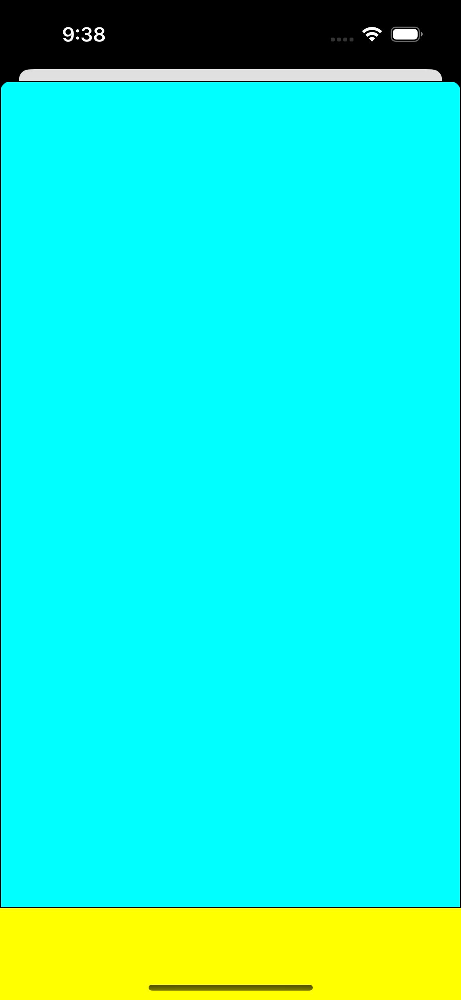
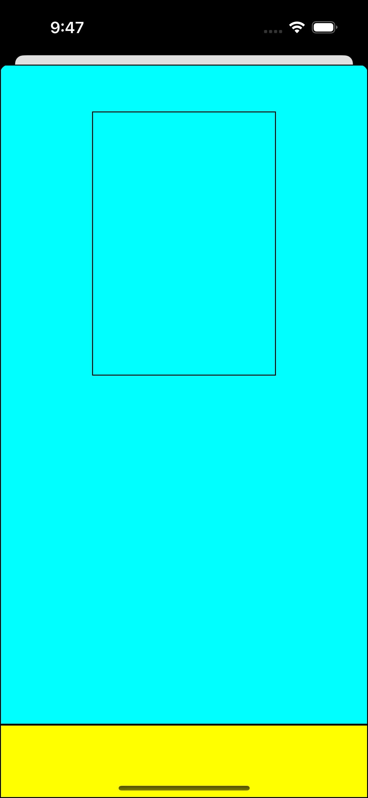
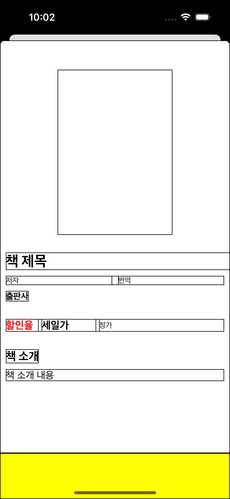
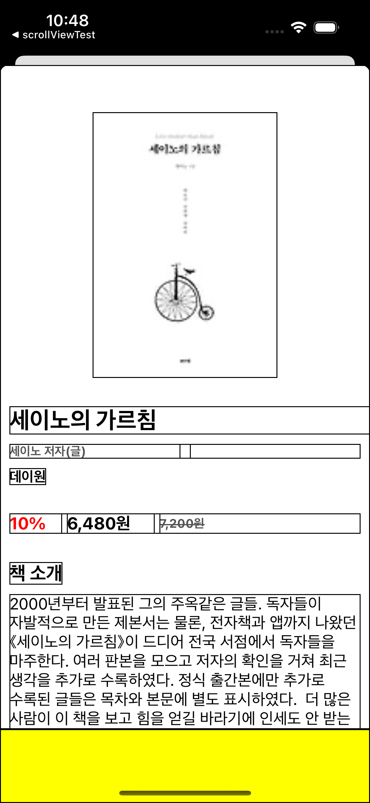
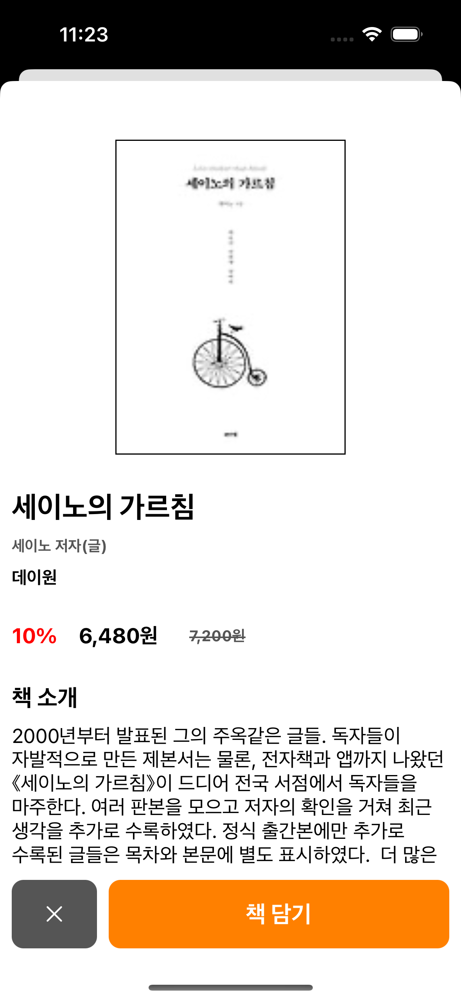

# 지난이야기 
- [⭐️책 검색 앱 만들기 1 보러가기⭐️](https://limlogging.github.io/sparta/MyBookApp1/){:target="_blank"} 
- [⭐️책 검색 앱 만들기 2 보러가기⭐️](https://limlogging.github.io/sparta/MyBookApp2/){:target="_blank"} 
- [⭐️책 검색 앱 만들기 3 보러가기⭐️](https://limlogging.github.io/sparta/MyBookApp3/){:target="_blank"} 
- 지난번에 이어 책 정보를 보여주는 BookDetailViewController에 데이터를 보여주도록 하겠습니다. 

# 1. 스크롤뷰와 버튼이 담길 뷰 추가하기 
- 책 상세 정보를 담을 BookDetailViewController를 수정합니다. 
- 스크롤뷰와 버튼이 담길 뷰를 추가했습니다. 

```swift
class BookDetailViewController: UIViewController {
    // MARK: - 버튼이 담길 뷰
    var buttonView: UIView = {
        let view = UIView()
        view.backgroundColor = .yellow
        view.translatesAutoresizingMaskIntoConstraints = false
        return view
    }()

    // MARK: - 책 데이터가 담길 스크롤 뷰
    var scrollView: UIScrollView = {
        let scrollView = UIScrollView()
        scrollView.backgroundColor = .cyan
        scrollView.layer.borderColor = #colorLiteral(red: 0, green: 0, blue: 0, alpha: 1)
        scrollView.layer.borderWidth = 1
        scrollView.translatesAutoresizingMaskIntoConstraints = false
        return scrollView
    }()

    override func viewDidLoad() {
        super.viewDidLoad()
        view.backgroundColor = .white
        
        setupAddView()
        setupAutoLayout()
    }

    // MARK: - 뷰 추가 
    func setupAddView() {
        view.addSubview(scrollView)
        view.addSubview(buttonView)
    }

        // MARK: - 오토레이아웃 설정
    func setupAutoLayout() {
        NSLayoutConstraint.activate([
            //버튼 추가후 스크롤 뷰
            scrollView.topAnchor.constraint(equalTo: view.topAnchor),
            scrollView.leadingAnchor.constraint(equalTo: view.leadingAnchor),
            scrollView.trailingAnchor.constraint(equalTo: view.trailingAnchor),
            scrollView.bottomAnchor.constraint(equalTo: buttonView.topAnchor),

            //버튼이 담기는 뷰
            buttonView.heightAnchor.constraint(equalTo: view.heightAnchor, multiplier: 0.1),
            buttonView.leadingAnchor.constraint(equalTo: view.leadingAnchor),
            buttonView.trailingAnchor.constraint(equalTo: view.trailingAnchor),
            buttonView.bottomAnchor.constraint(equalTo: view.bottomAnchor),
        ])
    }
}
```

## 실행화면 


# 2. 이미지 뷰 추가하기 
- 책 이미지를 담을 이미지뷰를 추가했습니다. 

```swift
class BookDetailViewController: UIViewController {
    // MARK: - 책 이미지
    var bookImageView: UIImageView = {
        let imageView = UIImageView()
        //imageView.contentMode = .scaleAspectFill
        imageView.contentMode = .scaleToFill
        imageView.layer.borderColor = #colorLiteral(red: 0, green: 0, blue: 0, alpha: 1)
        imageView.layer.borderWidth = 1
        imageView.translatesAutoresizingMaskIntoConstraints = false
        return imageView
    }()

    // MARK: - 뷰 추가
    func setupAddView() {
        scrollView.addSubview(bookImageView)
    }
    
    // MARK: - 오토레이아웃 설정
    func setupAutoLayout() {
        NSLayoutConstraint.activate([           
            //책 이미지
            bookImageView.topAnchor.constraint(equalTo: scrollView.topAnchor, constant: 50),
            bookImageView.centerXAnchor.constraint(equalTo: scrollView.centerXAnchor),
            bookImageView.heightAnchor.constraint(equalTo: scrollView.heightAnchor, multiplier: 0.4),
            bookImageView.widthAnchor.constraint(equalTo: scrollView.widthAnchor, multiplier: 0.5),
        ])
    }
}
```

## 실행화면


# 3. 영화제목, 저자 등 나머지 추가하기 
- 나머지 필요한 내용을 추가했습니다.

```swift
class BookDetailViewController: UIViewController {
    // MARK: - 책 데이터가 담길 스크롤 뷰
    var scrollView: UIScrollView = {
        let scrollView = UIScrollView()
        scrollView.layer.borderColor = #colorLiteral(red: 0, green: 0, blue: 0, alpha: 1)
        scrollView.layer.borderWidth = 1
        scrollView.translatesAutoresizingMaskIntoConstraints = false
        return scrollView
    }()
    
    // MARK: - 책 이미지
    var bookImageView: UIImageView = {
        let imageView = UIImageView()
        //imageView.contentMode = .scaleAspectFill
        imageView.contentMode = .scaleToFill
        imageView.layer.borderColor = #colorLiteral(red: 0, green: 0, blue: 0, alpha: 1)
        imageView.layer.borderWidth = 1
        imageView.translatesAutoresizingMaskIntoConstraints = false
        return imageView
    }()
    
    // MARK: - 책 제목
    var bookTitleLabel: UILabel = {
        let label = UILabel()
        label.text = "책 제목"
        label.font = UIFont.systemFont(ofSize: 25, weight: .bold)
        label.numberOfLines = 0
        label.layer.borderColor = #colorLiteral(red: 0, green: 0, blue: 0, alpha: 1)
        label.layer.borderWidth = 1
        label.translatesAutoresizingMaskIntoConstraints = false
        return label
    }()
    
    // MARK: - 저자와 번역 레이블을 담는 스택 뷰
    var bookAuthorsTranslatorsStackView: UIStackView = {
        let stackView = UIStackView()
        stackView.axis = .horizontal
        stackView.alignment = .fill
        stackView.distribution = .fillEqually
        stackView.spacing = 10
        stackView.layer.borderColor = #colorLiteral(red: 0, green: 0, blue: 0, alpha: 1)
        stackView.layer.borderWidth = 1
        stackView.translatesAutoresizingMaskIntoConstraints = false
        return stackView
    }()
    
    // MARK: - 저자
    var bookAuthorsLabel: UILabel = {
        let label = UILabel()
        label.text = "저자"
        label.font = UIFont.systemFont(ofSize: 13, weight: .bold)
        label.textColor = .darkGray
        label.numberOfLines = 0
        label.layer.borderColor = #colorLiteral(red: 0, green: 0, blue: 0, alpha: 1)
        label.layer.borderWidth = 1
        label.translatesAutoresizingMaskIntoConstraints = false
        return label
    }()
    
    // MARK: - 번역
    var bookTranslatorsLabel: UILabel = {
        let label = UILabel()
        label.text = "번역"
        label.font = UIFont.systemFont(ofSize: 13, weight: .bold)
        label.textColor = .darkGray
        label.numberOfLines = 0
        label.layer.borderColor = #colorLiteral(red: 0, green: 0, blue: 0, alpha: 1)
        label.layer.borderWidth = 1
        label.translatesAutoresizingMaskIntoConstraints = false
        return label
    }()
    
    // MARK: - 할인율, 할인 가격, 정가를 담을 스택 뷰
    var bookPriceStackView: UIStackView = {
        let stackView = UIStackView()
        stackView.axis = .horizontal
        stackView.spacing = 5
        // 스택뷰의 distribution 속성 설정
        //stackView.distribution = .fill
        stackView.layer.borderColor = #colorLiteral(red: 0, green: 0, blue: 0, alpha: 1)
        stackView.layer.borderWidth = 1
        stackView.translatesAutoresizingMaskIntoConstraints = false
        return stackView
    }()
    
    // MARK: - 할인율
    var bookDiscountLabel: UILabel = {
        let label = UILabel()
        label.text = "할인율"
        label.font = UIFont.systemFont(ofSize: 18, weight: .bold)
        label.textColor = .red
        label.layer.borderColor = #colorLiteral(red: 0, green: 0, blue: 0, alpha: 1)
        label.layer.borderWidth = 1
        label.translatesAutoresizingMaskIntoConstraints = false
        return label
    }()
    
    // MARK: - 책 세일 가격
    var bookSalePriceLabel: UILabel = {
        let label = UILabel()
        label.text = "세일가"
        label.font = UIFont.systemFont(ofSize: 18, weight: .bold)
        label.layer.borderColor = #colorLiteral(red: 0, green: 0, blue: 0, alpha: 1)
        label.layer.borderWidth = 1
        label.translatesAutoresizingMaskIntoConstraints = false
        return label
    }()
    
    // MARK: - 책 가격
    var bookPriceLabel: UILabel = {
        let label = UILabel()
        label.text = "정가"
        label.font = UIFont.systemFont(ofSize: 13, weight: .bold)
        label.textColor = .darkGray
        label.layer.borderColor = #colorLiteral(red: 0, green: 0, blue: 0, alpha: 1)
        label.layer.borderWidth = 1
        label.translatesAutoresizingMaskIntoConstraints = false
        return label
    }()
    
    // MARK: - 출판사
    var bookPublisherLabel: UILabel = {
        let label = UILabel()
        label.text = "출판사"
        label.font = UIFont.systemFont(ofSize: 15, weight: .bold)
        label.layer.borderColor = #colorLiteral(red: 0, green: 0, blue: 0, alpha: 1)
        label.layer.borderWidth = 1
        label.translatesAutoresizingMaskIntoConstraints = false
        return label
    }()
    
    // MARK: - 책 소개 타이틀
    var bookContentsTitleLabel: UILabel = {
        let label = UILabel()
        label.text = "책 소개"
        label.font = UIFont.systemFont(ofSize: 20, weight: .bold)
        label.layer.borderColor = #colorLiteral(red: 0, green: 0, blue: 0, alpha: 1)
        label.layer.borderWidth = 1
        label.translatesAutoresizingMaskIntoConstraints = false
        return label
    }()
    
    // MARK: - 책 소개
    var bookContentsLabel: UILabel = {
        let label = UILabel()
        label.text = "책 소개 내용"
        label.numberOfLines = 0
        label.layer.borderColor = #colorLiteral(red: 0, green: 0, blue: 0, alpha: 1)
        label.layer.borderWidth = 1
        label.translatesAutoresizingMaskIntoConstraints = false
        return label
    }()

    // MARK: - 버튼이 담길 뷰
    var buttonView: UIView = {
        let view = UIView()
        view.backgroundColor = .yellow
        view.layer.borderColor = #colorLiteral(red: 0, green: 0, blue: 0, alpha: 1)
        view.layer.borderWidth = 1
        view.translatesAutoresizingMaskIntoConstraints = false
        return view
    }()

    // MARK: - 뷰 추가
    func setupAddView() {
        //저자 및 번역가
        bookAuthorsTranslatorsStackView.addArrangedSubview(bookAuthorsLabel)
        bookAuthorsTranslatorsStackView.addArrangedSubview(bookTranslatorsLabel)
        
        //할인율, 할인가, 정가
        bookPriceStackView.addArrangedSubview(bookDiscountLabel)
        bookPriceStackView.addArrangedSubview(bookSalePriceLabel)
        bookPriceStackView.addArrangedSubview(bookPriceLabel)
    
        scrollView.addSubview(bookImageView)                    //책 이미지
        scrollView.addSubview(bookTitleLabel)                   //책 제목
        scrollView.addSubview(bookAuthorsTranslatorsStackView)  //저자 및 번역가
        scrollView.addSubview(bookPublisherLabel)               //출판사
        scrollView.addSubview(bookPriceStackView)               //할인율, 할인가, 정가
        scrollView.addSubview(bookContentsTitleLabel)           //책 소개 텍스트
        scrollView.addSubview(bookContentsLabel)                //책 소개
        view.addSubview(scrollView)
        
        view.addSubview(buttonView)
    }

    // MARK: - 오토레이아웃 설정
    func setupAutoLayout() {
        NSLayoutConstraint.activate([
            //스크롤 뷰
            scrollView.topAnchor.constraint(equalTo: view.topAnchor),
            scrollView.leadingAnchor.constraint(equalTo: view.leadingAnchor),
            scrollView.trailingAnchor.constraint(equalTo: view.trailingAnchor),
            scrollView.bottomAnchor.constraint(equalTo: buttonView.topAnchor),
           
            //책 이미지
            bookImageView.topAnchor.constraint(equalTo: scrollView.topAnchor, constant: 50),
            bookImageView.centerXAnchor.constraint(equalTo: scrollView.centerXAnchor),
            bookImageView.heightAnchor.constraint(equalTo: scrollView.heightAnchor, multiplier: 0.4),
            bookImageView.widthAnchor.constraint(equalTo: scrollView.widthAnchor, multiplier: 0.5),
                        
            //책 제목
            bookTitleLabel.topAnchor.constraint(equalTo: bookImageView.bottomAnchor, constant: 30),
            bookTitleLabel.leadingAnchor.constraint(equalTo: scrollView.leadingAnchor, constant: 10),
            bookTitleLabel.widthAnchor.constraint(equalTo: scrollView.widthAnchor),
                        
            //저자 및 번역가
            bookAuthorsTranslatorsStackView.topAnchor.constraint(equalTo: bookTitleLabel.bottomAnchor, constant: 10),
            bookAuthorsTranslatorsStackView.leadingAnchor.constraint(equalTo: view.leadingAnchor, constant: 10),
            bookAuthorsTranslatorsStackView.trailingAnchor.constraint(equalTo: view.trailingAnchor, constant: -10),
            
            //출판사
            bookPublisherLabel.topAnchor.constraint(equalTo: bookAuthorsTranslatorsStackView.bottomAnchor, constant: 10),
            bookPublisherLabel.leadingAnchor.constraint(equalTo: scrollView.leadingAnchor, constant: 10),
            
            //할인율, 할인가, 정가
            bookPriceStackView.topAnchor.constraint(equalTo: bookPublisherLabel.bottomAnchor, constant: 30),
            bookPriceStackView.leadingAnchor.constraint(equalTo: view.leadingAnchor, constant: 10),
            bookPriceStackView.trailingAnchor.constraint(equalTo: view.trailingAnchor, constant: -10),            
            bookDiscountLabel.widthAnchor.constraint(equalTo: bookPriceStackView.widthAnchor, multiplier: 0.15),
            bookSalePriceLabel.widthAnchor.constraint(equalTo: bookPriceStackView.widthAnchor, multiplier: 0.25),
 
            //책 소개 타이틀
            bookContentsTitleLabel.topAnchor.constraint(equalTo: bookPriceStackView.bottomAnchor, constant: 30),
            bookContentsTitleLabel.leadingAnchor.constraint(equalTo: scrollView.leadingAnchor, constant: 10),
            
            //책 소개
            bookContentsLabel.topAnchor.constraint(equalTo: bookContentsTitleLabel.bottomAnchor, constant: 10),
            bookContentsLabel.leadingAnchor.constraint(equalTo: view.leadingAnchor, constant: 10),
            bookContentsLabel.trailingAnchor.constraint(equalTo: view.trailingAnchor, constant: -10),
            bookContentsLabel.bottomAnchor.constraint(greaterThanOrEqualTo: scrollView.bottomAnchor),
            
            //버튼이 담기는 뷰
            buttonView.heightAnchor.constraint(equalTo: view.heightAnchor, multiplier: 0.1),
            buttonView.leadingAnchor.constraint(equalTo: view.leadingAnchor),
            buttonView.trailingAnchor.constraint(equalTo: view.trailingAnchor),
            buttonView.bottomAnchor.constraint(equalTo: view.bottomAnchor),      
        ])
    }
```

## 실행화면 


# 4. 검색화면에서 정보를 받아오기 위해 변수 설정 
- 검색 페이지에서 받은 데이터를 저장할 변수를 생성합니다.   

```swift 
class BookDetailViewController: UIViewController {
    var tempTitle: String?          //책 제목
    var tempAuthors: [String]?      //저자
    var tempTranslators: [String]?  //번역
    var tempPublisher: String?      //출판사
    var tempImageView: String?      //책 이미지
    var tempPrice: Int?             //책 가격
    var tempSalePrice: Int?         //책 세일 가격
    var tempContents: String?       //책 소개
}
```

# 5. 상세페이지로 이동 시 테이블 뷰 정보 넘겨주기 
- 셀을 선택하고 상세페이지로 이동할때 상세페이지 변수에 데이터를 전달합니다.  

```swift 
extension SearchBookViewController: UITableViewDelegate {
    // MARK: - tableView Cell을 선택했을때 화면 이동
    func tableView(_ tableView: UITableView, didSelectRowAt indexPath: IndexPath) {
        let bookDetailVC = BookDetailViewController()
        bookDetailVC.tempTitle = bookData?.documents[indexPath.row].title               //책 제목
        bookDetailVC.tempAuthors = bookData?.documents[indexPath.row].authors           //저자
        bookDetailVC.tempTranslators = bookData?.documents[indexPath.row].translators   //번역
        bookDetailVC.tempPublisher = bookData?.documents[indexPath.row].publisher       //출판사 
        bookDetailVC.tempImageView = bookData?.documents[indexPath.row].thumbnail       //책 이미지
        bookDetailVC.tempSalePrice = bookData?.documents[indexPath.row].salePrice       //책 할인가
        bookDetailVC.tempPrice = bookData?.documents[indexPath.row].price               //책 가격
        bookDetailVC.tempContents = bookData?.documents[indexPath.row].contents         //책 소개
        
        present(bookDetailVC, animated: true, completion: nil)
    }
}
```

# 6. 상세화면에서 옵셔널 해제하고 데이터 할당하기 
- 상세 페이지인 BookDetailViewController의 뷰디드로드에 옵셔널을 해제하고 데이터를 할당합니다.  
- 숫자 자리수 및 취소선 처리를 위해 함수를 따로 만들었습니다. 
- 이미지 처리를 위해 킹 피셔 라이브러리를 사용했습니다. 

```swift 
   override func viewDidLoad() {
        super.viewDidLoad()
        view.backgroundColor = .white
        
        guard let title = tempTitle,
           let authors = tempAuthors,
           let translators = tempTranslators,
           let publisher = tempPublisher,
           let imageView = tempImageView,
           let salePrice = tempSalePrice,
           let price = tempPrice,
           let contents = tempContents else { return }
        
        bookTitleLabel.text = title
        bookAuthorsLabel.text = authors.joined(separator: ", ") + " 저자(글)"
 
        if translators.count == 0 {
            bookTranslatorsLabel.text = ""
        } else {
            bookTranslatorsLabel.text = translators.joined(separator: ", ") + " 번역"
        }
        bookPublisherLabel.text = publisher     //출판사

        //책 이미지         
        if let url = URL(string: imageView) {
            DispatchQueue.main.async { [weak self] in
                self?.bookImageView.kf.setImage(with: url)
            }
        }

        let discountPercent = ((Double(price) - Double(salePrice)) / Double(price)) * 100
        let formattedDiscount = String(format: "%.0f%%", discountPercent)
        bookDiscountLabel.text = "\(formattedDiscount)"                 //할인율
        bookSalePriceLabel.text = setComma(number: salePrice) + "원"     //할인가
        let salePriceWithUnderline = addStrikethrough(to: setComma(number: price) + "원")
        bookPriceLabel.attributedText = salePriceWithUnderline          //정가
        bookContentsLabel.text = contents   //책 소개
    }

    // MARK: - 가운데 밑줄 추가
    func addStrikethrough(to string: String) -> NSAttributedString {
        let attributedString = NSMutableAttributedString(string: string)
        attributedString.addAttribute(.strikethroughStyle, value: NSUnderlineStyle.single.rawValue, range: NSRange(location: 0, length: string.count))
        return attributedString
    }
    
    // MARK: - 숫자 자리수 추가
    func setComma(number: Int) -> String {
        let numberFormatter: NumberFormatter = NumberFormatter()
        numberFormatter.numberStyle = .decimal
        if let num = numberFormatter.string(for: number) {
            return num
        } else {
            return String(number)
        }
    }
```

## 실행화면


# 7. 닫기 버튼 및 등록 버튼 추가하기 
- 버튼 추가를 위해 만들어 놓은 뷰에 스택뷰를 추가하고 스택뷰에 닫기 버튼과 등록 버튼을 추가했습니다. 
- 이미지뷰를 제외한 나머지 객체들의 테두리를 없앴습니다. 

```swift 
    // MARK: - 버튼이 담길 뷰
    var buttonView: UIView = {
        let view = UIView()
        view.translatesAutoresizingMaskIntoConstraints = false
        return view
    }()
    
    // MARK: - 닫기 버튼
    var closeButton: UIButton = {
        let button = UIButton()
        button.setImage(UIImage(systemName: "xmark"), for: .normal)
        button.tintColor = .white   //버튼의 색상
        button.backgroundColor = .darkGray
        button.clipsToBounds = true
        button.layer.cornerRadius = 10
        button.translatesAutoresizingMaskIntoConstraints = false
        return button
    }()
    
    // MARK: - 담기 버튼
    var addButton: UIButton = {
        let button = UIButton()
        button.setTitle("책 담기", for: .normal)
        button.titleLabel?.font = UIFont.systemFont(ofSize: 20, weight: .bold)
        button.setTitleColor(.white, for: .normal)
        button.backgroundColor = .orange
        button.clipsToBounds = true
        button.layer.cornerRadius = 10
        button.translatesAutoresizingMaskIntoConstraints = false
        return button
    }()
    
    // MARK: - 닫기 및 담기 버튼이 담기는 스택 뷰
    var buttonStackView: UIStackView = {
        let stackView = UIStackView()
        stackView.axis = .horizontal
        stackView.spacing = 10
        stackView.translatesAutoresizingMaskIntoConstraints = false
        return stackView
    }()

    buttonStackView.addArrangedSubview(closeButton)
    buttonStackView.addArrangedSubview(addButton)
    buttonView.addSubview(buttonStackView)
    view.addSubview(buttonView)

    //버튼이 담기는 뷰
    buttonView.heightAnchor.constraint(equalTo: view.heightAnchor, multiplier: 0.1),
    buttonView.leadingAnchor.constraint(equalTo: view.leadingAnchor),
    buttonView.trailingAnchor.constraint(equalTo: view.trailingAnchor),
    buttonView.bottomAnchor.constraint(equalTo: view.safeAreaLayoutGuide.bottomAnchor),
    
    //닫기버튼과 담기 버튼을 스택뷰로 묶기
    buttonStackView.topAnchor.constraint(equalTo: buttonView.topAnchor, constant: 10),
    buttonStackView.leadingAnchor.constraint(equalTo: buttonView.leadingAnchor, constant: 10),
    buttonStackView.trailingAnchor.constraint(equalTo: buttonView.trailingAnchor, constant: -10),
    buttonStackView.bottomAnchor.constraint(equalTo: buttonView.bottomAnchor, constant: -10),
    
    //leading, trailing, spacing때문에 -30, 버튼을 1:4 비율로
    closeButton.widthAnchor.constraint(equalToConstant: (view.bounds.width - 30) * 0.2),
    addButton.widthAnchor.constraint(equalToConstant: (view.bounds.width - 30) * 0.8),
```

## 실행화면 


# 마무리 
- 책 상세 페이지의 UI를 구성하고 검색페이지에서 넘겨 받은 데이터를 보여주도록 만들었습니다. 
- 오토레이아웃하고 UI구성하는데 너무 시간을 많이 뺐겼습니다... 😭