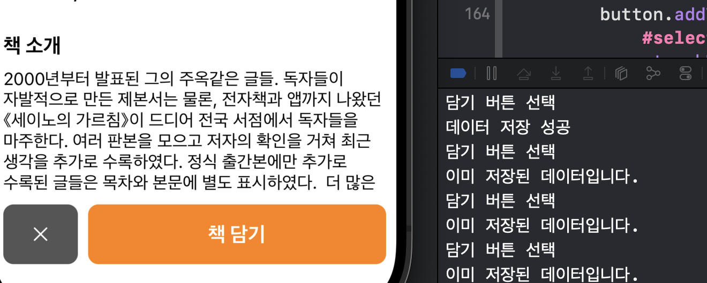
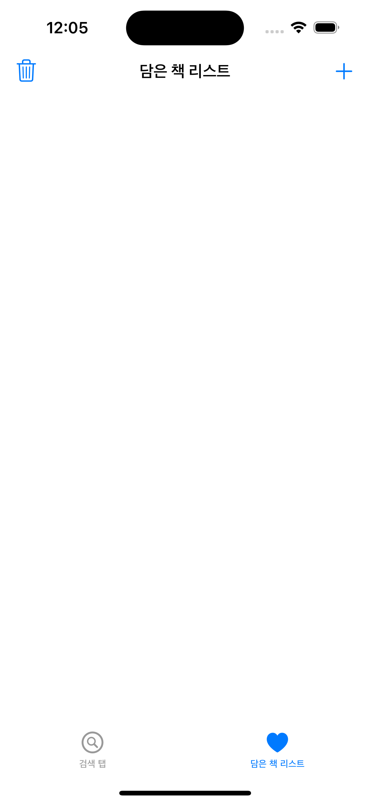
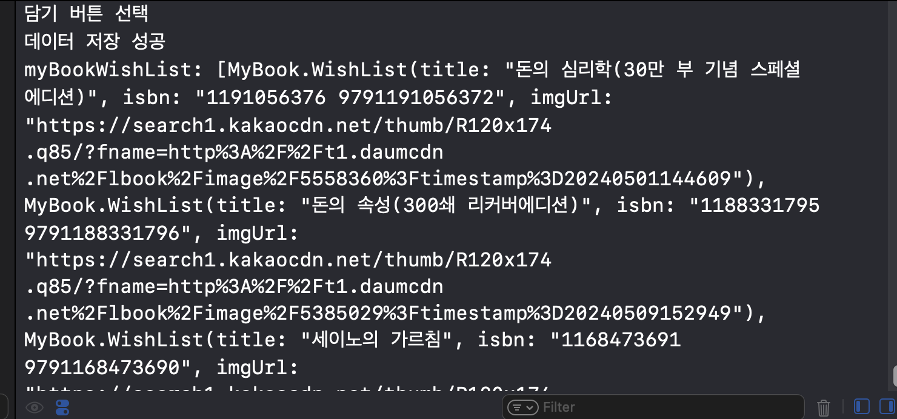
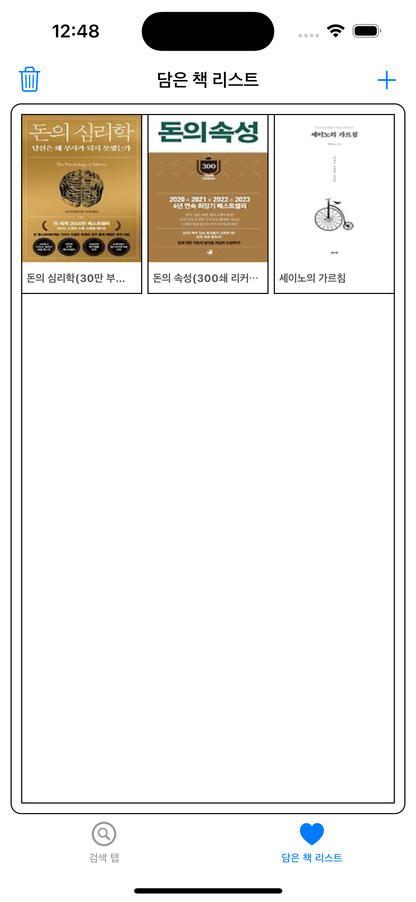
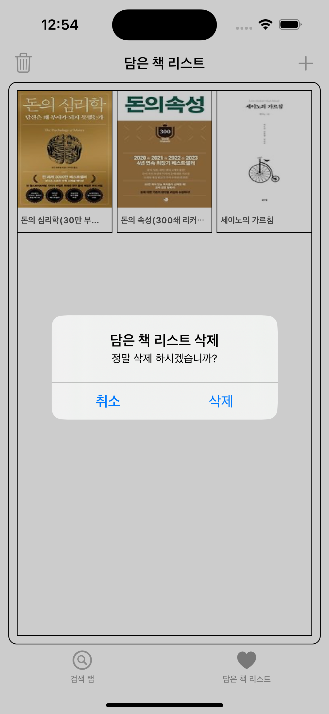
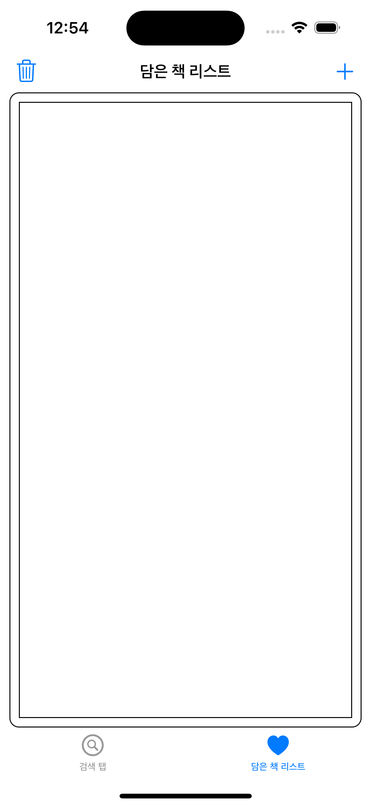

# 지난이야기 
- [⭐️책 검색 앱 만들기 1 보러가기⭐️](https://limlogging.github.io/sparta/MyBookApp1/){:target="_blank"} 
- [⭐️책 검색 앱 만들기 2 보러가기⭐️](https://limlogging.github.io/sparta/MyBookApp2/){:target="_blank"} 
- [⭐️책 검색 앱 만들기 3 보러가기⭐️](https://limlogging.github.io/sparta/MyBookApp3/){:target="_blank"} 
- [⭐️책 검색 앱 만들기 4 보러가기⭐️](https://limlogging.github.io/sparta/MyBookApp4/){:target="_blank"} 
- 지난번에 이어 책 정보보여주는 페이지에서 닫기 및 담기 기능을 구현하고 담은 책 리스트를 만들겠습니다. 

# 1. 화면 닫기 및 책 담기 버튼 기능 추가하기 
- addTarget으로 닫기 버튼과 책 담기 버튼을 선택 시 사용할 함수를 추가했습니다. 

```swift 
    // MARK: - 닫기 버튼
    lazy var closeButton: UIButton = {
        let button = UIButton()
        button.setImage(UIImage(systemName: "xmark"), for: .normal)
        button.tintColor = .white   //버튼의 색상
        button.backgroundColor = .darkGray
        button.clipsToBounds = true
        button.layer.cornerRadius = 10
        button.translatesAutoresizingMaskIntoConstraints = false
        button.addTarget(self, action: #selector(closeButtonTapped), for: .touchUpInside)
        return button
    }()
    
    // MARK: - 책 담기 버튼
    lazy var addButton: UIButton = {
        let button = UIButton()
        button.setTitle("책 담기", for: .normal)
        button.titleLabel?.font = UIFont.systemFont(ofSize: 20, weight: .bold)
        button.setTitleColor(.white, for: .normal)
        button.backgroundColor = .orange
        button.clipsToBounds = true
        button.layer.cornerRadius = 10
        button.translatesAutoresizingMaskIntoConstraints = false
        button.addTarget(self, action: #selector(addButtonTapped), for: .touchUpInside)
        return button
    }()

    // MARK: - 닫기 버튼 선택
    @objc func closeButtonTapped() {
        dismiss(animated: true, completion: nil)
    }
    
```

# 2. 함수 기능 추가하기 
- X 버튼을 선택하면 화면 닫기, 책 담기를 선택하면 코어데이터에 입력되도록 하였습니다. 
- 책을 담을 때 중복되는 데이터를 확인하여 중복된 데이터는 담기지 않도록 하였습니다. 
- 같은 이름의 책이 있을 수 있어 isbn으로만 체크할까 하다가 책제목, isbn, 책이미지주소까지 우선 추가했습니다. 

```swift
    // MARK: - 담기 버튼 선택
    @objc func addButtonTapped() {
        print("담기 버튼 선택")
        
        guard let appDelegate = UIApplication.shared.delegate as? AppDelegate else { return }
        let context = appDelegate.persistentContainer.viewContext
        
        // 중복 데이터 확인
        let fetchRequest: NSFetchRequest<BookWishList> = BookWishList.fetchRequest()
        if let title = tempTitle,
           let isbn = tempIsbn,
           let imgUrl = tempImageView {            
            fetchRequest.predicate = NSPredicate(format: "title == %@ AND isbn == %@ AND imgUrl == %@", title, isbn, imgUrl)
        }
        do {
            let results = try context.fetch(fetchRequest)
            if results.isEmpty { // 중복되지 않은 경우에만 저장
                guard let entity = NSEntityDescription.entity(forEntityName: "BookWishList", in: context) else { return }
                let myBook = NSManagedObject(entity: entity, insertInto: context)
                myBook.setValue(tempTitle, forKey: "title")
                myBook.setValue(tempIsbn, forKey: "isbn")
                myBook.setValue(tempImageView, forKey: "imgUrl")
                
                try context.save()
                print("데이터 저장 성공")
            } else {
                print("이미 저장된 데이터입니다.")
            }
        } catch let error as NSError {
            print("데이터 저장 에러: \(error.localizedDescription)")
        }
    }
```

## 실행화면
- 책을 담고 책을 또 담으면 저장된 데이터라고 출력됩니다. 
- 창을 닫고 alert로 구현해야하는데 우선은 print로 확인만 했습니다. 


# 3. 담은 책 리스트 화면 만들기 
- 네비게이션바에 삭제 버튼, 추가 버튼을 추가하고 title을 지정하였습니다. 
- 버튼의 상세 기능은 나중에 구현하겠습니다. 

```swift
    override func viewDidLoad() {
        super.viewDidLoad()
        view.backgroundColor = .white
        
        setupNavigationButton()         //네비게이션 버튼 설정
    }

    // MARK: - 네비게이션 버튼 설정
    func setupNavigationButton() {
        navigationItem.title = "담은 책 리스트"
        // 왼쪽 삭제 버튼 추가
        let deleteButton = UIBarButtonItem(barButtonSystemItem: .trash , target: self, action: #selector(deleteButtonTapped))
        navigationItem.leftBarButtonItem = deleteButton
        // 오른쪽 추가 버튼 추가
        let addButton = UIBarButtonItem(barButtonSystemItem: .add, target: self, action: #selector(addButtonTapped))
        navigationItem.rightBarButtonItem = addButton
    }
    // MARK: - 담은 책 리스트 전체 삭제
    @objc func deleteButtonTapped() {
    }    
    // MARK: - 추가 버튼
    @objc func addButtonTapped() {
    }
```

## 실행화면
- 버튼과 타이틀이 추가된 것을 확인할 수 있습니다. 



# 4. 담은 책 리스트를 보여줄 컬렉션 뷰 만들기 
- UIView를 추가하고 UIView에 컬렉션뷰를 추가했습니다.
- 오토레이아웃은 스냅킷을 사용하여 처리하였습니다. (다른 분들이 스냅킷으로 하셔서 연습 겸 사용했습니다.)
- 나중에는 스냅킷으로 코드를 다 바꿔보려고 합니다. 

```swift
    // MARK: - 컬렉션뷰를 담을 뷰
    private var cvView: UIView = {
        let view = UIView()
        view.layer.borderColor = #colorLiteral(red: 0, green: 0, blue: 0, alpha: 1)
        view.layer.borderWidth = 1
        view.layer.cornerRadius = 10
        view.clipsToBounds = true
        return view
    }()
    
    // MARK: - 담은 책 컬렉션 뷰
    lazy private var MyBookCollectionView: UICollectionView = {
        let flowLayout = UICollectionViewFlowLayout()
        flowLayout.scrollDirection = .vertical
        flowLayout.minimumInteritemSpacing = collectionViewItemSpacing
        flowLayout.minimumLineSpacing = 10
        let collectionView = UICollectionView(frame: .zero, collectionViewLayout: flowLayout)
        return collectionView
    }()

    override func viewDidLoad() {
        super.viewDidLoad()
        view.backgroundColor = .white
   
        setupAddView()                  //뷰 추가 설정
        setupAutoLayout()               //오토레이아웃 설정
    }

    // MARK: - 뷰 추가 설정
    func setupAddView() {
        cvView.addSubview(MyBookCollectionView)
        view.addSubview(cvView)
    }

    // MARK: - 오토레이아웃 설정
    func setupAutoLayout() {
        // MARK: - 컬렉션 뷰를 담을 뷰
        cvView.snp.makeConstraints { make in
            make.top.equalTo(view.safeAreaLayoutGuide.snp.top)
            make.leading.equalTo(view.safeAreaLayoutGuide.snp.leading).offset(10)
            make.trailing.equalTo(view.safeAreaLayoutGuide.snp.trailing).inset(10)
            make.bottom.equalTo(view.safeAreaLayoutGuide.snp.bottom)
        }
        
        // MARK: - 담은 책 컬렉션 뷰
        MyBookCollectionView.snp.makeConstraints { make in
            make.top.equalTo(cvView.snp.top).offset(10)
            make.leading.equalTo(cvView.snp.leading).offset(10)
            make.trailing.equalTo(cvView.snp.trailing).inset(10)
            make.bottom.equalTo(cvView.snp.bottom).inset(10)
        }
    }
```

## 실행화면 


# 5. Cell 파일 생성 및 Cell 등록하기 
- UICollectionViewCell를 상속받는 MyBookListCollectionViewCell 파일을 만들었습니다. 

```swift 
class MyBookListCollectionViewCell: UICollectionViewCell {
    // MARK: - Cell 등록 시 사용할 identifier 설정
    static let identifier = String(describing: MyBookListCollectionViewCell.self)
    
    // MARK: - 책 이미지
    var bookImageView: UIImageView = {
        let imageView = UIImageView()
        imageView.backgroundColor = .systemPink
        return imageView
    }()
    
    // MARK: - 책 제목
    var bookTilteLabel: UILabel = {
        let label = UILabel()
        label.font = UIFont.systemFont(ofSize: 10, weight: .bold)
        label.textColor = .darkGray
        return label
    }()
    
    override init(frame: CGRect) {
        super.init(frame: frame)
        self.layer.borderColor = #colorLiteral(red: 0, green: 0, blue: 0, alpha: 1)
        self.layer.borderWidth = 1
        
        addSubview(bookImageView)
        addSubview(bookTilteLabel)
        
        // 책 이미지 
        bookImageView.snp.makeConstraints { make in
            make.top.equalToSuperview()
            make.leading.equalToSuperview()
            make.trailing.equalToSuperview()
            make.height.equalTo(140) // 이미지 뷰 높이 설정
        }
        
        // 책 제목
        bookTilteLabel.snp.makeConstraints { make in
            make.top.equalTo(bookImageView.snp.bottom)
            make.leading.equalToSuperview().offset(5)
            make.trailing.equalToSuperview().inset(5)
            make.bottom.equalToSuperview()
        }
    }
    
    required init?(coder: NSCoder) {
        fatalError("init(coder:) has not been implemented")
    }
}
```

- 다시 담은 책 리스트로 돌아와서 셀을 등록합니다. 

```swift
    override func viewDidLoad() {
        super.viewDidLoad()
        view.backgroundColor = .white
  
        setupMyBookListCollectionView() //컬렉션 뷰 설정
    }

    // MARK: - 컬렉션 뷰 설정
    func setupMyBookListCollectionView() {
        MyBookCollectionView.register(MyBookListCollectionViewCell.self, forCellWithReuseIdentifier: MyBookListCollectionViewCell.identifier)
    }
```

# 6. 화면이 열릴 때 코어데이터에서 데이터 불러오기 
- 화면이 열릴 때 코어데이터에서 데이터를 불러와서 배열에 담아 배열의 데이터를 컬렉션뷰에 출력하겠습니다. 

- 코어데이터에서 불러온 데이터를 담을 구조체 파일을 하나 만들었습니다. 

```swift
struct WishList {
    var title: String
    var isbn: String
    var imgUrl: String
}
```

- 구조체 타입 변수를 만들었습니다. 

```swift 
var myBookWishList: [WishList] = [] //코어데이터에서 불러온 데이터를 담을 변수
```

- 함수를 만들어 코어데이터 조회 및 배열에 할당하였습니다.

```swift
   // MARK: - 코어데이터 데이터 가져오기
    private func fetchEntityData() {
        do {
            //배열 초기화
            myBookWishList = []
            
            // 코어 데이터에서 BookWishList 엔티티의 모든 데이터를 가져오기
            let context = (UIApplication.shared.delegate as! AppDelegate).persistentContainer.viewContext
            let request = NSFetchRequest<BookWishList>(entityName: "BookWishList")
            let result = try context.fetch(request)
             
            // 가져온 데이터를 WishList 구조체로 변환하여 배열에 추가
            for data in result {
                let wishList = WishList(title: data.title ?? "",
                                        isbn: data.isbn ?? "",
                                        imgUrl: data.imgUrl ?? "")
                myBookWishList.append(wishList)
            }
            
            //컬렉션 뷰 새로고침
            DispatchQueue.main.async { [weak self] in
                self?.MyBookCollectionView.reloadData()
            }
            
            print("myBookWishList: \(myBookWishList)")
        } catch {
            print("코어 데이터에서 데이터를 가져오는데 실패했습니다: \(error.localizedDescription)")
        }
    }
```

- viewDidLoad가 아닌 viewWillAppear에 fetchEntityData 함수를 추가합니다. 
- 처음 한번 추가하고 리스트를 출력하면 출력이 되는데  다시 추가 후 담은 책 리스트를 가면 출력이 되지 않아 viewWillAppear에 추가하였습니다. 
    - 탭바 컨트롤러에서 뷰 컨트롤러를 전환할 때 viewDidLoad는 해당 뷰 컨트롤러가 처음으로 로드될 때 한 번만 호출됩니다. 
    - ⭐️ 이미 로드된 뷰 컨트롤러가 다시 화면에 표시될 때는 해당 뷰 컨트롤러의 viewWillAppear 또는 viewDidAppear 메서드가 호출해야합니다! ⭐️

```swift
    override func viewWillAppear(_ animated: Bool) {
        super.viewWillAppear(animated)
        fetchEntityData()         //코어데이터에서 데이터 가져오기
    }
```

## 실행화면 



# 7. 컬렉션 뷰 데이터소스 프로토콜 채택 및 셀 크기 설정
- 컬렉션 뷰 데이터소스 프로토콜 채택 및 설정 

```swift 
private let collectionViewItemSpacing: CGFloat = 5
private let collectionViewLineItemCnt: CGFloat = 3

extension MyBookListViewController: UICollectionViewDataSource {
    func collectionView(_ collectionView: UICollectionView, numberOfItemsInSection section: Int) -> Int {
        return myBookWishList.count
    }
    
    func collectionView(_ collectionView: UICollectionView, cellForItemAt indexPath: IndexPath) -> UICollectionViewCell {
        guard let cell = collectionView.dequeueReusableCell(withReuseIdentifier: MyBookListCollectionViewCell.identifier, for: indexPath) as? MyBookListCollectionViewCell else { return UICollectionViewCell() }
        
        if let url = URL(string: myBookWishList[indexPath.row].imgUrl) {
            DispatchQueue.main.async {
                cell.bookImageView.kf.setImage(with: url)
            }
        }
        cell.bookTilteLabel.text = myBookWishList[indexPath.row].title
        
        return cell
    }
}
```

- 셀 크기 설정하기 

```swift 
extension MyBookListViewController: UICollectionViewDelegateFlowLayout {
    // MARK: - 컬렉션 뷰 셀 크기 설정
    func collectionView(_ collectionView: UICollectionView, layout collectionViewLayout: UICollectionViewLayout, sizeForItemAt indexPath: IndexPath) -> CGSize {
        let width = (collectionView.bounds.width - (collectionViewItemSpacing * (collectionViewLineItemCnt - 1))) / collectionViewLineItemCnt
        return CGSize(width: width, height: 170)
    }
    
    func collectionView(_ collectionView: UICollectionView, didSelectItemAt indexPath: IndexPath) {
        print(myBookWishList[indexPath.row].title)
    }
}
``` 

- 대리자 지정하기 

```swift   
    // MARK: - 컬렉션 뷰 설정
    func setupMyBookListCollectionView() {
        MyBookCollectionView.dataSource = self
        MyBookCollectionView.delegate = self
        MyBookCollectionView.register(MyBookListCollectionViewCell.self, forCellWithReuseIdentifier: MyBookListCollectionViewCell.identifier)
    }
```

## 실행화면 


# 8. 전체 삭제하기 기능 구현 
- alert를 사용하여 삭제 여부를 한번 더 확인하고 코어데이터를 삭제 후 배열을 초기화하고 컬렉션뷰를 reload합니다. 

```swift
    // MARK: - 담은 책 리스트 전체 삭제
    @objc func deleteButtonTapped() {
        let alertController = UIAlertController(title: "담은 책 리스트 삭제", message: "정말 삭제 하시겠습니까?", preferredStyle: .alert)
        let cancelButton = UIAlertAction(title: "취소", style: .cancel, handler: nil)
        let submitButton = UIAlertAction(title: "삭제", style: .default) { [weak self] _ in
            guard let appDelegate = UIApplication.shared.delegate as? AppDelegate else { return }
            let context = appDelegate.persistentContainer.viewContext
    
            let fetchRequest = NSFetchRequest<NSFetchRequestResult>(entityName: "BookWishList")
            let deleteRequest = NSBatchDeleteRequest(fetchRequest: fetchRequest)
    
            do {
                try context.execute(deleteRequest)
                try context.save()
                print("담은 책 데이터 삭제 완료")
    
                self?.myBookWishList = [] //배열 초기화
                
                DispatchQueue.main.async { [weak self] in
                    self?.MyBookCollectionView.reloadData()
                }
            } catch {
                print("담은 책 데이터 삭제 실패: \(error.localizedDescription)")
            }
        }
        alertController.addAction(cancelButton)
        alertController.addAction(submitButton)
        present(alertController, animated: true, completion: nil)
    }
```

## 실행화면 



# 마무리 
- 코어데이터와 컬렉션뷰를 사용해서 담은 책 리스트를 구현하였습니다. 
- 추가 버튼의 기능은 검색 탭으로 돌아가 서치바에 포커스를 둬야하는데 선택 구현 과제라 필수과제를 끝내고 다시 확인해보겠습니다. 