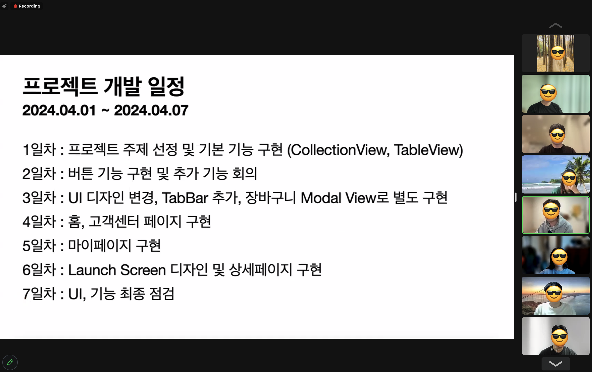
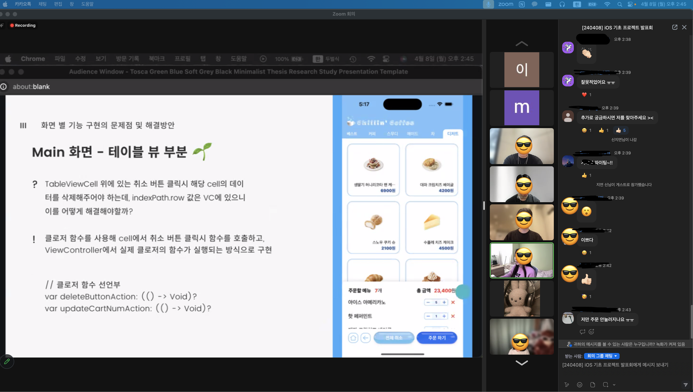

# 팀프로젝트 
- 팀프로젝트가 바빠서 28, 29일차는 생략! 
- 이번 팀 프로젝트의 개인적인 목표는 기존에 배웠던 내용을 학습하고 깃허브와 익숙해지기였다. 
- 깃허브 머지 역할을 담당하면서 충돌, 브랜치 다시 만들기, 코드로 직접 옮겨쓰기 .. 많은 우여곡절이 있었다. 깃허브를 제대로 마스터하지는 못했지만 기본적인 사용방법을 알아낸 것 같아 만족스러웠다. 
- 기존에 배웠던 내용 + 코드로 UI 작성하기 + 스크롤뷰에서 페이지컨트롤러를 사용하여 이미지 출력하기를 만들어볼 수 있었다. 

## 야근?하는 다른 팀들과 함께... 🧑🏻‍💻  
- 우리조에 난입한 친구들 ! 

## 우리팀 발표 

## 발표 무작위 캡처 

    
# 팀 프로젝트 
- [팀프로젝트](https://limlogging.github.io/sparta/firstTeamProject/){:target="_blank"}

# 팀 프로젝트 회고 
- [팀프로젝트 회고](https://limlogging.github.io/sparta/firstTeamProjectKPT/){:target="_blank"}

### 내일 목표 
- 새로운 팀에 적응하기 
- 챌린지반 과제 