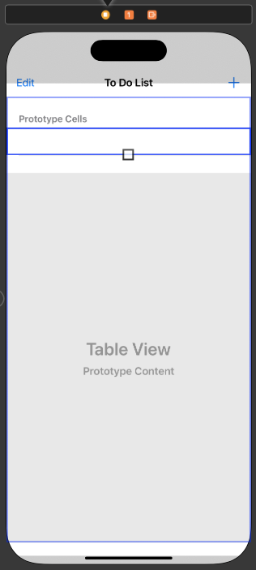

# UITableView 
- 세로로만 스크롤 가능한 뷰
- iOS 애플리케이션에서 테이블 형식의 데이터를 표시하고 관리하는 데 사용되는 중요한 뷰 컴포넌트입니다. 
- 테이블 뷰는 여러 행으로 구성되며, 각 행에는 하나 이상의 셀이 포함됩니다. 
- 각 셀은 사용자 인터페이스에 정보를 표시하거나 사용자 상호 작용을 위한 컨트롤을 제공합니다.

## 특징
- 다양한 셀 유형
    - UITableView는 특정 유형의 데이터를 표시하기 위해 다양한 스타일과 레이아웃의 셀을 지원합니다. 텍스트, 이미지, 버튼 등 다양한 컨텐츠를 포함할 수 있습니다.
- 스크롤 기능
    - 테이블 뷰는 데이터가 많거나 너무 긴 경우에도 스크롤하여 모든 데이터에 접근할 수 있도록 합니다.
- 섹션 및 인덱스
    - UITableView는 섹션을 사용하여 데이터를 구성하고 섹션 인덱스를 제공하여 사용자가 특정 부분으로 빠르게 이동할 수 있도록 합니다.
- 셀 재사용
    - UITableView는 셀을 효율적으로 관리하기 위해 셀 재사용 메커니즘을 사용합니다. 이는 메모리 사용량을 최적화하고 성능을 향상시킵니다.
- 델리게이트 및 데이터 소스
    - UITableView는 UITableViewDelegate 및 UITableViewDataSource 프로토콜을 사용하여 사용자 상호 작용 및 데이터 관리를 처리합니다. 데이터 소스는 UITableView에 표시할 데이터를 제공하고, 델리게이트는 사용자 상호 작용 및 테이블 뷰의 동작을 제어합니다.

## 사용 
- iOS 애플리케이션에서 매우 일반적으로 사용됩니다. 
- 메시지 리스트, 설정 화면, 사용자 목록 등

# UITableView 설정 예제 코드

## 1. 스토리보드에 Table View 추가 


## 2. TableView 아울렛 변수 추가 
- 스토리보드에 추가한 객체에 접근 할 수 있는 아울렛 변수 추가 

```swift
class ViewController: UIViewController {    
    @IBOutlet weak var toDoListTableView: UITableView!
 
    override func viewDidLoad() {
        super.viewDidLoad()
    }
```

## 3. TableView DataSource 추가 및 필수 메서드 구현 
- ViewController 클래스에 UITableViewDataSource 프로토콜을 확장(extension)하여 UITableViewDataSource 프로토콜의 메서드를 구현

```swift
extension ViewController: UITableViewDataSource {
    //특정 섹션(section)에 표시할 행(row)의 수를 반환
    public func tableView(_ tableView: UITableView, numberOfRowsInSection section: Int) -> Int {
        return 10   //10개의 행을 반환하여 표시 
    }
    
    //메서드는 특정 indexPath에 해당하는 행의 셀을 반환
    public func tableView(_ tableView: UITableView, cellForRowAt indexPath: IndexPath) -> UITableViewCell {
        //행에 표시할 셀을 생성하고 반환 
        return UITableViewCell() 
    }
}
```

- 세션은 여러개의 row로 구성된 그룹 (아래 빨간 묶음)


## 4. DataSource 설정 (델리게이트 설정과 동일)

```swift
class ViewController: UIViewController {    
    @IBOutlet weak var toDoListTableView: UITableView!
 
    override func viewDidLoad() {
        super.viewDidLoad()
        toDoListTableView.dataSource = self //UITableView의 dataSource를 현재(self)의 ViewController로 설정
    }
```

## 5. 실행
- row 10개가 생겼는데 데이터가 없습니다.  


## 6. row에 Data를 입력하기위해 Cell 추가 
- 라이브러리에서 table view cell을 추가합니다. 


## 7. Cell 식별자(Identifier) 이름 지정  
- 셀을 선택하고 인스펙터(Inspector) 화면에서 식별자 이름을 지정합니다. 


- 식별자 이름을 변경하면 다큐먼트 아웃라인(Document Outline) 화면에서도 변경된 것을 확인할 수 있습니다. 


## 8. Cell에 연결시킬 Class 파일 생성
- UITableViewCell를 상속 받는 ToDoCell 클래스를 생성합니다. 


## 9. Cell에 Class 연결 
- 스토리보드에서 Cell을 선택하고 인스펙터 화면에서 클래스를 연결합니다. 


## 10. Cell에 object 추가 및 아울렛 변수 추가 
- label 2개 스위치 1개를 추가했습니다. 

- 만들어진 객체의 아울렛 변수 추가했습니다. 
```swift
class ToDoCell: UITableViewCell {
    @IBOutlet weak var idLebel: UILabel!        //id
    @IBOutlet weak var titleLabel: UILabel!     //title
    @IBOutlet weak var isCompleteSwitch: UISwitch!      //스위치 
    
    override func awakeFromNib() {
        super.awakeFromNib()
        // Initialization code
    }
```

## 11. Cell에 보여줄 배열 생성 및 초기화 
- 구조체 생성 및 배열 초기화 
```swift
    struct ToDo {
        var id: Int
        var title: String
        var isComplete: Bool
    }
    var toDoListArr: [ToDo] = [
        ToDo(id: 1, title: "테스트1111", isComplete: true),
        ToDo(id: 2, title: "테스트2222", isComplete: false),
        ToDo(id: 3, title: "테스트3333", isComplete: true)
    ]
```

## 12. UITableViewDataSource 필수 메서드 수정 

```swift
extension ViewController: UITableViewDataSource {
    //특정 섹션에 표시할 행의 수
    public func tableView(_ tableView: UITableView, numberOfRowsInSection section: Int) -> Int {
        return toDoListArr.count //테이블 뷰에 표시할 셀의 개수를 배열의 수로 변경
    }
    
    //특정 indexPath에 해당하는 행의 셀을 반환
    public func tableView(_ tableView: UITableView, cellForRowAt indexPath: IndexPath) -> UITableViewCell {
        //재사용 가능한 셀을 생성, 식별자를 Cell과 동일하게, cell이 UITableViewCell라서 만들어놓은 Cell로 다운캐스팅
        let cell = tableView.dequeueReusableCell(withIdentifier: "ToDoCell", for: indexPath) as! ToDoCell
        
        //ToDoCell 클래스의 아울렛 변수에 배열의 값을 할당
        cell.idLebel.text = String(toDoListArr[indexPath.row].id)
        cell.titleLabel.text = toDoListArr[indexPath.row].title
        cell.isCompleteSwitch.isOn = toDoListArr[indexPath.row].isComplete
        
        return cell //셀 반환 
    }
}
```

## 13. 실행
- 배열의 데이터을 cell에서 확인할 수 있습니다. 


# 마무리 
- Table View에서 row와 cell의 데이터는 TableViewDatasource 프로토콜을 채택하여 필수 메서드 구현, viewDidLoad 밑 datasource 설정 필수 
- UITableViewCell을 상속받는 클래스를 만들고 스토리보드의 Cell과 연결시키기, 스토리보드 Cell의 식별자 추가하기  