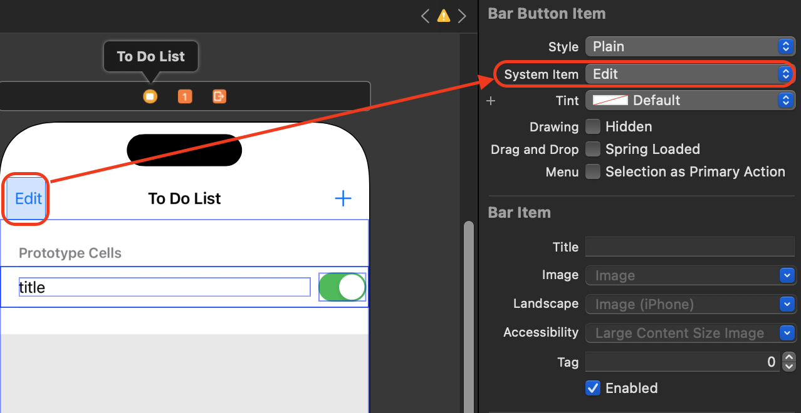

# Navigation Bar에 Edit 버튼 추가하기 
- navigation과 연결된 상태에서 viewDidLoad에 코드를 추가합니다. 

```swift
    override func viewDidLoad() {
        super.viewDidLoad()
        
        myTodoListTableView.dataSource = self
        myTodoListTableView.delegate = self
        
        //상단 Navigation bar 왼쪽에 Edit 버튼 추가
        self.navigationItem.leftBarButtonItem = self.editButtonItem 
    }
```

<br>

# 실행 화면 
- 네비게이션 바 왼쪽에 edit 버튼이 생기고 edit 버튼을 누르면 done으로 바뀝니다.  
- edit 버튼을 선택 시 아무런 변화가 없습니다.  

<video width="640" height="360" controls>
    <source src="../../assets/video/2024-03-26-NavigationBarEditButton1.mov" type="video/mp4">
</video>

<br>

# Delegate 상속 후 setEditing 메서드를 추가
- UITableViewDelegate를 채택하고 setEditing 메서드를 추가합니다. 

```swift
    override func setEditing(_ editing: Bool, animated: Bool) {
        //부모클래스 편집 모드 설정에 관련된 작업을 수행, 없으면 Done 버튼 사라짐 
        super.setEditing(editing, animated: animated) 
        
        //사용자가 편집 모드로 전환할 때 테이블 뷰의 셀을 편집할 수 있도록 허용하거나 허용하지 않도록 설정
        //myTodoListTableView를 편집모드로 변경할 수 있도록 설정 
        myTodoListTableView.setEditing(editing, animated: true) 
    }
```

- 관련 이벤트가 없으면 ⛔️ 버튼을 클릭하면 아무런 변화가 없습니다. 
- [삭제기능 바로가기](https://limlogging.github.io/UIKit/TableViewSwipeDelete/){:target="_blank"}

<br>

# 실행 화면
<video width="640" height="360" controls>
    <source src="../../assets/video/2024-03-26-NavigationBarEditButton2.mov" type="video/mp4">
</video>

<br>

# 코드가 아닌 스토리보드에 bar Button Item 추가하여 구현하기 
## 1. bar Button Item 추가 
- 라이브러리에서 bar button item을 추가하고 System Item을 Edit으로 변경합니다. 



## 2. 액션버튼 생성 
- 편집모드가 아닐땐 Edit 버튼이 보여야하고 편집모드일때는 Done 버튼이 보여야합니다. 
- 새로운 버튼 설정을 하지 않으면 button title이 edit로만 보입니다.  

```swift 
// MARK: - edit 창 선택
@IBAction func editButtonTapped(_ sender: UIBarButtonItem) {
    //편집 모드와 버튼의 Text는 서로 반대 
    if myTodoListTableView.isEditing {
        // 편집 모드 해제
        myTodoListTableView.setEditing(false, animated: true)
        // 새로운 UIBarButtonItem 생성하여 Edit 버튼으로 설정
        let editButton = UIBarButtonItem(barButtonSystemItem: .edit, target: self, action: #selector(editButtonTapped(_:)))
        navigationItem.leftBarButtonItem = editButton
    } else {
        // 편집 모드 활성화
        myTodoListTableView.setEditing(true, animated: true)
        
        // 새로운 UIBarButtonItem 생성하여 Done 버튼으로 설정
        let doneButton = UIBarButtonItem(barButtonSystemItem: .done, target: self, action: #selector(editButtonTapped(_:)))
        navigationItem.leftBarButtonItem = doneButton
    }
}
``` 

<br>

# 마무리 
- Navigation Bar에 버튼을 추가하고 TableView Delegate를 채택하여 TableView 편집모드 구현가능