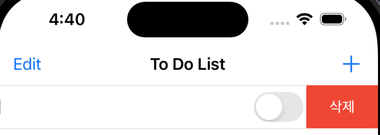
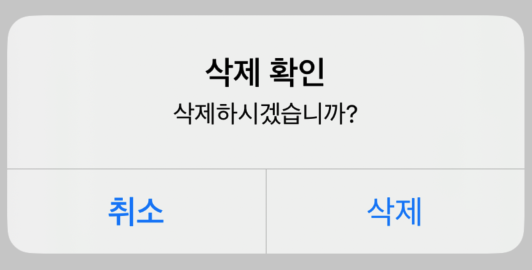

# Tableview에서 Swipe로 Row 삭제하기
- TableView에서 Row을 움직여 삭제할 수 있습니다. 

<br>

# 예제 코드 
```swift
    // MARK: - TableView 스와이프(swipe) 삭제
    func tableView(_ tableView: UITableView, commit editingStyle: UITableViewCell.EditingStyle, forRowAt indexPath: IndexPath) {
        // 편집 스타일이 삭제인 경우 
        if editingStyle == .delete {
            //해당 indexPath에 위치한 데이터를 배열에서 제거
            myToDoListArray.remove(at: indexPath.row)
            // 테이블 뷰에서 해당 행을 애니메이션과 함께 삭제
            tableView.deleteRows(at: [indexPath], with: .fade)
        } 
    }
```

<br>

# 실행화면 
<video width="640" height="360" controls>
    <source src="../../assets/video/2024-03-26-TableViewSwipeDelete.mov" type="video/mp4">
</video>

<br>

# 버튼 이름 변경 
- 버튼 이름 변경 (Delete -> 삭제) 

```swift
    // MARK: - 삭제 글자 변경 Delete -> 삭제
    func tableView(_ tableView: UITableView, titleForDeleteConfirmationButtonForRowAt indexPath: IndexPath) -> String? {
        return "삭제"
    }
```

- 버튼 이름 변경 확인 



<br>

# 삭제 전 alert 버튼으로 다시 확인하기 
- alert 추가 코드 

```swift
    // MARK: - TableView 스와이프(swipe) 삭제
    func tableView(_ tableView: UITableView, commit editingStyle: UITableViewCell.EditingStyle, forRowAt indexPath: IndexPath) {
        if editingStyle == .delete {
            let alertController = UIAlertController(title: "삭제 확인", message: "삭제하시겠습니까?", preferredStyle: .alert)
            let cancelButton = UIAlertAction(title: "취소", style: .cancel)
            let deleteButton = UIAlertAction(title: "삭제", style: .default) { _ in
                //해당 indexPath에 위치한 데이터를 배열에서 제거
                self.myToDoListArray.remove(at: indexPath.row)
                // 테이블 뷰에서 해당 행을 애니메이션과 함께 삭제
                tableView.deleteRows(at: [indexPath], with: .fade)
            }
            alertController.addAction(cancelButton)
            alertController.addAction(deleteButton)
            present(alertController, animated: true, completion: nil)
        } 
    }
```
- alert 창 확인 



<br>

# 마무리
- TableView의 편집 버튼을 눌러 삭제를 시도할 수 있지만 Swipe로 삭제 가능 
- 삭제를 되물어보는 기능이 없어 따로 만들어야함 
- 해당 메서드가 XCode에서 자동검색이 되지 않는 것 같다. 
    - ⭐️⭐️⭐️더 찾아보니 내 클래스 파일은 UIViewController를 상속받는 클래스인데 <font color="red">UITableViewController</font>를 상속받는 클래스 파일을 만들면 주석처리된 메서드가 그냥 보인다!!!!!⭐️⭐️⭐️ 
    ```swift
    /*
    // Override to support editing the table view.
    override func tableView(_ tableView: UITableView, commit editingStyle: UITableViewCell.EditingStyle, forRowAt indexPath: IndexPath) {
        if editingStyle == .delete {
            // Delete the row from the data source
            tableView.deleteRows(at: [indexPath], with: .fade)
        } else if editingStyle == .insert {
            // Create a new instance of the appropriate class, insert it into the array, and add a new row to the table view
        }    
    }
    */
    ```