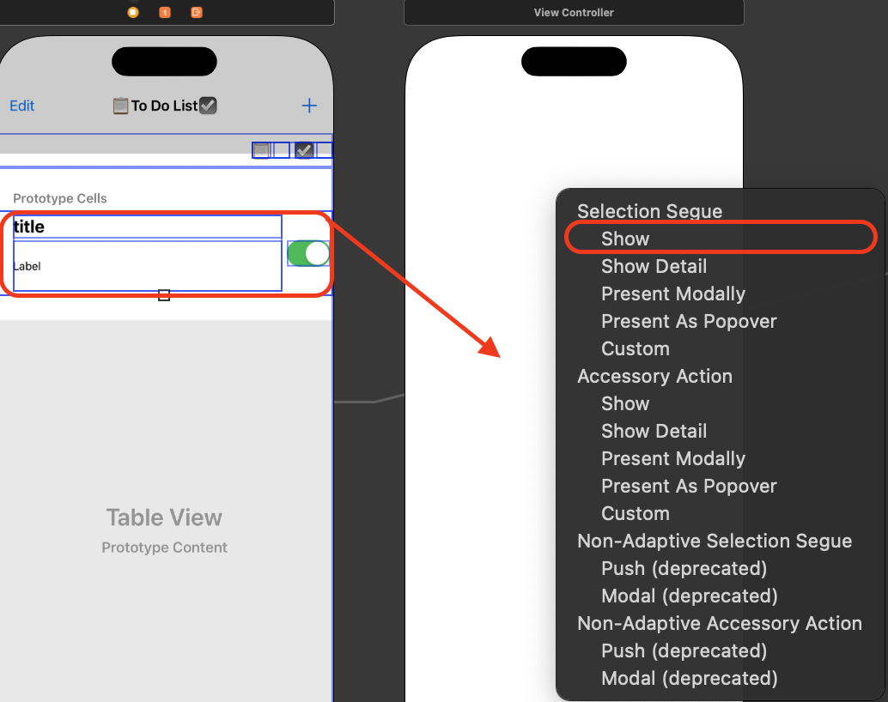
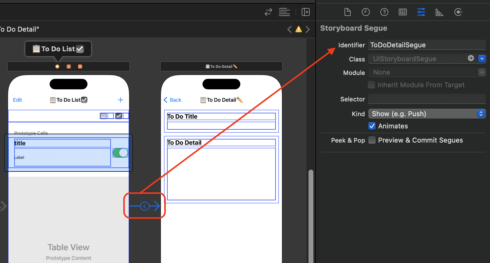
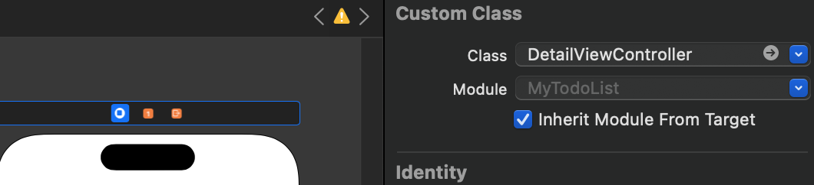
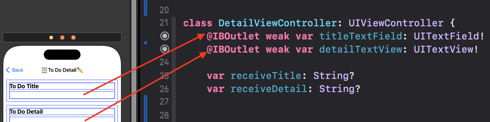

# Row 선택 후 화면 이동하기 
- ViewController를 만들고 TableView Row를 선택하면 Cell의 정보를 확인하는 방법입니다. 

## 1. 실행화면 

<video width="640" height="360" controls>
    <source src="../../assets/video/2024-03-28-로우선택후화면이동.mov" type="video/mp4">
</video>

<br>

## 2. View Controller 생성 및 세그웨이(Segue) 선택
- 세그웨이 연결 후 row를 선택하면 View Controller가 연결됩니다.  
- Cell의 데이터를 View Controller로 전달해주기 위해 설정 및 코드를 추가해야합니다. 



## 3. 세그웨이 식별자 설정 
- 세그웨이 이름을 ToDoDetailSegue로 지정하였습니다. 



## 4. UIViewController를 상속받는 class 파일 생성
- DetailViewController 이름의 class 파일 생성했습니다.  

## 5. View Controller에 생성한 class 파일 연결 
- 스토리보드 컨트롤뷰와 클래스파일을 연결합니다.



## 6. DetailView Controller에서 아울렛 변수 설정 
- 아울렛 변수를 생성하고 코드를 수정합니다.  



```swift
class DetailViewController: UIViewController {
    @IBOutlet weak var titleTextField: UITextField!
    @IBOutlet weak var detailTextView: UITextView!
    
    //ViewController에서 전달 받은 데이터를 저장하는 변수 
    var receiveTitle: String?
    var receiveDetail: String?
    
    override func viewDidLoad() {
        super.viewDidLoad()
        //화면이 실행될때 ViewController에서 받은 데이터를 아울렛 변수에 할당
        titleTextField.text = receiveTitle       
        detailTextView.text = receiveDetail
```

## 7. View Controller에서 prepare 매서드 설정 
- TableView가 있는 클래스파일에서 prepare 메서드 설정 

```swift
    //스토리보드에서의 화면 이동
    override func prepare(for segue: UIStoryboardSegue, sender: Any?) {
        //화면 이동할때 세그웨이 식별자 확인 
        if segue.identifier == "ToDoDetailSegue" {
            let cell = sender as! UITableViewCell   //sender를 UITableViewCell로 캐스팅하여 Cell에 할당 
            let indexPath = self.myTodoListTableView.indexPath(for: cell)   //TableView에서 선택한 셀의 indexPath 가져오기 
            let detailView = segue.destination as! DetailViewController     //세그웨이 목적지를 새로만든 클래스파일로 형변환

            //DetailViewController에 생성한 아울렛 변수에 title, detail 데이터 할당  
            detailView.receiveTitle = myToDoListArray[indexPath!.row].toDoTitle     
            detailView.receiveDetail = myToDoListArray[indexPath!.row].toDoDetail   
        }
    }
```

## 8. 실행 
- 처음 동영상처럼 로우를 선택하면 ViewController의 Cell데이터를 DetailViewController에서도 확인할 수 있습니다. 

<br>

# Detail 화면에서 데이터 수정하기 
- Detail View Controller에서 Title의 TextField, Detail의 TextView를 수정하고 되돌아 갔을때 ViewController에서도 수정된 데이터를 볼 수 있는 예제입니다.  

## 1. 실행 화면 

<video width="640" height="360" controls>
    <source src="../../assets/video/2024-03-28-타이틀디테일수정.mov" type="video/mp4">
</video>

## 2. 델리게이트 채택 
- DetailViewController에서 TextField와 TextView 델리게이트 채택 후 메서드를 구현합니다. 

```swift
// MARK: - 타이틀 처리를 위한 델리게이트
extension DetailViewController: UITextFieldDelegate {
    //UITextField에 텍스트를 입력하거나 삭제할 때마다 호출 
    func textFieldDidChangeSelection(_ textField: UITextField) {

    }
}
// MARK: - 디테일 처리를 위한 델리게이트
extension DetailViewController: UITextViewDelegate {
    // UITextView에 텍스트를 입력하거나 삭제할 때마다 호출
    func textViewDidChange(_ textView: UITextView) {
 
    }
}
```

## 3. 델리게이트 설정 
- 델리게이트를 설정합니다. 

```swift
    override func viewDidLoad() {
        super.viewDidLoad()
        //ViewController에서 받은 데이터 할당
        titleTextField.text = receiveTitle     
        detailTextView.text = receiveDetail
        
        //델리게이트 설정 
        titleTextField.delegate = self
        detailTextView.delegate = self
    }
```

## 4. 델리게이트 프로토콜 정의 
- 프로토콜을 정의하고 선언합니다. 

```swift
import UIKit
//TextField 델리게이트 
protocol DetailViewControllerTitleDelegate: AnyObject {
    func textFieldDidChangeSelection(_ controller: DetailViewController, textField: String)
}
//TextView 델리게이트 
protocol DetailViewControllerDetailDelegate: AnyObject {
    func textViewDidChange(_ controller: DetailViewController, textView: String)
}
class DetailViewController: UIViewController {
    //코드생략 

    //델리게이트 선언 
    var titleDelegate: DetailViewControllerTitleDelegate?       
    var detailDelegate: DetailViewControllerDetailDelegate? 
```

## 5. 메서드 구현 
- 델리게이트 채택 후 생성한 메서드를 구현합니다. 

```swift
// MARK: - 타이틀 처리를 위한 델리게이트
extension DetailViewController: UITextFieldDelegate {
    func textFieldDidChangeSelection(_ textField: UITextField) {
        //textField 확인 후 nil 체크 
        if textField == titleTextField {
            if textField.text != nil {
                //textField의 변경을 알림 
                titleDelegate?.textFieldDidChangeSelection(self, textField: textField.text!)
            }
        }
    }
}
// MARK: - 디테일 처리를 위한 델리게이트
extension DetailViewController: UITextViewDelegate {
    func textViewDidChange(_ textView: UITextView) {
        //textView 확인 후 nil 체크 
        if textView == detailTextView {
            if textView.text != nil {
                //textView 변경 알림 
                detailDelegate?.textViewDidChange(self, textView: textView.text)
            }
        }
    }
}
```

## 6. ViewController에서 생성한 델리게이트 채택 
- 필수 메서드를 구현하고 ViewController의 배열에서 title, detail 데이터를 수정하면 되는데 indexPath를 알 수 없습니다. 

```swift
// MARK: - 디테일 뷰에서 타이틀 입력
extension ViewController: DetailViewControllerTitleDelegate {
    func textFieldDidChangeSelection(_ controller: DetailViewController, textField: String) {
        //ViewController에 있는 배열의 데이터 수정 
    }
}
// MARK: - 디테일 뷰에서 디테일 입력
extension ViewController: DetailViewControllerDetailDelegate {
    func textViewDidChange(_ controller: DetailViewController, textView: String) {
        //ViewController에 있는 배열의 데이터 수정
    }
}
```

## 7. DetailViewController에서 indexPath 받을 변수 생성하기 
- receiveIndexPath 옵셔널 변수와 indexPath 변수를 선언합니다. 
- ViewDidLoad에서 indexPath 변수의 값을 receiveIndexPath로 할당합니다. 

```swift
class DetailViewController: UIViewController {
    @IBOutlet weak var titleTextField: UITextField!
    @IBOutlet weak var detailTextView: UITextView!
    
    //ViewController에서 전달 받은 데이터 저장
    var receiveTitle: String?
    var receiveDetail: String?
    var receiveIndexPath: Int?  //IndexPath를 받기위한 변수 
    
    var indexPath: Int = 0
    
    var titleDelegate: DetailViewControllerTitleDelegate?
    var detailDelegate: DetailViewControllerDetailDelegate?
    
    override func viewDidLoad() {
        super.viewDidLoad()
        titleTextField.text = receiveTitle
        detailTextView.text = receiveDetail
        indexPath = receiveIndexPath!   //indexPath 저장 
```

## 8. ViewController에서 prepare 메서드 수정 
- IndexPath를 전달하는 코드와 델리게이트를 설정합니다. 

```swift
    override func prepare(for segue: UIStoryboardSegue, sender: Any?) {
        if segue.identifier == "ToDoDetailSegue" {
            let cell = sender as! UITableViewCell
            let indexPath = self.myTodoListTableView.indexPath(for: cell)
            let detailView = segue.destination as! DetailViewController
            detailView.receiveTitle = myToDoListArray[indexPath!.row].toDoTitle
            detailView.receiveDetail = myToDoListArray[indexPath!.row].toDoDetail
            detailView.receiveIndexPath = indexPath!.row    //IndexPath 전달 
            detailView.titleDelegate = self     //타이틀처리를 위한 TextField 델리게이트
            detailView.detailDelegate = self    //디테일처리를 위한 TextView 델리게이트
        }
    }
```

## 9. ViewController에서 채택한 메서드 수정 
- indexPath를 받아 올 수 있어 배열을 수정합니다. 
- 수정된 데이터를 확인할 수 있도록 reload 합니다. 

```swift
// MARK: - 디테일 뷰에서 타이틀 입력
extension ViewController: DetailViewControllerTitleDelegate {
    func textFieldDidChangeSelection(_ controller: DetailViewController, textField: String) {
        if let indexPath = controller.receiveIndexPath {
            myToDoListArray[indexPath].toDoTitle = textField    //타이틀 자동저장
            self.myTodoListTableView.reloadData()   //테이블 뷰 리로드
        }
    }
}
// MARK: - 디테일 뷰에서 디테일 입력
extension ViewController: DetailViewControllerDetailDelegate {
    func textViewDidChange(_ controller: DetailViewController, textView: String) {
        if let indexPath = controller.receiveIndexPath {
            myToDoListArray[indexPath].toDoDetail = textView    //디테일 자동저장
            self.myTodoListTableView.reloadData()   //테이블 뷰 리로드
        }
    }
}
```

## 10. 실행 
- 처음 동영상처럼 ViewController의 TableView에서 Row를 선택하면 DetailViewController 화면으로 이동하고 DetailViewController에서 ViewController Cell데이터를 확인할 수 있습니다. 

# 마무리 
- 데이터를 주고 받을 때 델리게이트를 사용해서 주고 받는 연습이 된다. 
