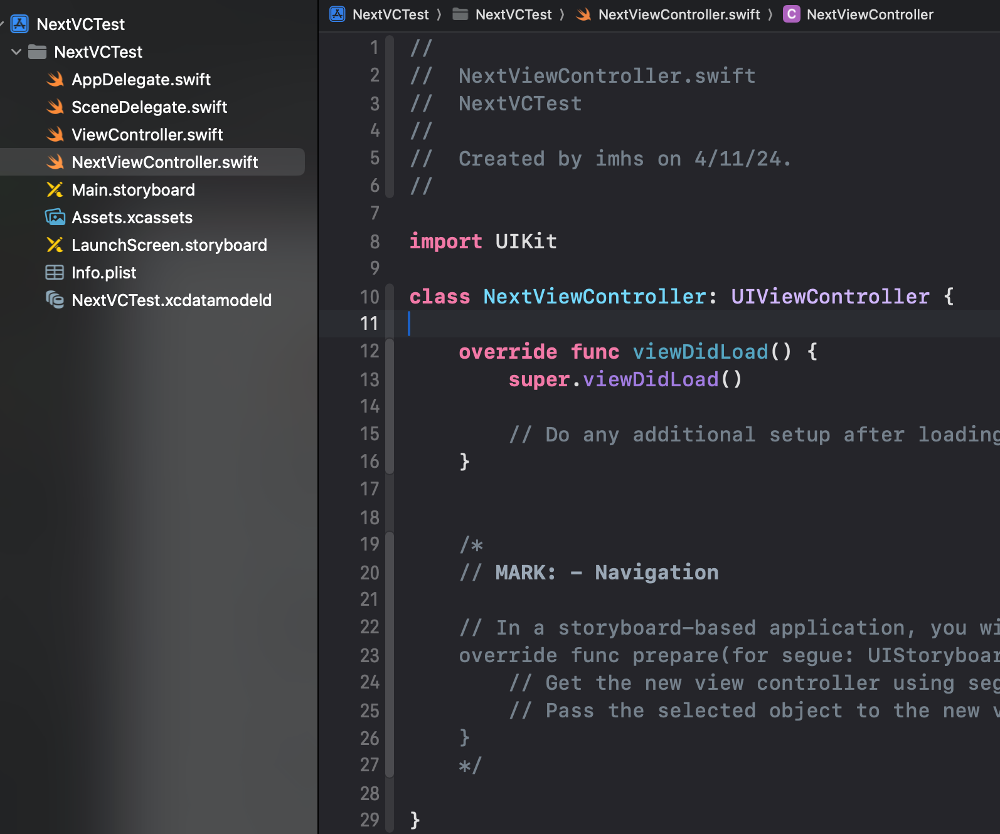
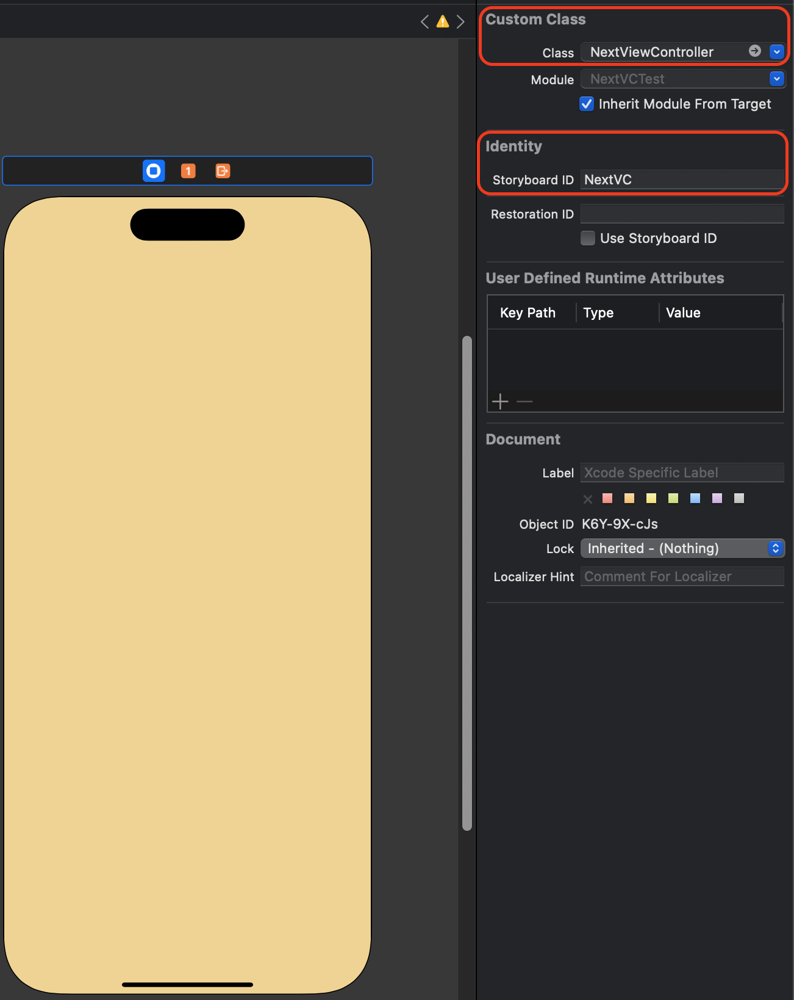

# 세그웨이 없이 코드로 화면 이동 
- 코드로 스토리보드 객체를 생성해서 화면을 이동하는 방법입니다. 

# 1. View Controller에 버튼 추가 및 액션함수 생성 
- 버튼 추가 


- 버튼 액션함수 생성

```swift
// MARK: - 다음 화면으로 이동하는 버튼
@IBAction func nextButtonTapped(_ sender: UIButton) {
}
```

# 2. ViewController 파일 생성 
- UIViewController를 상속받는 NextViewController 생성 


# 3. 스토리보드에 View Controller 추가 및 class파일 등록, 스토리보드 ID 등록 


# 4. 버튼 액션 함수 수정 

```swift
// MARK: - 다음 화면으로 이동하는 버튼
@IBAction func nextButtonTapped(_ sender: UIButton) {
    //현재 스토리보드에서 "NextVC"라는 식별자로 뷰 컨트롤러를 인스턴스화를 시도
    guard let nextVC = storyboard?.instantiateViewController(identifier: "NextVC") as? NextViewController else { return }
    //인스턴스화가 성공하면 새로 생성된 뷰 컨트롤러를 모달로 표시
    self.present(nextVC, animated: true, completion: nil)
}
```

# 5. 실행 화면 

<video width="640" height="360" controls>
    <source src="../../assets/video/categories/uikit/2024-04-11-NextVC2.mov" type="video/mp4">
</video>

# 마무리 
- 세그웨이 없이 ViewController에 스토리보드ID를 지정하고 연결하기 