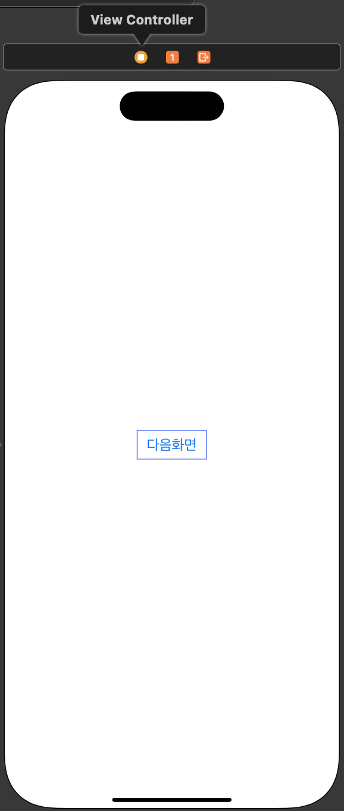

# View와 View를 세그웨이로 연결하고 코드로 화면 이동 
- 세그웨이 식별자를 사용해서 화면이동 

# 1. View Controller에 버튼 추가 및 액션함수 생성 
- 버튼 추가 



- 버튼 액션함수 생성

```swift
// MARK: - 다음 화면으로 이동하는 버튼
@IBAction func nextButtonTapped(_ sender: UIButton) {
}
```

# 2. 스토리보드에서 View Controller 생성 및 연결 
- 스토리보드에 새로 뷰컨트롤러를 추가합니다 (바탕 노란색)
- 뷰 컨트롤러에서 마우스 우클릭으로 드래그 후 옆에 새로 만든 뷰컨트롤러로 드래그하고 마우스를 떼면 Manual Segue 창이 뜹니다. 
- Show를 선택합니다. 


# 3. 세그웨이 식별자ID를 추가 
- 세그웨이는 화면 이동을 담당하는 객체입니다. 
- 세그웨이를 선택하고 식별자ID를 추가합니다. 


# 4. 버튼 액션 함수 수정 

```swift
// MARK: - 다음 화면으로 이동하는 버튼
@IBAction func nextButtonTapped(_ sender: UIButton) {
    // 스토리보드에서 View와 View를 세그웨이로 연결 (매뉴얼 세그웨이 or 간접 세그웨이)
    self.performSegue(withIdentifier: "NextVCSegue", sender: self) //식별자를 사용하여 세그웨이를 실행
}
```

# 5. 실행 화면 

<video width="640" height="360" controls>
    <source src="../../assets/video/categories/uikit/2024-04-11-NextVC3.mov" type="video/mp4">
</video>

# 마무리 
- view - view를 세그웨이로 연결하고 식별자 ID를 통해 세그웨이를 실행 