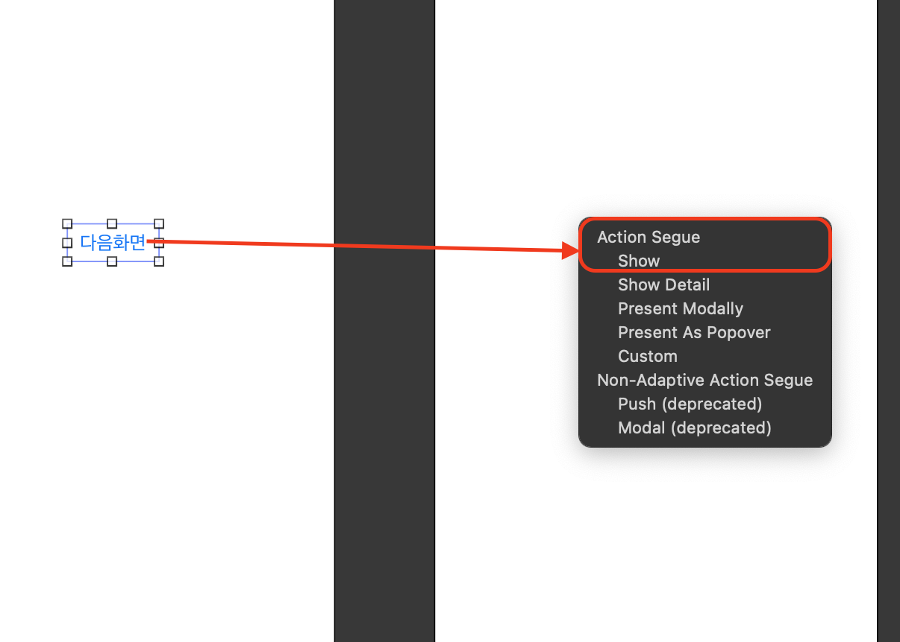

# 스토리보드 버튼과 View를 세그웨이로 연결하고 코드로 화면 이동 
- 세그웨이를 통해 연결됐지만 추가적인 정보를 전달 가능 

# 1. View Controller에 버튼 추가 및 액션함수 생성 
- 버튼을 추가하고 액션함수는 생성하지 않습니다.  


# 2. View Controller 생성 하고 버튼과 연결
- 뷰 컨트롤러에서 버튼을 마우스 우클릭으로 드래그 후 옆에 새로 만든 뷰컨트롤러로 드래그하고 마우스를 떼면 Action Segue 창이 뜹니다. 
- Show를 선택합니다. 
- 버튼을 누르면 View Controller로 바로 이동합니다. 



# 3. 세그웨이 식별자ID를 추가 
- 세그웨이는 화면 이동을 담당하는 객체입니다. 
- 세그웨이를 선택하고 식별자ID를 추가합니다. 


# 4. 이동하는 뷰컨트롤러에 Label 추가 
- 버튼으로 화면이동 시 Label의 text값을 변경하기 위함입니다. 


# 5. Next View Controller 수정
- Label을 변경하기 위한 코드 수정 
- 전체코드 

```swift
import UIKit

class NextViewController: UIViewController {
    @IBOutlet weak var textLabel: UILabel!
    var tempLabel: String?
    
    override func viewDidLoad() {
        super.viewDidLoad()
        
        textLabel.text = tempLabel
    }
}
```

# 6. View Controller prepare 함수 추가 
- 버튼으로 다음화면으로 이동하면서 Label의 값을 변경하기 위해 prepare 함수를 추가하고 코드를 작성합니다. 

```swift
import UIKit

class ViewController: UIViewController {
    override func viewDidLoad() {
        super.viewDidLoad()
    }
    
    override func prepare(for segue: UIStoryboardSegue, sender: Any?) {
        if segue.identifier == "NextVCSegue" {
            print("prepare 함수 실행")
            let nextVC = segue.destination as? NextViewController
            nextVC?.tempLabel = "안녕하세요~~"
        }
    }
}
```

# 7. 실행 화면 

<video width="640" height="360" controls>
    <source src="../../assets/video/categories/uikit/2024-04-11-NextVC4.mov" type="video/mp4">
</video>

# 마무리 
- 세그웨이를 통해 버튼과 뷰가 자동으로 연결되었으나 데이터 전달등 추가적인 작업을 위해 prepare 함수 추가 