# UICollectionView란? 
- UIKit에서 UICollectionView은 iOS 앱에서 사용자 인터페이스를 구성하는 데 사용되는 클래스입니다. 
- 이 클래스는 다양한 형식의 데이터 항목을 그리드나 리스트와 같은 다양한 레이아웃으로 표시할 수 있습니다. 
- UICollectionView은 UITableView와 유사하지만 좀 더 유연하며 복잡한 레이아웃 및 사용자 지정 표현을 구현할 수 있습니다.

# UICollectionView 주요 특징
- UICollectionView은 UITableView와 다르게 UICollectionViewFlowLayout 또는 사용자 정의 UICollectionViewLayout을 사용하여 레이아웃을 관리합니다. 
- 이를 통해 다양한 스크롤 방향, 항목 크기, 간격 등을 설정할 수 있습니다.

# 예제코드 
- 에셋에 이미지파일을 추가하고 컬렉션뷰에 보이게하는 예제입니다. 

## 1. 이미지 파일 추가하기 
- 애플 홈페이지에서 아이폰 이미지 8개를 다운로드받아 Assets.xcassets에 이미지를 추가하였습니다. 

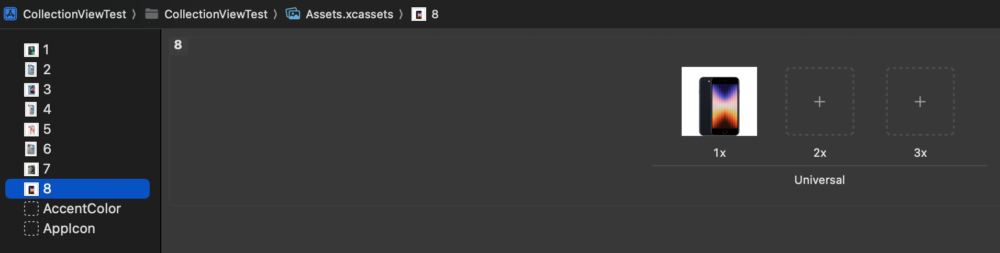

## 2. 이미지 배열에 담기 
- viewDidLoad 위에 배열을 만들어 이미지를 추가하였습니다. 

``` swift 
import UIKit

class ViewController: UIViewController {
    let images: [UIImage] = [#imageLiteral(resourceName: "4"), #imageLiteral(resourceName: "7"), #imageLiteral(resourceName: "1"), #imageLiteral(resourceName: "1"), #imageLiteral(resourceName: "2"), #imageLiteral(resourceName: "3"), #imageLiteral(resourceName: "4"), #imageLiteral(resourceName: "5")]
    override func viewDidLoad() {
        super.viewDidLoad()
```

- 캡처이미지 

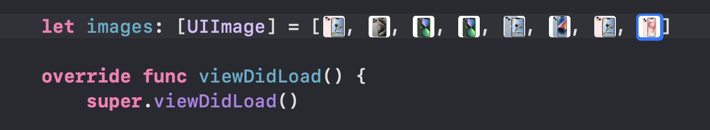

## 3. 스토리보드에 CollectionView를 추가하기 
- 라이브러리에서 컬렉션뷰를 찾아서 뷰컨트롤러에 추가합니다. 

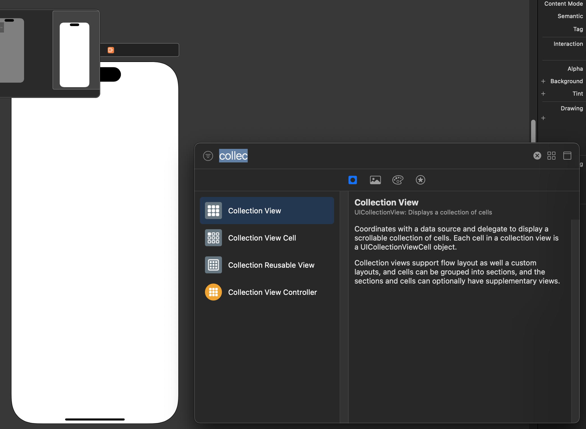

- 컬렉션뷰를 선택하고 오토레이아웃을 설정합니다. 

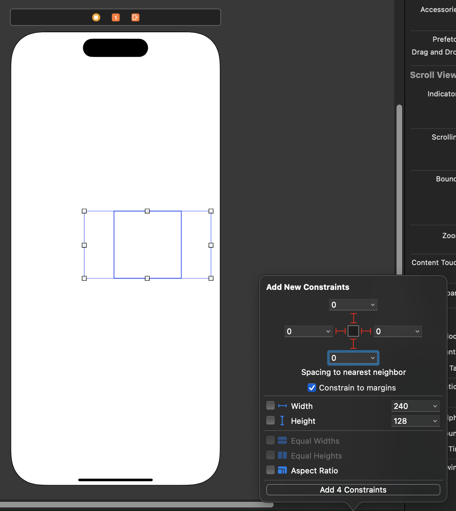

## 4. Cell 안에 imageView 추가하기 
- Cell안에 ImageView를 넣고 오토레이아웃을 설정합니다. 
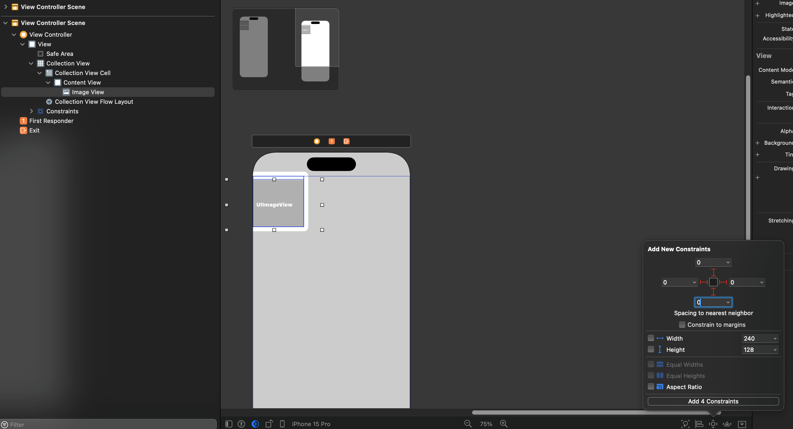

## 5. UICollectionViewCell을 상속받는 파일 만들기 
- MyCollectionViewCell 파일을 만들었습니다. 

```swift 
import UIKit

class MyCollectionViewCell: UICollectionViewCell {

}
```

## 6. 스토리보드에서 Cell을 선택 후 클래스를 지정 
- 스토리보드에서 Cell을 선택하고 클래스를 지정합니다. 

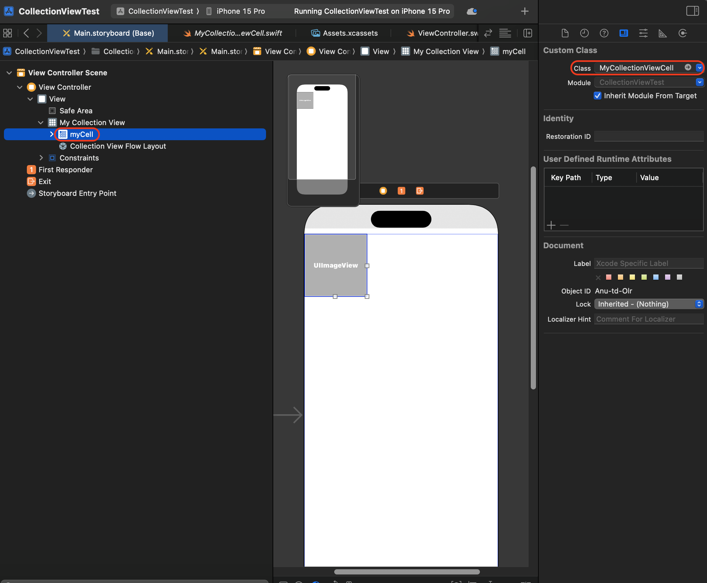

## 7. 스토리보드에서 Cell을 선택 후 리유저블 식별자명을 지정 
- 스토리보드에서 Cell을 선택하고 리유저블 식별자명을 지정합니다. 

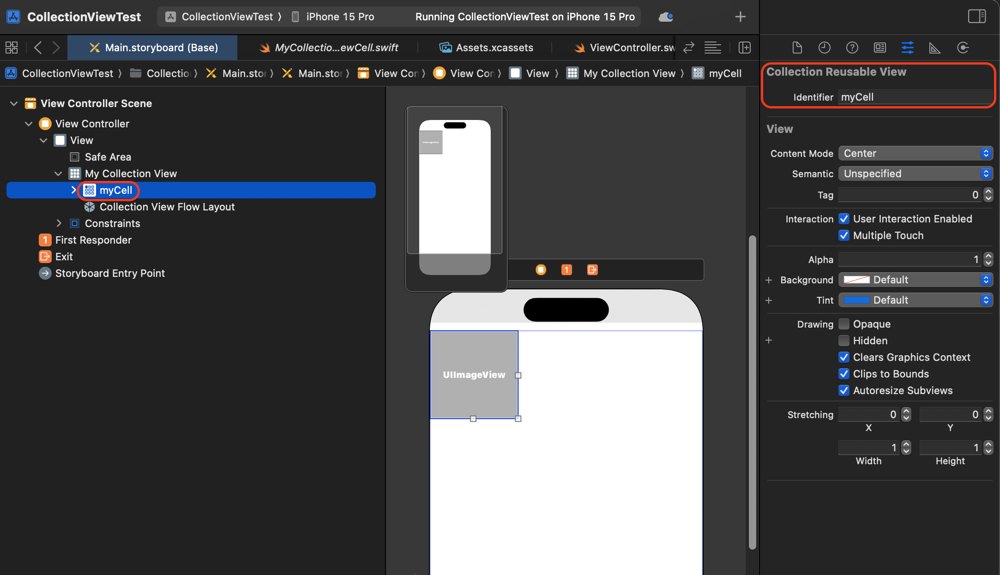

## 8. imageView 아울렛 변수 추가 
- 스토리보드에서 imageView 선택 후 MyCollectionViewCell 파일로 드래그하여 아울렛 변수를 추가합니다. 

```swift 
import UIKit

class MyCollectionViewCell: UICollectionViewCell {
    @IBOutlet weak var imageView: UIImageView!
}
```

## 9. ViewController 수정하기 
- collectionView 아울렛 변수 추가합니다. 
- UICollectionViewDataSource를 채택합니다. 
- datasource를 설정합니다. 

### collectionView 아울렛 변수 추가
``` swift 
class ViewController: UIViewController {
    @IBOutlet weak var myCollectionView: UICollectionView!
    
    let images: [UIImage] = [#imageLiteral(resourceName: "4"), #imageLiteral(resourceName: "7"), #imageLiteral(resourceName: "1"), #imageLiteral(resourceName: "1"), #imageLiteral(resourceName: "2"), #imageLiteral(resourceName: "3"), #imageLiteral(resourceName: "4"), #imageLiteral(resourceName: "5")]
    
    override func viewDidLoad() {
        super.viewDidLoad()
```

### UICollectionViewDataSource 채택
- 필수 메서드 2개를 구현합니다. tableView와 방식이 같습니다. 

``` swift 
extension ViewController: UICollectionViewDataSource {
    //컬렉션뷰에서 보여줄 아이템의 수 
    func collectionView(_ collectionView: UICollectionView, numberOfItemsInSection section: Int) -> Int {
        return images.count
    }
    
    //아이템에서 보여줄 데이터 지정 
    func collectionView(_ collectionView: UICollectionView, cellForItemAt indexPath: IndexPath) -> UICollectionViewCell {
        //리유저블 식별자 명을 입력하고 MyCollectionViewCell로 타입캐스팅
        let cell = collectionView.dequeueReusableCell(withReuseIdentifier: "myCell", for: indexPath) as? MyCollectionViewCell
        
        //MyCollectionViewCell에 추가한 이미지뷰에 애플에서 다운로드받은 이미지 보여주기 
        cell?.imageView.image = images[indexPath.row]
        cell?.backgroundColor = .systemPink
        
        return cell ?? UICollectionViewCell()
    }
}
```
### datasource를 설정
```swift
override func viewDidLoad() {
    super.viewDidLoad()
    myCollectionView.backgroundColor = .yellow
    myCollectionView.dataSource = self //컬렉션뷰 데이타소스 설정 
```

# 실행화면 - 레이아웃 사용 전
- 세로로 8개가 가득 찼습니다.  
- 사진첩처럼 1줄에 3개씩 보이도록 수정해보겠습니다. 

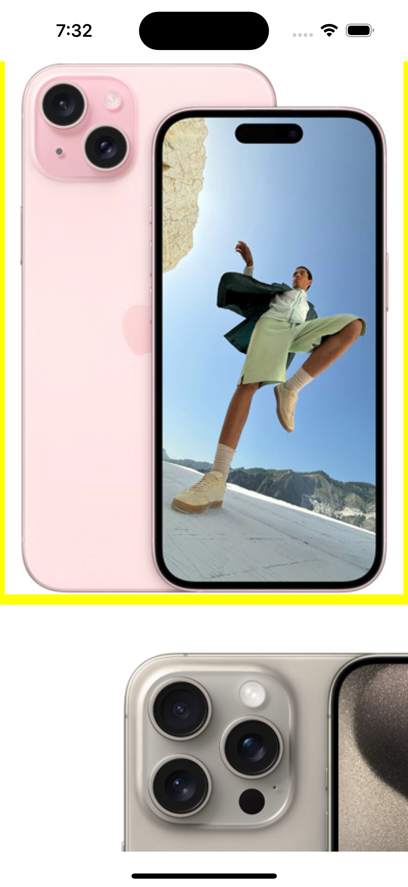
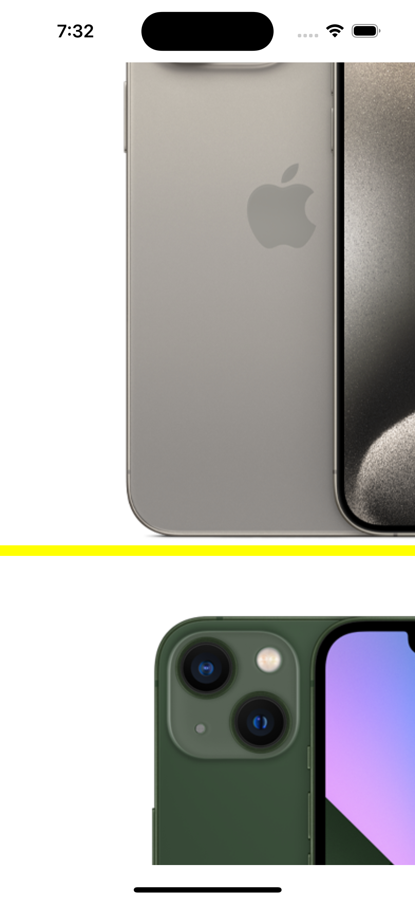

# UICollectionViewFlowLayout 사용해서 컬렉션뷰 꾸미기 
- 1줄에 3개씩 나오도록 수정해 보겠습니다. 

```swift
override func viewDidLoad() {
    super.viewDidLoad()
    
    myCollectionView.backgroundColor = .yellow
    myCollectionView.dataSource = self

    //컬렉션뷰의 레이아웃을 담당하는 객체 생성 
    let flowLayout = UICollectionViewFlowLayout() 
    //컬렉션뷰의 스크롤 방향 설정
    flowLayout.scrollDirection = .vertical
    let lineWidth: CGFloat = 1  //아이템 좌우 사이의 거리
    let columnCnt: CGFloat = 3  //1줄에 들어갈 아이템 개수
    //아이템 사이 간격 설정
    flowLayout.minimumInteritemSpacing = lineWidth
    //아이템 위아래 사이 간격 설정
    flowLayout.minimumLineSpacing = 1

    //아이템 가로 길이 구하기
    let collectionCellWidth = (UIScreen.main.bounds.width - (lineWidth * (columnCnt - 1))) / columnCnt

    //아이템을 정사각형으로
    flowLayout.itemSize = CGSize(width: collectionCellWidth, height: collectionCellWidth)

    //적용된 레이아웃 컬렉션뷰에 적용하기
    myCollectionView.collectionViewLayout = flowLayout
}
```

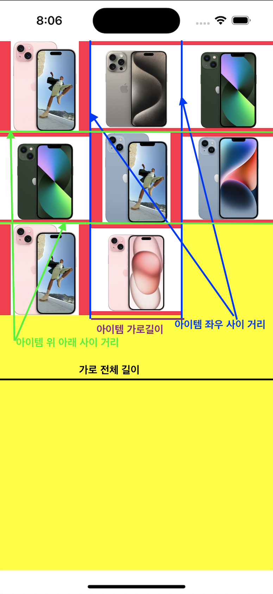

- 아이템 가로길이 = (뷰 전체 가로 길이 - (좌우 아이템 사이 길이 * 좌우 아이템 사이 길이 개수)) / 1줄에 보여줄 아이템 수 

# 실행 화면 - 레이아웃 사용 후 
## let columnCnt: CGFloat = 3 

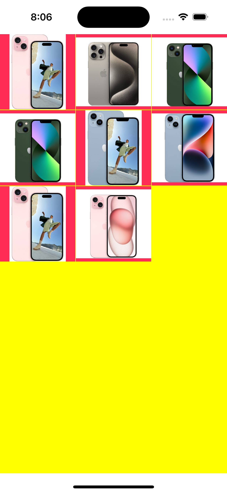

## let columnCnt: CGFloat = 4

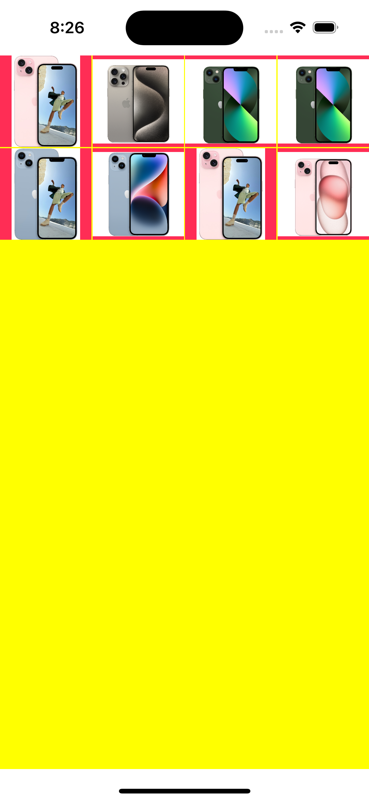

# ⭐️스크롤 방향 관련⭐️
- minimumInteritemSpacing, minimumLineSpacing는 스크롤 방향에 따라 달라집니다! 

## 세로일때 
```swift
flowLayout.scrollDirection = .vertical
//아이템 좌우 사이 간격 설정
flowLayout.minimumInteritemSpacing = lineWidth
//아이템 위아래 사이 간격 설정
flowLayout.minimumLineSpacing = 30
```

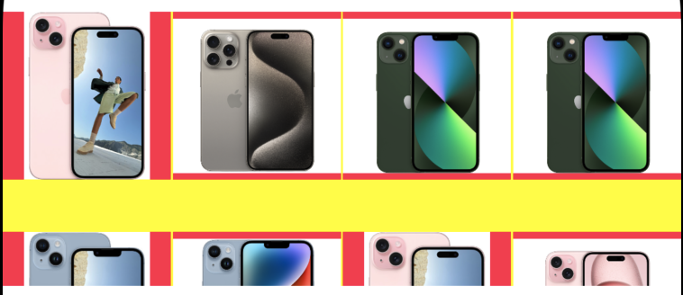

## 가로일때 
```swift
flowLayout.scrollDirection = .horizontal
//아이템 위아래 간격 설정
flowLayout.minimumInteritemSpacing = lineWidth
//아이템 좌우 사이 간격 설정
flowLayout.minimumLineSpacing = 30
```

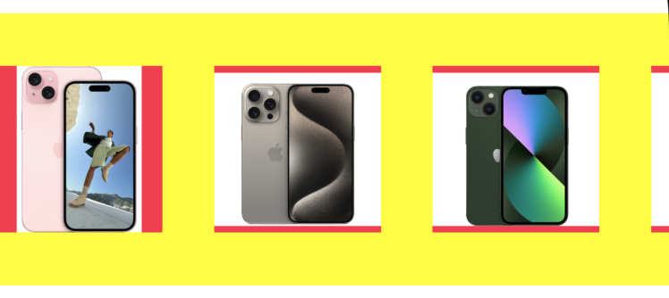

# 마무리 
- collectionView는 tableview와 비슷하지만 UICollectionViewFlowLayout을 사용하여 레이아웃을 변경할 수 있습니다. 