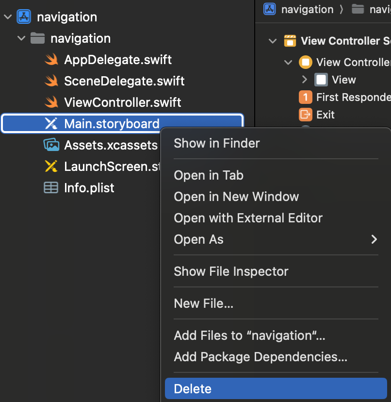
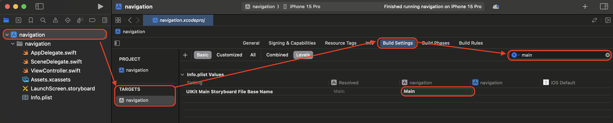
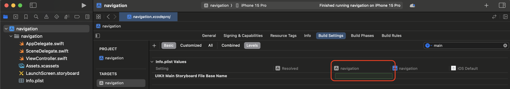
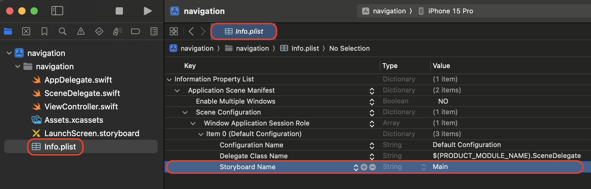
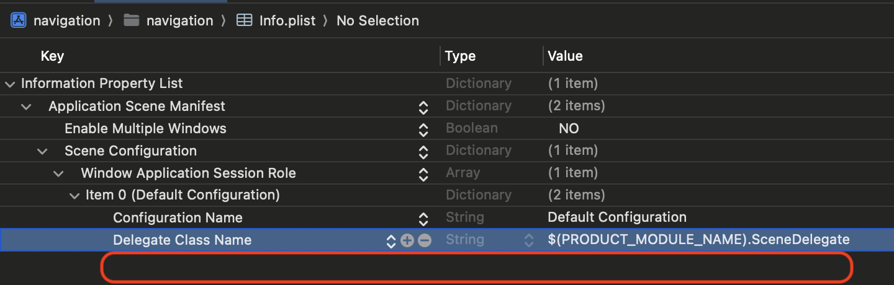
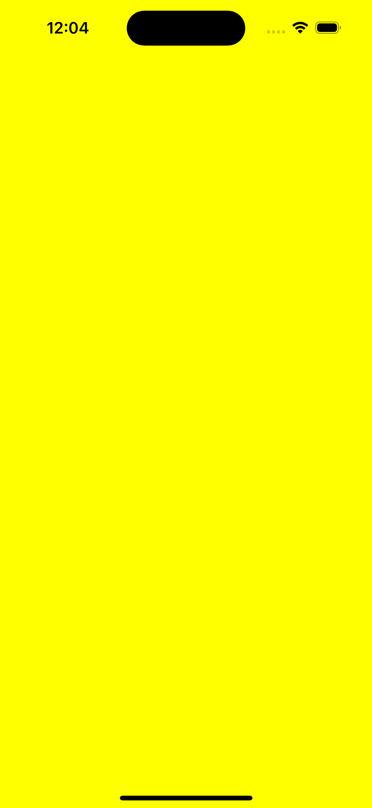

# Code Base를 위한 main storyboard 삭제하기
- 코드를 기반으로 UI를 구성하기위해 main Storyboard 삭제 방법입니다. 

# 1. Main Storyboard 삭제
- Main Storyboard를 삭제합니다. 


# 2. Build Setting 변경 
- Build Settings에서 main를 검색해서 UIKit Main Storyboard File Base Name 삭제합니다. 
- UIKit Main Storyboard File Base Name 항목은 남아있고 text만 지워집니다.

## 삭제 전 


## 삭제 후 


# 3. Info.plist 변경
- Storyboard Name을 삭제합니다.
- 한줄이 모두 삭제 됩니다. 

## 삭제 전 


## 삭제 후 


# 4. SceneDelegate.swift 파일 코드 수정 
- 첫 화면을 보여줄 컨트롤러 지정해주기 
- NavigationController나 TabBarController를 rootViewController로 가지고 싶다면 SceneDelegate 파일에서 아래 함수를 추가로 수정해야합니다. 

## 수정 전 
```swift
    func scene(_ scene: UIScene, willConnectTo session: UISceneSession, options connectionOptions: UIScene.ConnectionOptions) {
        // Use this method to optionally configure and attach the UIWindow `window` to the provided UIWindowScene `scene`.
        // If using a storyboard, the `window` property will automatically be initialized and attached to the scene.
        // This delegate does not imply the connecting scene or session are new (see `application:configurationForConnectingSceneSession` instead).

        guard let _ = (scene as? UIWindowScene) else { return }
    }
```
## 수정 후  
```swift
    func scene(_ scene: UIScene, willConnectTo session: UISceneSession, options connectionOptions: UIScene.ConnectionOptions) {
        // Use this method to optionally configure and attach the UIWindow `window` to the provided UIWindowScene `scene`.
        // If using a storyboard, the `window` property will automatically be initialized and attached to the scene.
        // This delegate does not imply the connecting scene or session are new (see `application:configurationForConnectingSceneSession` instead).
        //수정 전
        //guard let _ = (scene as? UIWindowScene) else { return }
        //수정 후
        guard let windowScene = (scene as? UIWindowScene) else { return }
            
        window = UIWindow(windowScene: windowScene)
        window?.rootViewController = ViewController()
        window?.makeKeyAndVisible()
    }
```

# 5. 실행 확인 
- 실행 유무를 확인하기 위해 배경을 노란색으로 변경하였습니다. 

```swift
import UIKit

class ViewController: UIViewController {
    override func viewDidLoad() {
        super.viewDidLoad()
        view.backgroundColor = .yellow
    }
}
```




# 마무리 
- 이제 코드베이스로 시작해봅시다! 