# UICollectionView 코드로 구현하기  
- 스토리보드로만 UICollectionView 연습을 해봤었는데 코드로 UICollectionView를 만들어보았습니다. 
- [⭐️스토리보드로 CollectionView 만들기 바로가기⭐️](https://limlogging.github.io/UIKit/UICollectionViewStoryboard/){:target="_blank"} 

# 1. 컬렉션뷰를 담을 뷰 만들기 
- UICollectionView를 담을 UIView 하나를 추가했습니다. 

```swift 
class ViewController: UIViewController {
    var cvView: UIView = {
        let view = UIView()
        view.layer.borderColor = #colorLiteral(red: 0, green: 0, blue: 0, alpha: 1)
        view.layer.borderWidth = 1
        view.translatesAutoresizingMaskIntoConstraints = false
        return view
    }()

    override func viewDidLoad() {
        super.viewDidLoad()
        view.addSubview(cvView)

        setupAutoLayout()
    }

    // MARK: - 오토레이아웃 설정
    func setupAutoLayout() {
        NSLayoutConstraint.activate([
            cvView.topAnchor.constraint(equalTo: view.safeAreaLayoutGuide.topAnchor, constant: 10),
            cvView.leadingAnchor.constraint(equalTo: view.safeAreaLayoutGuide.leadingAnchor, constant: 10),
            cvView.trailingAnchor.constraint(equalTo: view.safeAreaLayoutGuide.trailingAnchor, constant: -10),
            cvView.heightAnchor.constraint(equalToConstant: 150),
        ])
    }
}
```
- 실행화면
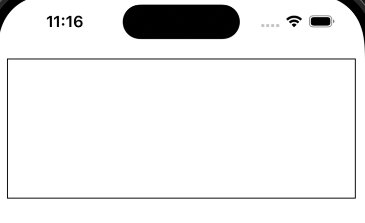

# 2. UICollectionView 추가하기 
- TableView나 Button, Label처럼 추가 후 실행하면 에러가 발생합니다. 
- UICollectionViewFlowLayout를 추가해야 에러가 발생하지 않습니다. 

## UICollectionViewFlowLayout 레이아웃 추가 전 
```swift
class ViewController: UIViewController {
    // MARK: - 컬렉션뷰
    var collectionView: UICollectionView = {
        let collectionView = UICollectionView()
        collectionView.backgroundColor = .yellow
        collectionView.layer.borderColor = #colorLiteral(red: 0, green: 0, blue: 0, alpha: 1)
        collectionView.layer.borderWidth = 1
        collectionView.translatesAutoresizingMaskIntoConstraints = false
        return collectionView
    }()
    override func viewDidLoad() {
        super.viewDidLoad()

        view.addSubview(cvView)             //뷰에 컬렉션뷰를 담을 뷰 추가 
        cvView.addSubview(collectionView)   //컬렉션뷰를 담을 뷰에 컬렉션뷰 추가 

        setupAutoLayout()   //오토레이아웃설정
    }
    // MARK: - 오토레이아웃 설정
    func setupAutoLayout() {
        NSLayoutConstraint.activate([
            //컬렉션뷰를 담을 뷰 
            cvView.topAnchor.constraint(equalTo: view.safeAreaLayoutGuide.topAnchor, constant: 10),
            cvView.leadingAnchor.constraint(equalTo: view.safeAreaLayoutGuide.leadingAnchor, constant: 10),
            cvView.trailingAnchor.constraint(equalTo: view.safeAreaLayoutGuide.trailingAnchor, constant: -10),
            cvView.heightAnchor.constraint(equalToConstant: 150),
            //컬렉션뷰
            collectionView.topAnchor.constraint(equalTo: cvView.topAnchor, constant: 10),
            collectionView.leadingAnchor.constraint(equalTo: cvView.leadingAnchor, constant: 10),
            collectionView.trailingAnchor.constraint(equalTo: cvView.trailingAnchor, constant: -10),
            collectionView.bottomAnchor.constraint(equalTo: cvView.bottomAnchor, constant: -10),
        ])
    }
}
```
### 🚨에러메시지🚨
- 컬렉션뷰는 테이블뷰와 달리 레이아웃 없이 초기화할 수 없습니다 ! 
- Thread 1: "UICollectionView must be initialized with a non-nil layout parameter"
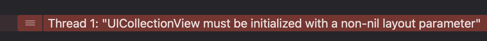

## UICollectionViewFlowLayout 레이아웃 추가 후
- FlowLayout을 추가하고 다시 실행해보면 에러 없이 추가된 것을 확인할 수 있습니다. 
```swift
// MARK: - 컬렉션뷰
var collectionView: UICollectionView = {
    let flowLayout = UICollectionViewFlowLayout()    
    let collectionView = UICollectionView(frame: .zero, collectionViewLayout: flowLayout)
    collectionView.backgroundColor = .yellow
    collectionView.layer.borderColor = #colorLiteral(red: 0, green: 0, blue: 0, alpha: 1)
    collectionView.layer.borderWidth = 1
    collectionView.translatesAutoresizingMaskIntoConstraints = false
    return collectionView
}()
```
- 실행화면 
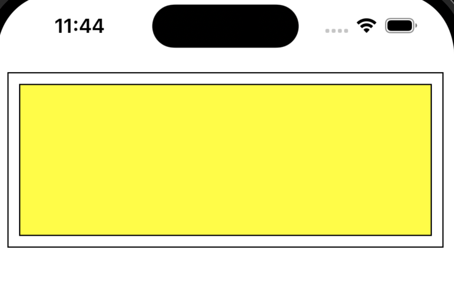

# 3.UICollectionViewDataSource 프로토콜 채택하기 
- 테이블뷰처럼 DataSource를 채택하면 필수메서드가 필요하다고 에러가 발생합니다. 
- 임의로 Return 데이터를 추가하면 테이블 뷰는 실행이되지만 컬렉션뷰는 dequeueReusableCell를 사용하지 않으면 에러가 발생합니다. 
```swift
class ViewController: UIViewController {
    override func viewDidLoad() {
        super.viewDidLoad()
        
        collectionView.dataSource = self    //ㄷ

        //다른코드 생략 
    }
}
extension ViewController: UICollectionViewDataSource {
    //컬렉션뷰에서 보여줄 아이템의 개수
    func collectionView(_ collectionView: UICollectionView, numberOfItemsInSection section: Int) -> Int {
        return 10
    }
    
    //컬렉션뷰의 셀에 포함할 데이터  
    func collectionView(_ collectionView: UICollectionView, cellForItemAt indexPath: IndexPath) -> UICollectionViewCell {
        return UICollectionViewCell()
    }
}
```

## 🚨에러메시지🚨 
- 컬렉션 뷰에서 셀을 반환할 때 재사용 큐에서 셀을 가져오지 않고 새로운 셀을 생성하여 반환하려고 할 때 에러 발생
- Thread 1: "the cell returned from -collectionView:cellForItemAtIndexPath: does not have a reuseIdentifier - cells must be retrieved by calling -dequeueReusableCellWithReuseIdentifier:forIndexPath:"
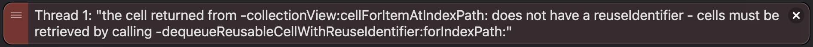

# 4. UICollectionViewCell를 상속받는 파일 추가 
- UICollectionViewCell를 상속받는 MyCollectionViewCell 파일을 추가했습니다. 
- 셀을 초기화하기위해서 init을 추가하면 required init? 메서드가 필요하다고 에러가 발생하고 required init?(coder: NSCoder)를 자동으로 추가해줍니다. 

```swift
class MyCollectionViewCell: UICollectionViewCell {
    override init(frame: CGRect) {
        super.init(frame: frame)
    }
    required init?(coder: NSCoder) {
        fatalError("init(coder:) has not been implemented")
    }
}
```

## MyCollectionViewCell 전체 코드 
- Cell에 숫자를 보여주기위해서 Label 하나를 추가하고 오토레이아웃을 설정했습니다. 

```swift
import UIKit
class MyCollectionViewCell: UICollectionViewCell {
    override init(frame: CGRect) {
        super.init(frame: frame)

        self.backgroundColor = .white

        addViews()
        setupAutoLayout()
    }
    
    required init?(coder: NSCoder) {
        fatalError("init(coder:) has not been implemented")
    }
    
    // MARK: - 숫자 추가
    var numberLabel: UILabel = {
        let label = UILabel()
        
        return label
    }()
    
    // MARK: - 뷰에 객체 추가
    func addViews() {
        [numberLabel].forEach { item in
            item.translatesAutoresizingMaskIntoConstraints = false
            addSubview(numberLabel)
        }
    }
    
    // MARK: - 오토레이아웃 설정
    func setupAutoLayout() {
        NSLayoutConstraint.activate([
            numberLabel.centerXAnchor.constraint(equalTo: safeAreaLayoutGuide.centerXAnchor),
            numberLabel.centerYAnchor.constraint(equalTo: safeAreaLayoutGuide.centerYAnchor),
        ])
    }
}
```

# 5. ViewController에 컬렉션뷰에서 사용할 Cell 등록 및 cellForItemAt 메서드 수정
- ViewController에 컬렉션뷰에서 사용할 Cell 등록
```swift
class ViewController: UIViewController {
    //다른코드 생략 
    override func viewDidLoad() {
        super.viewDidLoad()
        //다른코드 생략 

        //MyCollectionViewCell 클래스를 컬렉션 뷰에 등록하고 식별자 지정 
        collectionView.register(MyCollectionViewCell.self, forCellWithReuseIdentifier: "MyCollectionViewCell")
    }
    //다른코드 생략 
}
```
- cellForItemAt 메서드 수정
```swift
extension ViewController: UICollectionViewDataSource {
   func collectionView(_ collectionView: UICollectionView, cellForItemAt indexPath: IndexPath) -> UICollectionViewCell {
        guard let cell = collectionView.dequeueReusableCell(withReuseIdentifier: "MyCollectionViewCell", for: indexPath) as? MyCollectionViewCell else { return UICollectionViewCell() }
        cell.numberLabel.text = String(indexPath.row)
        
        return cell
    }
}
```
- 실행화면
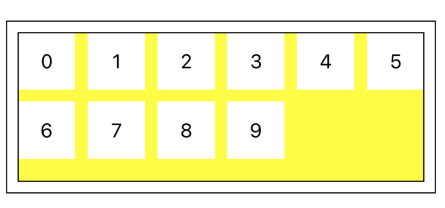

# 6. 컬렉션뷰 수정 전 스크롤 방향에 따른 라인의 간격과 아이템간의 간격 차이 확인 
- 스크롤 방향에 따라서 최소 줄 간격과 최소항목간 간격이 변경됩니다. 
    - 빨간색 박스 = 라인의 범위
    - 파란색 박스 = 라인의 간격 (minimumLineSpacing)
    - 초록색 박스 = 아이템간의 간격 (minimumInteritemSpacing)

## 스크롤 방향이 vertical 일때 (기본 설정)
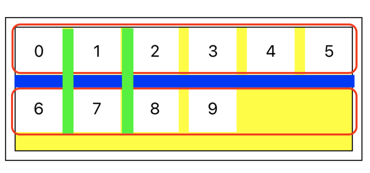
## 스크롤 방향이 horizontal 일때
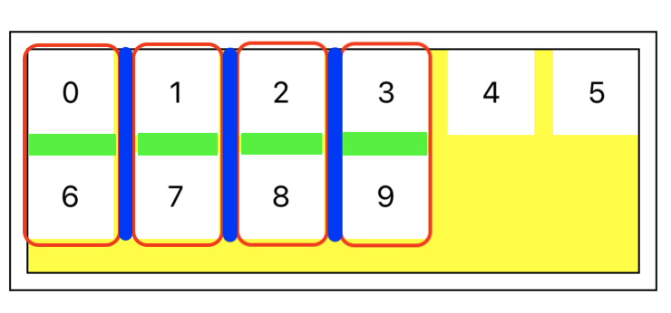

# 7. UICollectionViewFlowLayout 수정하기 
- UICollectionViewFlowLayout를 수정해서 한 줄에 들어갈 아이템의 수와 아이템의 간격을 원하는대로 지정해보겠습니다. 

## 1. 아이템간의 간격과 라인에 들어갈 아이템 수 지정 

```swift
class ViewController: UIViewController {
    let collectionViewItemSpacing: CGFloat = 5      //아이템간의 간격
    let collectionViewItemCnt: CGFloat = 4          //라인에 들어갈 아이템 수
    //다른 코드 생략 
}
```

## 2. 컬렉션뷰 수정 
- 스크롤 방향과 아이템간의 간격, 라인간의 간격을 설정합니다. 
- collectionViewItemSpacing 상수의 추가로 lazy를 추가하고 collectionViewItemSpacing 상수보다 나중에 초기화 되도록 합니다. 
```swift 
// MARK: - 컬렉션뷰
lazy var collectionView: UICollectionView = {
    let flowLayout = UICollectionViewFlowLayout()
    flowLayout.scrollDirection = .vertical  //스크롤 방향
    flowLayout.minimumLineSpacing = 20      //라인 간격 
    flowLayout.minimumInteritemSpacing = self.collectionViewItemSpacing //아이템 간격
    
    let collectionView = UICollectionView(frame: .zero, collectionViewLayout: flowLayout)
    collectionView.backgroundColor = .yellow
    collectionView.layer.borderColor = #colorLiteral(red: 0, green: 0, blue: 0, alpha: 1)
    collectionView.layer.borderWidth = 1
    collectionView.translatesAutoresizingMaskIntoConstraints = false
    return collectionView
}()
```

## 3. 컬렉션뷰 델리게이트 설정 

```swift
override func viewDidLoad() {
    super.viewDidLoad()
    //다른코드 생략 
    collectionView.delegate = self
}
```

## 4. UICollectionViewDelegateFlowLayout 프로토콜 채택 및 메서드 추가
```swift
extension ViewController: UICollectionViewDelegateFlowLayout {
    // MARK: - 컬렉션 뷰의 각 셀의 크기를 결정하는 메서드 
    func collectionView(_ collectionView: UICollectionView, layout collectionViewLayout: UICollectionViewLayout, sizeForItemAt indexPath: IndexPath) -> CGSize {
        //return 값으로 원하는 크기를 지정 
    }
}
``` 

### 스크롤 방향이 vertical 일때 한 줄에 4개 만큼 아이템 넣기 
- 스크롤 방향 설정 
```swift 
// MARK: - 컬렉션뷰
lazy var collectionView: UICollectionView = {
    //다른코드 생략
    flowLayout.scrollDirection = .vertical  //스크롤 방향
    //다른코드 생략
}()
```
- 스크롤 방향이 horizontal일때 한 줄이 width 기준 
```swift
extension ViewController: UICollectionViewDelegateFlowLayout {
    // MARK: - 컬렉션 뷰의 각 셀의 크기를 결정하는 메서드 
    func collectionView(_ collectionView: UICollectionView, layout collectionViewLayout: UICollectionViewLayout, sizeForItemAt indexPath: IndexPath) -> CGSize {
        let width = (collectionView.bounds.width - (self.collectionViewLineWidth * (self.collectionViewItemCnt - 1))) / self.collectionViewItemCnt
        return CGSize(width: width, height: width)
    }
}
``` 
- 실행화면 (한 줄에 아이템 수 4, 아이템 간격 5, 라인 간격 20)
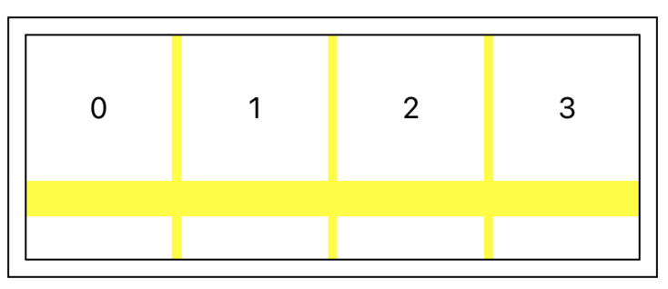
- 실행화면 (한 줄에 아이템 수 5, 아이템 간격 1, 라인 간격 10)
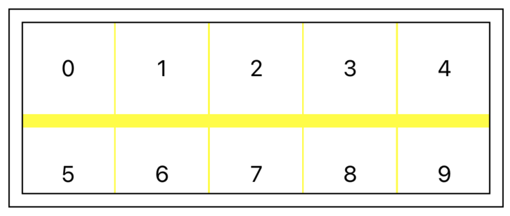

### 스크롤 방향이 horizontal 일때 한 줄에 4개 만큼 아이템 넣기 
- 스크롤 방향 설정 
```swift 
// MARK: - 컬렉션뷰
lazy var collectionView: UICollectionView = {
    //다른코드 생략
    flowLayout.scrollDirection = .horizontal  //스크롤 방향
    //다른코드 생략
}()
```
- 스크롤 방향이 horizontal일때 한 줄이 height 기준 
```swift
extension ViewController: UICollectionViewDelegateFlowLayout {
    // MARK: - 컬렉션 뷰의 각 셀의 크기를 결정하는 메서드 
    func collectionView(_ collectionView: UICollectionView, layout collectionViewLayout: UICollectionViewLayout, sizeForItemAt indexPath: IndexPath) -> CGSize {
        let width = (collectionView.bounds.height - (collectionViewItemSpacing * (collectionViewItemCnt - 1))) / collectionViewItemCnt
        return CGSize(width: width, height: width)
    }
}
``` 
- 실행화면 (한 줄에 아이템 수 4, 아이템 간격 5, 라인 간격 20)
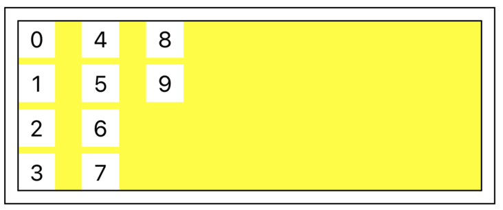
- 실행화면 (한 줄에 아이템 수 5, 아이템 간격 1, 라인 간격 10)
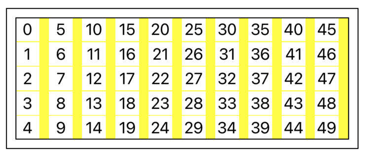

# 마무리 
- 컬렉션뷰를 사용할때는 레이아웃 설정 필요함
- 스크롤 방향에 따라 라인이 변경됨  